# RFC-0001: Arthur OS — Entity-centric AI Operating System

| Поле | Значение |
|---|---|
| Идентификатор | Arthur OS RFC-0001 |
| Статус | **Предложение для архитектурного аудита** |
| Класс документа | Request For Comments, целевая концептуальная архитектура |
| Язык | Русский |
| Дата | 12 августа 2026 года |
| Целевая аудитория | Enterprise-архитекторы, владельцы продукта, инженеры платформы, специалисты по данным, AI, безопасности и эксплуатации |
| Решение | Не принято |
| Автор решения | Не определён |
| Заменяет | Ничего |
| Связанные документы | `docs/ARTHUR_MASTER_ARCHITECTURE.md`, `docs/arthur/00_PROJECT_VISION.md`, `docs/arthur/03_ARCHITECTURE.md`, `docs/arthur/04_MEMORY_MODEL.md`, `docs/arthur/13_ARTHUR_CORE_V0_SPEC.md`, `docs/arthur-v1-foundation.md` |

> **Предупреждение о статусе.** Этот документ не утверждает окончательную архитектуру Arthur OS и не означает, что описанные компоненты реализованы. Он формулирует целевую гипотезу достаточно подробно, чтобы независимый архитектор мог найти противоречия, скрытые допущения, чрезмерную сложность, риски безопасности и ошибочные границы ответственности.

---

## Содержание

1. Резюме предложения
2. Контекст и постановка проблемы
3. Цели, нецели и критерии качества
4. Термины и архитектурные инварианты
5. Обзор целевой архитектуры
6. Entity как основная единица системы
7. Work Item как обобщённая единица работы
8. Проект как Entity
9. Knowledge Graph
10. Context Graph
11. Архитектура памяти
12. Decision как самостоятельный Work Item
13. Waiting как самостоятельный Work Item
14. Режимы Arthur OS
15. AI-слой и оркестрация
16. Интеграционная архитектура
17. Данные, хранение и поиск
18. Контракты, API и события
19. Безопасность, приватность и доверие
20. Многопользовательская работа
21. Надёжность, наблюдаемость и эксплуатация
22. Что заимствуется из существующих систем
23. Что сознательно не копируется
24. Риски и меры контроля
25. Этапы развития и миграция
26. Управление архитектурой
27. Рассмотренные альтернативы
28. Открытые вопросы
29. Приложения
30. Чек-лист независимого аудита
31. Источники

---

## 1. Резюме предложения

Arthur OS предлагается рассматривать как персональную и бизнес-ориентированную AI Operating System, а не как чат-бот, таск-менеджер, CRM, базу заметок или набор независимых агентов. Система должна объединять личную жизнь, бизнес, магазины, закупки, документы, проекты, календарь, почту, память, знания и AI вокруг единой семантической модели.

Ключевая гипотеза RFC состоит в переходе от task-centric к entity-centric архитектуре:

> **В Arthur OS первична Entity. Task — только один из типов Work Item.**

Любой устойчиво идентифицируемый объект предметного мира — человек, компания, магазин, поставщик, проект, документ, товар, бренд, встреча, поездка, автомобиль, дом, письмо, контакт или сотрудник — представлен Entity. Связи Entity образуют Knowledge Graph. Работа, требующая внимания, представлена Work Item: Task, Idea, Decision, Reminder, Waiting, Problem, Goal, Meeting, Request, Approval, Incident или Review.

Перед каждым значимым AI-ответом Arthur строит временный **Context Graph** — ограниченный подграф только из тех Entity, связей, фактов, документов и Work Items, которые релевантны текущему намерению, режиму, пользователю и разрешениям. Полная память никогда не передаётся модели автоматически.

Предложение опирается на следующие системные свойства:

- единая идентичность Arthur при множестве режимов и навыков;
- графовая семантика поверх нескольких возможных физических хранилищ;
- временная и версионная модель фактов, решений и связей;
- доказуемое происхождение данных;
- явное разделение фактов, вычислений, допущений и AI-интерпретаций;
- минимальные права и контекстное раскрытие данных;
- подтверждение рискованных действий человеком;
- независимость от конкретной AI-модели и поставщика;
- возможность эволюции от одного владельца к контролируемой многопользовательской работе;
- наблюдаемость не только технического исполнения, но и процесса сборки контекста.

RFC не выбирает окончательно базу данных, графовый движок, протокол API, брокер событий или набор моделей. Вместо этого он фиксирует семантические контракты и критерии выбора, чтобы технология не стала скрытым источником архитектурных ограничений.

### 1.1. Главные решения, предлагаемые к обсуждению

| № | Предлагаемое решение | Статус в RFC |
|---:|---|---|
| 1 | Сделать Entity главным объектом предметной модели | Предлагается |
| 2 | Представлять Task как подтип Work Item | Предлагается |
| 3 | Представлять Project как Entity, а не контейнер | Предлагается |
| 4 | Использовать Knowledge Graph как логическую модель связей | Предлагается |
| 5 | Строить ограниченный Context Graph для каждого запроса | Предлагается |
| 6 | Разделить память на Profile, Knowledge, Facts, Preferences, History, Work Items, Decisions, Calendar, Mail и Documents | Предлагается |
| 7 | Сделать Decision и Waiting самостоятельными типами Work Item | Предлагается |
| 8 | Изолировать режимы через политики контекста, а не отдельные памяти | Предлагается |
| 9 | Подключать внешние системы через адаптеры и синхронизационные границы | Предлагается |
| 10 | Рассматривать AI Summary и AI Notes как производные, версионные и недоверенные данные | Предлагается |

### 1.2. Что требуется от архитектурного аудита

Аудитор должен проверить не красоту модели, а её состоятельность:

- достаточно ли Entity и Work Item для реальных сценариев;
- не является ли Knowledge Graph преждевременным усложнением;
- может ли Context Graph обеспечивать полноту без утечки лишних данных;
- где проходит граница между источником истины и проекцией Arthur;
- можно ли гарантировать временную корректность фактов;
- не создаёт ли универсальная модель неуправляемую схему;
- выдержит ли модель многопользовательские конфликты;
- возможно ли объяснить каждый AI-ответ и действие;
- какие решения необходимо принять до реализации, а какие можно отложить.

---

## 2. Контекст и постановка проблемы

### 2.1. Исходная ситуация

Жизнь и бизнес пользователя распределены между множеством систем. Контакты находятся в почте, CRM и телефоне; обязательства — в переписке, календаре, задачах и памяти человека; документы — в файловых хранилищах и чатах; решения — в сообщениях, заметках и устных договорённостях; закупочные данные — в специализированных модулях и таблицах; личные планы — в календаре, заметках и мессенджерах.

Отдельные системы хорошо управляют собственным типом данных, но не поддерживают общую картину. Типичные разрывы:

- письмо от поставщика не связано надёжно с товаром, магазином, заказом и ожиданием ответа;
- встреча имеет календарное время, но теряет решения и последствия;
- проект становится папкой задач и не отражает людей, документы, цели и внешние события;
- одна и та же компания дублируется в CRM, почте, документах и учётной системе;
- AI получает либо слишком мало контекста, либо небезопасный массив всей памяти;
- причины решений теряются, поэтому последующие рекомендации повторяют уже отвергнутые варианты;
- завершение действия ошибочно принимается за завершение результата: «отправили запрос» вместо «получили ответ»;
- чатовый интерфейс создаёт иллюзию знания, не обеспечивая происхождение и актуальность данных.

### 2.2. Почему task-centric модель недостаточна

Task-centric система оптимизирует регистрацию, назначение и закрытие задач. Но значительная часть реального управления не является задачей:

- решение уже принято и должно ограничивать будущие действия;
- идея ещё не требует обязательства;
- ожидание зависит от внешней стороны;
- проблема требует диагностики до постановки задач;
- цель описывает желаемое состояние, а не конкретное действие;
- запрос может быть отклонён или преобразован;
- встреча содержит участников, повестку, материалы и результаты;
- инцидент требует отдельной срочности, хронологии и постанализа;
- проверка оценивает существующий результат, а не создаёт новый.

Когда все эти понятия насильно становятся Task, поля и статусы теряют смысл. «Завершённая задача» может означать принятое решение, прошедшую встречу, закрытый инцидент или исчезнувшую идею. Такая унификация удобна интерфейсу, но разрушает семантику и качество AI-рассуждений.

### 2.3. Почему «единый чат» недостаточен

Чат является каналом взаимодействия, но не архитектурой. Он не задаёт:

- идентичность объектов;
- временную действительность фактов;
- права на чтение и изменение;
- источники истины;
- разрешение конфликтов;
- связь ответа с доказательствами;
- жизненный цикл обязательств;
- наблюдаемость автоматических действий.

Arthur может иметь разговорный интерфейс, но его ценность должна исходить из управляемой предметной модели и безопасной оркестрации.

### 2.4. Гипотеза ценности

Если факты, документы, обязательства, решения и внешние события связаны через устойчивые Entity, Arthur сможет:

- восстанавливать контекст без ручного пересказа;
- обнаруживать незакрытые ожидания;
- показывать последствия решения для нескольких доменов;
- различать текущую истину и исторические сведения;
- готовить режимно-специфичные ответы без создания отдельных помощников;
- выполнять повторяемые операции через доменные навыки;
- объяснять, почему конкретные данные попали в ответ;
- снижать число забытых обязательств и повторных решений.

Эта гипотеза должна быть проверена на ограниченных сценариях до построения универсальной платформы.

---

## 3. Цели, нецели и критерии качества

### 3.1. Цели

1. Определить единую концептуальную модель объектов личной и бизнес-среды.
2. Сохранить различия между типами работы, не сводя их к Task.
3. Описать граф связей, пригодный для поиска, объяснения и AI-контекста.
4. Определить безопасный и воспроизводимый процесс построения Context Graph.
5. Развести канонические данные, внешние источники, проекции, кеши и AI-производные сведения.
6. Обеспечить версионность, происхождение, аудит и временную корректность.
7. Определить архитектурные точки подключения каналов, бизнес-систем, AI и автоматизации.
8. Поддержать личные и бизнес-режимы без дублирования памяти.
9. Сформировать границы для последующей поэтапной реализации.
10. Предоставить аудитору достаточное число проверяемых утверждений и открытых вопросов.

### 3.2. Нецели

Этот RFC не должен:

- выбирать окончательный технологический стек;
- описывать таблицы, SQL, конкретные маршруты API или программные интерфейсы;
- заменять продуктовую стратегию или roadmap;
- проектировать пользовательский интерфейс до уровня экранов;
- обещать полную автономность AI;
- объявлять Arthur источником истины для всех интеграций;
- предлагать перенос всех исторических данных в первую версию;
- заменять доменные системы 1С, Gmail, Google Calendar, GitHub или Bitrix24;
- фиксировать конкретного поставщика модели;
- считать текст модели доказательством факта;
- разрешать необратимые действия без политики подтверждений.

### 3.3. Критерии архитектурного качества

| Критерий | Ожидаемое свойство | Проверка на аудите |
|---|---|---|
| Корректность | Типы и состояния отражают предметный смысл | Сценарии и контрпримеры |
| Трассируемость | Факт и вывод имеют происхождение | Проход от ответа к источнику |
| Ограниченность контекста | Модель получает только необходимое | Анализ выборки Context Graph |
| Расширяемость | Новый тип добавляется управляемо | Проверка реестра типов и миграций |
| Изоляция | Личные и бизнес-данные не пересекаются по умолчанию | Модель угроз и негативные сценарии |
| Независимость | Замена AI или интеграции не меняет доменную семантику | Анализ границ адаптеров |
| Временная точность | Истина имеет период действительности | Сценарии изменения фактов |
| Надёжность | Частичные сбои не искажают состояние | Отказы интеграций и повторная доставка |
| Управляемость | Изменения схемы и политик имеют владельца | Процесс governance |
| Объяснимость | Пользователь видит основания существенного ответа | Набор обязательных объяснений |

### 3.4. Принципы приоритета

При конфликте требований применяется следующий порядок:

1. Безопасность человека и бизнеса.
2. Корректность и сохранность источников.
3. Возможность человеческого контроля.
4. Конфиденциальность и минимизация данных.
5. Объяснимость.
6. Надёжность.
7. Пользовательская полезность.
8. Производительность.
9. Удобство реализации.

---

## 4. Термины и архитектурные инварианты

### 4.1. Словарь

| Термин | Определение |
|---|---|
| Arthur OS | Единый управляющий слой над объектами, памятью, знаниями, работой, интеграциями и AI |
| Entity | Устойчиво идентифицируемый объект предметного мира или цифровой среды |
| Entity Type | Управляемая классификация Entity с семантикой и ограничениями |
| Relationship | Типизированная направленная или симметричная связь между объектами |
| Work Item | Объект внимания или работы с собственным типом и жизненным циклом |
| Knowledge Graph | Логический граф Entity, Work Items, фактов, документов и отношений |
| Context Graph | Временный ограниченный подграф, собранный для конкретного запроса или действия |
| Fact | Утверждение с источником, временем действительности, уверенностью и статусом проверки |
| Memory | Управляемая совокупность сохранённых сведений, а не стенограмма всех взаимодействий |
| Source of Truth | Система, уполномоченная определять каноническое значение конкретного атрибута |
| Projection | Локальное представление внешних данных для поиска, связи или кеширования |
| Mode | Политика намерений, контекста, инструментов, рисков и представления для класса сценариев |
| Skill | Ограниченная доменная способность Arthur с формальным контрактом и разрешениями |
| Channel | Интерфейс взаимодействия: Telegram, web, voice и другие |
| AI Summary | Производное краткое описание объекта, сформированное AI и не являющееся фактом само по себе |
| AI Notes | Производные наблюдения, гипотезы или подсказки AI с явным статусом доверия |
| Provenance | Сведения о происхождении, преобразовании и подтверждении данных |
| Temporal validity | Интервал, в котором утверждение считается действительным в предметном мире |
| System time | Интервал, в котором запись существовала в Arthur |

### 4.2. Инварианты

1. Каждая Entity имеет глобально устойчивый идентификатор, не зависящий от названия или внешнего ID.
2. Внешний идентификатор не заменяет внутренний, а хранится как привязка к источнику.
3. Удаление или изменение внешнего объекта не должно бесследно менять историю Arthur.
4. Любое существенное утверждение имеет происхождение и время наблюдения.
5. AI Summary и AI Notes не могут автоматически повышаться до подтверждённого Fact.
6. Work Item всегда имеет явный тип; Task не используется как универсальная заглушка.
7. Project является Entity и связывает работу, но не владеет ею исключительно.
8. Один Work Item может относиться к нескольким Entity и проектам.
9. Decision не удаляется при пересмотре; создаётся новая версия или замещающее решение.
10. Waiting имеет объект ожидания, ответственную сторону и момент следующей проверки.
11. Контекст строится для цели и не равен всей доступной памяти.
12. Доступ к узлу не означает автоматический доступ ко всем соседним узлам графа.
13. Режим не создаёт отдельную копию личности или памяти.
14. Детерминированные вычисления выполняются доменными сервисами, а не языковой моделью.
15. Внешнее действие имеет инициатора, полномочие, идемпотентность и аудит.
16. Система должна уметь ответить: «Почему этот объект был включён в контекст?»
17. Система должна уметь ответить: «Какой источник владеет этим полем?»
18. Неопределённость показывается явно и не маскируется уверенным текстом.

### 4.3. Различия, которые нельзя стирать

| Пара понятий | Почему различие важно |
|---|---|
| Entity и запись источника | Одна Entity может иметь несколько внешних представлений |
| Fact и AI Notes | Факт подтверждён источником; заметка AI является гипотезой |
| Event и текущее состояние | Событие неизменно; состояние является результатом интерпретации событий |
| Project и папка | Проект имеет цель, историю, участников и связи за пределами списка работ |
| Meeting и календарное событие | Встреча включает смысл, материалы и решения; событие — временной слот |
| Waiting и Task в паузе | Waiting управляет внешней зависимостью и обязательной проверкой |
| Decision и комментарий | Решение имеет автора, обоснование, действие и условия пересмотра |
| Source и копия | Источник определяет значение; копия ускоряет доступ |
| Permission и relevance | Разрешённое не обязательно релевантно текущему запросу |
| Conversation context и Memory | Диалог временный; в память попадает только отобранное знание |

---

## 5. Обзор целевой архитектуры

### 5.1. Контекстная диаграмма

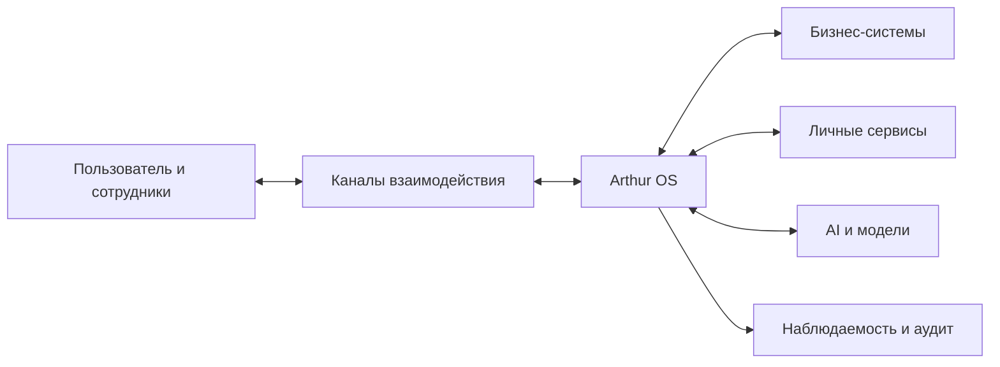

Arthur OS находится между пользовательским намерением и множеством систем. Он не обязан становиться физическим владельцем всех данных. Его роль — идентифицировать объекты, связывать контекст, применять политики, вызывать разрешённые навыки, контролировать последствия и сохранять объяснимую историю.

### 5.2. Логические слои

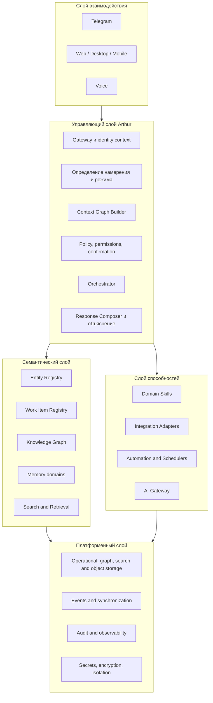

### 5.3. Ответственность слоёв

| Слой | Отвечает | Не отвечает |
|---|---|---|
| Взаимодействие | Приём запросов, отображение, каналная аутентификация | Бизнес-решения и долговременная память |
| Управление | Намерение, режим, план, политика, подтверждение, композиция ответа | Канонические расчёты домена |
| Семантика | Идентичность объектов, типы, связи, контекст, память | Транспорт внешних API |
| Способности | Доменная логика и интеграционные операции | Неограниченный доступ к графу |
| Платформа | Хранение, события, безопасность, наблюдаемость | Предметная интерпретация пользовательского запроса |

### 5.4. Единый Arthur, множество режимов

Режим — это не отдельный бот и не отдельная база. Он изменяет:

- приоритеты извлечения;
- разрешённые источники и навыки;
- допустимую глубину графа;
- политику чувствительности;
- форму ответа;
- требования к подтверждению;
- уровень инициативности.

Идентичность, правила безопасности и базовая семантика остаются общими.

### 5.5. Текущее и целевое состояние

Репозиторий уже описывает и частично реализует Telegram Gateway, Orchestrator, AI Provider abstraction, OmniRoute, Purchasing skill, identity/capability context, structured logging и PostgreSQL foundation. Этот RFC находится выше текущей реализации и не должен читаться как отчёт о готовности.

| Область | Наблюдаемое текущее направление | Целевая гипотеза RFC |
|---|---|---|
| Оркестрация | Intent/skill routing и планы исполнения | Контекстно-графовая оркестрация с политиками |
| Память | Ограниченная foundation-модель | Версионная семантическая память по категориям |
| Работа | Задачи и ожидания | Типизированная иерархия Work Item |
| Данные | Модули и PostgreSQL foundation | Логический Knowledge Graph поверх гибридного хранения |
| AI | Provider abstraction через OmniRoute | Модельно-независимый AI plane с доказательствами и оценкой |
| Пользователи | Прежде всего один владелец | Контролируемая эволюция к нескольким субъектам и организациям |

---

## 6. Entity как основная единица системы

### 6.1. Определение

Entity — объект, который:

- имеет самостоятельную идентичность;
- сохраняет смысл при изменении названия и атрибутов;
- может быть связан с другими объектами;
- имеет историю;
- участвует в контексте, работе или решениях;
- может иметь одно или несколько представлений во внешних системах.

Entity не обязана быть материальным объектом. Документ, поездка, письмо и встреча являются Entity, если системе нужно ссылаться на них независимо и во времени.

### 6.2. Базовый контракт Entity

| Поле | Назначение | Архитектурные требования |
|---|---|---|
| ID | Внутренняя устойчивая идентичность | Не переиспользуется и не зависит от внешней системы |
| Тип | Семантический класс | Берётся из управляемого реестра типов |
| Название | Человекочитаемое обозначение | Может меняться; не используется как ключ |
| Описание | Проверяемое описание объекта | Отделено от AI Summary |
| Статус | Текущее состояние жизненного цикла | Допустимые значения зависят от типа |
| История | Изменения, события и версии | Существенные изменения не затираются |
| Метаданные | Расширяемые атрибуты | Схемы и владельцы должны быть определены |
| AI Summary | Краткая производная сводка | Версия, модель, время, основания, срок свежести |
| AI Notes | Гипотезы и подсказки | Не смешиваются с подтверждёнными фактами |
| Связанные документы | Документальные основания и материалы | Типизированные связи с ролью документа |
| Связанные объекты | Семантические отношения | Направление, тип, период действия, источник |
| Связанные Work Items | Работа, решения, ожидания и встречи | Связь не означает владение или включение в контейнер |

### 6.3. Примерные типы Entity

| Категория | Типы | Примечание |
|---|---|---|
| Люди и организации | Человек, Сотрудник, Контакт, Компания, Поставщик, Команда | Роль может зависеть от контекста; один человек не должен дублироваться как отдельные сущности без причины |
| Розница и бизнес | Магазин, Бренд, Товар, Категория, Контракт, Заказ, Поставка | Часть объектов может иметь канонический источник в 1С или CRM |
| Работа | Проект, Инициатива, Процесс, Политика | Проект остаётся Entity, Work Items связываются с ним |
| Контент и знания | Документ, Страница, Медиа, Письмо, Сообщение, Источник | Контент и его носитель могут быть разными объектами |
| Время и события | Встреча, Поездка, Бронирование, Календарное событие | Встреча может связывать несколько календарных представлений |
| Личное | Дом, Автомобиль, Медицинский объект, Личная цель | Требует строгой чувствительности и изоляции |
| Технологии | Репозиторий, Сервис, Среда, Инцидентный объект | Не следует смешивать с Work Item Incident |

Типы не должны создаваться только ради отображения. Новый тип оправдан, если у него есть особая семантика, жизненный цикл, политика доступа, источники или правила связей.

### 6.4. Идентичность и разрешение дублей

Одна реальная сущность часто появляется под разными именами. Например, поставщик может присутствовать как компания в Bitrix24, контрагент в 1С, отправитель в Gmail и папка документов. Arthur должен отделять:

- внутреннюю Entity;
- внешние ссылки на записи;
- алиасы и варианты написания;
- гипотезы совпадения;
- подтверждённые объединения;
- ошибочно объединённые записи.

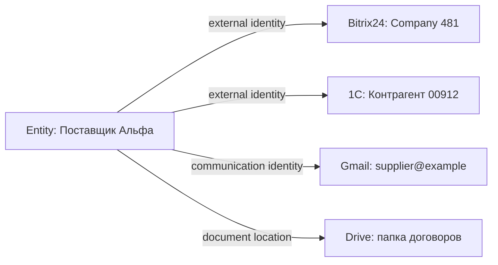

Автоматическое слияние допустимо только при достаточных доказательствах и обратимости. В спорном случае создаётся кандидат на объединение, а не безусловная истина.

### 6.5. Типы связей

Связь является объектом семантики, а не просто парой ID. Минимально она должна иметь:

- тип;
- исходную и целевую Entity;
- направленность или симметричность;
- источник;
- период действительности;
- уровень уверенности;
- чувствительность;
- статус подтверждения;
- автора или процесс создания.

Примеры типов:

| Отношение | Пример | Особенность |
|---|---|---|
| `работает_в` | Сотрудник → Магазин | Временно́е и направленное |
| `поставляет` | Поставщик → Товар | Может иметь условия и регион |
| `принадлежит_бренду` | Товар → Бренд | Обычно каноническое |
| `участвует_в` | Человек → Проект | Имеет роль и период |
| `обосновано_документом` | Decision → Документ | Связь доказательства |
| `ожидается_от` | Waiting → Компания | Управляет ответственностью |
| `создано_из` | Work Item → Письмо | Происхождение |
| `замещает` | Decision → Decision | Направленная историческая связь |
| `противоречит` | Fact → Fact | Не разрешает конфликт автоматически |
| `касается` | Документ → Entity | Общая связь с низкой специфичностью |

### 6.6. История и время

Для важных данных различаются минимум три времени:

1. **Время события** — когда изменение произошло во внешнем мире.
2. **Время наблюдения** — когда Arthur получил сведения.
3. **Время записи** — когда данные были сохранены системой.

Дополнительно может использоваться период предметной действительности. Например, человек работал в магазине с марта по июнь; Arthur узнал об увольнении в июле; исправление было записано в августе. Без этих различий исторические ответы будут недостоверны.

### 6.7. Статусы Entity

Единого бизнес-статуса для всех типов нет. Предлагается общий мета-жизненный цикл:

| Мета-статус | Значение |
|---|---|
| Candidate | Объект обнаружен, идентичность не подтверждена |
| Active | Объект актуален и доступен в обычной работе |
| Inactive | Объект существует, но не участвует в текущей деятельности |
| Archived | Сохранён для истории и обычно не включается в контекст |
| Merged | Идентичность объединена с другой Entity |
| Deleted/Tombstoned | Недоступен для использования, сохранён минимальный след по политике |

Тип Entity может иметь собственный жизненный цикл поверх мета-статуса. Например, заказ может быть «сформирован», «подтверждён», «отгружен», «получен» и «закрыт».

### 6.8. AI Summary и AI Notes

AI Summary нужен для быстрой ориентации и извлечения, но несёт риск устаревания и галлюцинации. Для каждой сводки требуется хранить:

- версию объекта и графа, на которых она построена;
- дату генерации;
- используемый режим;
- модель или класс модели;
- перечень оснований;
- уровень чувствительности;
- статус свежести;
- причину регенерации.

AI Notes подразделяются на:

| Вид | Пример | Разрешённое использование |
|---|---|---|
| Observation | «Сроки поставок увеличивались три раза» | Подсказка со ссылками на факты |
| Hypothesis | «Возможна проблема с логистикой» | Только как гипотеза |
| Recommendation | «Запросить новый SLA» | Требует проверки и решения |
| Ambiguity | «Два контакта могут быть одним человеком» | Триггер ручного уточнения |
| Risk flag | «Ожидание просрочено» | Может создавать уведомление по политике |

### 6.9. UML-представление Entity

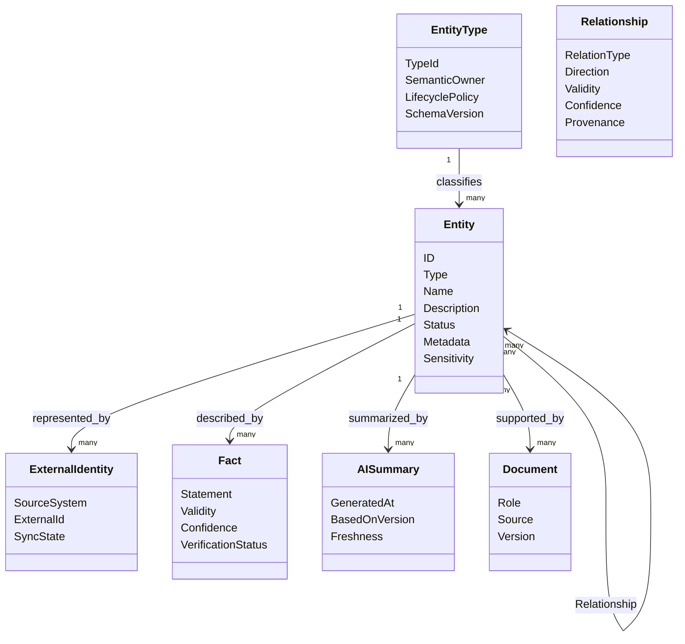

---

## 7. Work Item как обобщённая единица работы

### 7.1. Определение

Work Item — типизированный объект, который требует внимания, фиксации, координации, решения, ожидания, реакции или оценки. Он является частью Knowledge Graph и может быть связан с любым количеством Entity.

Work Item не обязательно означает обязательство что-либо сделать. Idea может не получить развития, Decision уже фиксирует выбор, Meeting может быть прошедшим событием, а Review оценивает результат.

### 7.2. Общие поля

| Группа | Поля и смысл |
|---|---|
| Идентичность | ID, тип, заголовок, описание |
| Ответственность | владелец, автор, участники, ответственная сторона |
| Состояние | статус, приоритет, срочность, здоровье, причина блокировки |
| Время | создано, обновлено, начало, срок, завершение, следующая проверка |
| Контекст | режим, домен, связанные Entity, документы и другие Work Items |
| Происхождение | канал, источник, исходное сообщение или событие |
| Управление | политика подтверждения, чувствительность, видимость |
| AI | Summary, Notes, классификация, уверенность и основания |
| История | переходы, комментарии, решения, изменения ответственных |

### 7.3. Общий жизненный цикл

Не все типы используют одинаковые статусы. Для межтиповой аналитики предлагаются мета-состояния:

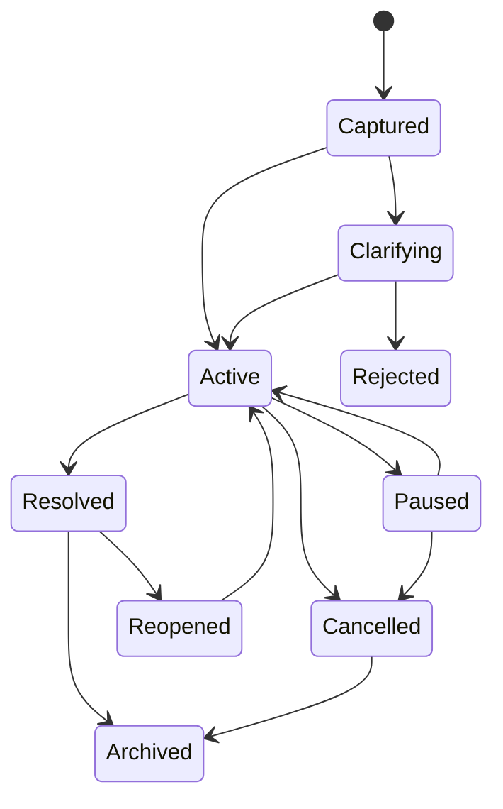

Тип определяет допустимые переходы и смысл завершения. Например, «Resolved» для Decision означает, что выбор зафиксирован, а не что его последствия выполнены.

### 7.4. Типы Work Item

#### 7.4.1. Task

**Назначение:** конкретное выполнимое действие с наблюдаемым критерием завершения.

| Аспект | Требование |
|---|---|
| Обязательные данные | ожидаемый результат, ответственный, следующий шаг |
| Срок | желателен; обязателен для срочных обязательств |
| Завершение | результат достигнут и проверен, а не только предпринята попытка |
| Связи | цель, проект, запрос, решение, человек, документ |
| Антипаттерн | «Разобраться с бизнесом» без результата и границ |

**Пример:** «До 16 августа согласовать финальный ассортимент заказа с владельцем магазина; результат — подтверждённый список позиций».

#### 7.4.2. Idea

**Назначение:** возможность или мысль без принятого обязательства реализации.

| Аспект | Требование |
|---|---|
| Обязательные данные | формулировка, источник, потенциальная ценность |
| Срок | обычно отсутствует; может быть дата пересмотра |
| Завершение | преобразована, отклонена, отложена или потеряла актуальность |
| Связи | проблема, цель, проект-кандидат, наблюдение |
| Антипаттерн | превращать каждую идею в просроченную Task |

**Пример:** «Проверить возможность объединять прогноз погоды и график поставок при планировании поездок между магазинами».

#### 7.4.3. Decision

**Назначение:** зафиксированный выбор между вариантами с автором, обоснованием и условиями пересмотра.

| Аспект | Требование |
|---|---|
| Обязательные данные | автор, решение, обоснование, дата, альтернативы, условия пересмотра |
| Срок | дата действия или пересмотра при необходимости |
| Завершение | решение принято; позднее может быть замещено или отменено |
| Связи | факты, документы, цели, последствия, заменённые решения |
| Антипаттерн | хранить решение только как комментарий в задаче |

Подробная модель приведена в главе 12.

#### 7.4.4. Reminder

**Назначение:** инициировать внимание в определённое время или при наступлении условия.

| Аспект | Требование |
|---|---|
| Обязательные данные | получатель, триггер, содержание, политика повторов |
| Завершение | доставлено, подтверждено или отменено согласно политике |
| Связи | Entity или Work Item, о котором напоминают |
| Антипаттерн | считать доставку напоминания выполнением связанной задачи |

**Пример:** «За 14 дней до окончания договора напомнить владельцу и приложить действующую версию договора».

#### 7.4.5. Waiting

**Назначение:** контролировать ожидаемый внешний результат, ответ, оплату, поставку или действие другой стороны.

| Аспект | Требование |
|---|---|
| Обязательные данные | что ожидается, от кого, с какого момента, ожидаемый срок, следующая проверка |
| Завершение | ожидаемый результат получен, ожидание отменено или преобразовано в проблему |
| Связи | инициирующий запрос, письмо, поставщик, заказ, Task |
| Антипаттерн | бессрочный статус «ждём» без контрольной даты |

Подробная модель приведена в главе 13.

#### 7.4.6. Problem

**Назначение:** описать нежелательное состояние, причина и способ устранения которого ещё не подтверждены.

| Аспект | Требование |
|---|---|
| Обязательные данные | наблюдаемый симптом, влияние, границы, источник обнаружения |
| Завершение | причина установлена и состояние устранено либо принято как ограничение |
| Связи | инциденты, гипотезы, решения, задачи и затронутые Entity |
| Антипаттерн | сразу формулировать решение как проблему и исключать альтернативы |

**Пример:** «По трём поставщикам не удаётся воспроизвести итоговую сумму заказа из исходных строк».

#### 7.4.7. Goal

**Назначение:** желаемое измеримое состояние, которое может порождать несколько инициатив и Work Items.

| Аспект | Требование |
|---|---|
| Обязательные данные | целевое состояние, метрика успеха, горизонт, владелец |
| Завершение | критерий достигнут, цель отменена или заменена |
| Связи | проекты, решения, метрики, риски и задачи |
| Антипаттерн | цель без способа определить достижение |

**Пример:** «Снизить долю просроченных ожиданий поставщиков до менее 5% к концу квартала».

#### 7.4.8. Meeting

**Назначение:** подготовить, провести и зафиксировать синхронное взаимодействие людей.

| Аспект | Требование |
|---|---|
| Обязательные данные | цель, участники, время или статус планирования, повестка |
| Завершение | встреча проведена или отменена; решения и действия извлечены отдельно |
| Связи | календарное событие, документы, решения, задачи, участники |
| Антипаттерн | считать заметки встречи достаточной фиксацией решений |

**Пример:** «Еженедельная встреча по закупке: отклонения, спорные позиции, решения владельца».

#### 7.4.9. Request

**Назначение:** формализовать просьбу к человеку, команде, системе или внешней стороне.

| Аспект | Требование |
|---|---|
| Обязательные данные | заявитель, адресат, предмет, ожидаемый результат |
| Завершение | выполнен, отклонён, отменён или истёк |
| Связи | Waiting после отправки, Approval до исполнения, Task для реализации |
| Антипаттерн | смешивать просьбу и обещание выполнить её |

**Пример:** «Запросить у поставщика обновлённые условия доставки во Владивосток».

#### 7.4.10. Approval

**Назначение:** получить явное полномочие на конкретное действие с неизменными существенными параметрами.

| Аспект | Требование |
|---|---|
| Обязательные данные | инициатор, утверждающий, действие, параметры, риск, срок действия |
| Завершение | одобрено, отклонено, истекло, отозвано или исполнено |
| Связи | запрос, решение, действие, аудиторская запись |
| Антипаттерн | общее «да» использовать для изменившегося действия |

**Пример:** «Подтвердить отправку поставщику заказа версии 7 на сумму, указанную в приложенном расчёте».

#### 7.4.11. Incident

**Назначение:** управлять незапланированным нарушением услуги, процесса, безопасности или доступности.

| Аспект | Требование |
|---|---|
| Обязательные данные | влияние, серьёзность, время обнаружения, затронутые объекты, координатор |
| Завершение | сервис восстановлен; постанализ может оставаться отдельным Review |
| Связи | сервисы, пользователи, события, проблемы, решения, корректирующие задачи |
| Антипаттерн | закрывать инцидент после временного обхода без фиксации остаточного риска |

**Пример:** «Arthur не получает новые письма Gmail в течение 40 минут; пользовательские ответы формируются без почтового контекста».

#### 7.4.12. Review

**Назначение:** оценить объект, решение, результат, период или набор изменений по явным критериям.

| Аспект | Требование |
|---|---|
| Обязательные данные | предмет, критерии, проверяющий, ожидаемый результат проверки |
| Завершение | выводы зафиксированы; последующие действия созданы отдельно |
| Связи | документ, проект, решение, поставка, код, период деятельности |
| Антипаттерн | превращать замечания в неструктурированный комментарий без решения о дальнейших действиях |

**Пример:** «Архитектурный аудит RFC-0001 с перечнем блокирующих и неблокирующих замечаний».

### 7.5. Преобразования между типами

Work Item не должен менять тип произвольно, потому что это разрушает историю. Предпочтительнее создавать связанный объект с отношением преобразования.

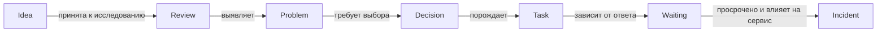

Допустима смена подтипа только как управляемая миграция с сохранением исходной классификации, автора и причины.

### 7.6. Work Item и Entity

Work Item логически специализирует Entity: он имеет идентичность, историю, документы и связи. Однако на уровне доменной модели полезно сохранить явную границу:

- Entity описывает «что существует»;
- Work Item описывает «что требует внимания и имеет процесс».

Это позволяет включать Work Item в общий граф, не заставляя все Entity иметь рабочие статусы.

---

## 8. Проект как Entity

### 8.1. Основное положение

Проект в Arthur OS не является контейнером задач. Это Entity, представляющая ограниченное во времени изменение с целью, владельцем, контекстом, заинтересованными сторонами, решениями, документами, рисками и результатами.

Задачи могут быть связаны с проектом, но не обязаны «находиться внутри» него. Одна задача может поддерживать несколько проектов, а один документ — одновременно быть основанием для проекта, решением и политикой организации.

### 8.2. Проектная модель

| Аспект | Содержание |
|---|---|
| Идентичность | название, цель, владелец, спонсор, домен |
| Обоснование | проблема или возможность, ожидаемая ценность |
| Границы | что входит и что не входит |
| Время | начало, целевой горизонт, контрольные точки, завершение |
| Состояние | proposed, active, on-hold, closing, completed, cancelled, archived |
| Результаты | измеримые outcomes и артефакты |
| Связи | люди, компании, магазины, документы, решения, цели, Work Items |
| Риски | угрозы, предпосылки и зависимости |
| История | изменение цели, границ, владельца и статуса |

### 8.3. Почему контейнерная модель вредна

Контейнерная модель создаёт искусственную иерархию:

- документ приходится дублировать между проектами;
- общая задача получает «главный» проект без предметного основания;
- решение теряется после архивирования контейнера;
- человек воспринимается как участник папки, а не носитель роли и ответственности;
- связи с письмами, поставщиками и календарём становятся вложениями вместо семантики;
- AI извлекает всё содержимое проекта вместо релевантного подграфа.

В entity-centric модели проект является одной из точек входа в граф, а не его владельцем.

### 8.4. Пример графа проекта

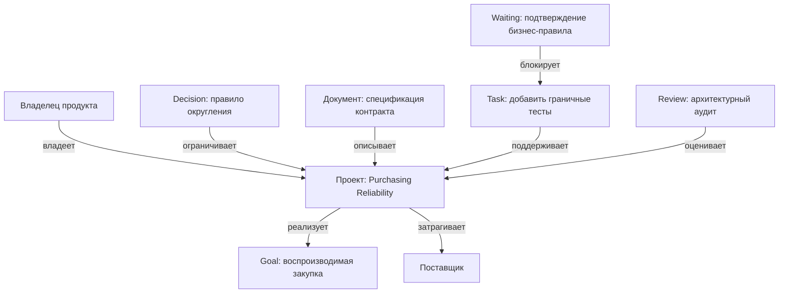

### 8.5. Завершение проекта

Завершение проекта не удаляет и не архивирует автоматически связанные объекты. При закрытии требуется:

1. определить достигнутые и недостигнутые результаты;
2. закрыть или переназначить активные Work Items;
3. зафиксировать финальные Decisions;
4. обновить статусы проектных фактов;
5. классифицировать документы как действующие, исторические или заменённые;
6. сохранить lessons learned как проверенное Knowledge или Review;
7. установить правила дальнейшего извлечения архивного контекста.

---

## 9. Knowledge Graph

### 9.1. Назначение

Knowledge Graph — логическая модель, в которой объекты и отношения имеют явную семантику, происхождение, время и права. «Граф» в этом RFC не означает обязательное использование графовой СУБД. Он задаёт способ мышления и контракты доступа независимо от физического хранения.

Граф нужен для вопросов, которые плохо выражаются папками и одиночными таблицами:

- какие решения действуют для этого поставщика и категории товара;
- какие ожидания связаны с письмами конкретной компании;
- кто участвует в проектах, затрагивающих магазин;
- какие документы подтверждают текущую политику;
- какие факты противоречат новой информации;
- почему Arthur включил конкретный объект в ответ.

### 9.2. Классы узлов

| Класс | Назначение | Примеры |
|---|---|---|
| Core Entity | Устойчивые объекты предметного мира | человек, компания, магазин, проект, товар |
| Work Item | Объекты внимания и процесса | Task, Decision, Waiting, Review |
| Content | Информационные артефакты | письмо, документ, сообщение, заметка |
| Fact | Атомарные утверждения | адрес магазина, условие поставки, роль человека |
| Event | Неизменяемое произошедшее событие | получено письмо, изменён статус, принято решение |
| External Reference | Связь с системой-источником | запись 1С, событие Calendar, issue GitHub |
| Policy | Правило доступа, поведения или домена | требование подтверждения, правило закупки |
| AI Artifact | Производный материал | summary, embedding, классификация, гипотеза |

### 9.3. Классы рёбер

Рёбра группируются не только по названию, но и по поведению:

| Класс | Примеры | Особые правила |
|---|---|---|
| Структурные | является_частью, принадлежит_бренду | Обычно высокая стабильность |
| Ролевые | работает_в, владеет, согласует | Имеют период действия |
| Процессные | блокирует, порождает, ожидается_от | Влияют на Work Item lifecycle |
| Доказательные | подтверждается, опровергается, основано_на | Обязательны для объяснимости |
| Исторические | заменяет, объединено_с, произошло_из | Не удаляются при актуализации |
| Контекстные | касается, упомянуто_в, релевантно_для | Низкая специфичность, требуют осторожного ранжирования |
| Доступа | видимо_роли, принадлежит_домену | Не должны обходиться графовым обходом |

### 9.4. Семантическая схема

Схема графа должна управляться реестрами:

- Entity Type Registry;
- Work Item Type Registry;
- Relationship Type Registry;
- Fact Predicate Registry;
- Status and Lifecycle Registry;
- Sensitivity Classification Registry;
- Source Authority Registry.

Каждая запись реестра имеет владельца, версию, описание, допустимые направления, кардинальность, временные правила, совместимость и процедуру вывода из употребления.

Без реестров граф быстро превращается в набор синонимов: `works_at`, `employee_of`, `сотрудник_магазина`, `назначен_в`. AI не должен свободно изобретать канонические типы связей.

### 9.5. Подграфы и границы

Логически граф разделяется по нескольким независимым осям:

- владелец данных;
- организация;
- домен: personal, health, travel, business, purchasing, finance и другие;
- чувствительность;
- источник;
- период;
- статус актуальности;
- среда: production, test, sandbox.

Это не обязательно физические базы. Однако каждое чтение должно учитывать пересечение всех применимых ограничений.

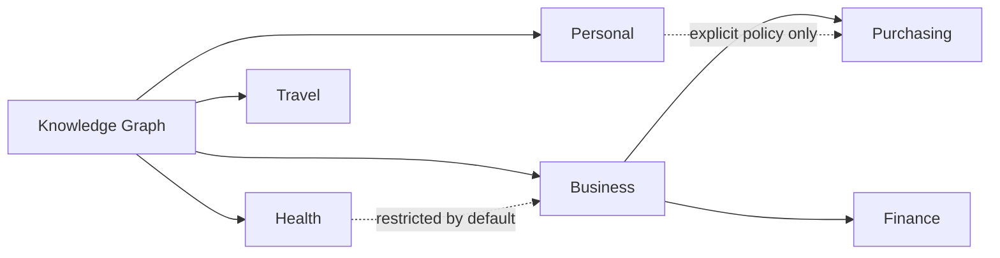

Пунктирные связи показывают потенциальную релевантность, но не разрешение. Например, поездка владельца может влиять на срок согласования закупки, однако Purchasing mode не должен получать медицинские или личные детали.

### 9.6. Происхождение и доказательства

Каждый факт и значимая связь должны указывать:

- первичный источник;
- точку внешнего объекта или документа;
- способ получения: синхронизация, ручной ввод, импорт, вывод;
- автора или сервис;
- время наблюдения;
- цепочку преобразований;
- статус проверки;
- возможность повторной проверки.

AI-вывод может ссылаться на факты, но не становится их источником. Если модель извлекла условие из договора, источником остаётся конкретная версия договора и фрагмент, а модель фиксируется как процесс извлечения.

### 9.7. Конфликты в графе

Конфликт не разрешается принципом «последняя запись победила», если источники имеют разный авторитет или относятся к разным периодам. Возможные состояния:

| Состояние | Смысл | Поведение Context Graph |
|---|---|---|
| Consistent | Источники согласованы | Использовать обычное ранжирование |
| Superseded | Старое значение явно заменено | Не считать текущим, сохранять для истории |
| Contradictory | Два актуальных утверждения конфликтуют | Включить конфликт и снизить уверенность |
| Unverified | Есть только неподтверждённое извлечение | Разрешить как гипотезу с маркировкой |
| Stale | Истёк срок свежести | Повторно проверить или предупредить |
| Authority conflict | Источники претендуют на каноничность | Эскалировать владельцу данных |

### 9.8. Графовая целостность

Нужны фоновые проверки:

- Entity без типа или владельца;
- отношения с удалёнными концами;
- недопустимые циклы для иерархических связей;
- две активные канонические связи там, где допустима одна;
- Waiting без следующей проверки;
- Decision без автора или основания;
- Facts без provenance;
- AI Summary, основанные на устаревших версиях;
- внешние идентичности, привязанные к нескольким несовместимым Entity;
- права дочернего объекта шире, чем разрешает политика владельца.

### 9.9. Что граф не должен делать

- становиться единственным физическим хранилищем всех бинарных документов;
- копировать полные данные внешних систем без необходимости;
- обходить доменные API для изменения бизнес-состояния;
- хранить секреты как обычные узлы;
- считать близость в графе эквивалентом разрешению;
- позволять модели напрямую создавать канонические типы и связи;
- заменять полнотекстовый, векторный или структурированный поиск.

---

## 10. Context Graph

### 10.1. Определение

Context Graph — эфемерный, версионированный, ограниченный по объёму и правам подграф, построенный для одного запроса, ответа, плана или действия. Он включает не только содержимое, но и причины выбора, оценки релевантности, исключения и ограничения.

Context Graph является центральным механизмом Arthur OS. Он должен предотвращать две симметричные ошибки:

- **недостаточный контекст**, приводящий к неверному или поверхностному ответу;
- **избыточный контекст**, приводящий к утечке данных, шуму, росту стоимости и ухудшению рассуждения.

### 10.2. Входы алгоритма

| Вход | Пример влияния |
|---|---|
| Пользователь и субъект действия | Определяет права и персонализацию |
| Запрос и намерение | Задаёт семантические якоря |
| Активный режим | Меняет источники, веса и форму ответа |
| Текущий диалог | Разрешает ссылки «этот поставщик» |
| Время и местоположение | Меняет актуальность календаря и поездок |
| Активные Entity | Явно открытый проект или магазин |
| Политика риска | Ограничивает сведения для внешнего действия |
| Бюджет контекста | Ограничивает число узлов, текст и глубину |
| Доступность источников | Определяет свежесть и деградацию |

### 10.3. Этапы построения

#### Этап 1. Нормализация запроса

Определяются язык, временные выражения, предполагаемые ссылки, требуемая форма результата и наличие действия. Неясные местоимения не разрешаются только по близости последних сообщений, если ошибка может иметь существенные последствия.

#### Этап 2. Идентификация субъекта и полномочий

До поиска данных определяется, от чьего имени выполняется запрос, в какой организации, роли и режиме. Политика доступа применяется до семантического расширения.

#### Этап 3. Классификация намерения и режима

Намерение может быть информационным, аналитическим, планирующим, изменяющим или подтверждающим. Режим выбирается явно, по устойчивому контексту или с запросом уточнения при конфликте.

#### Этап 4. Извлечение якорей

Якорями становятся:

- явно упомянутые Entity;
- активный объект интерфейса;
- связанные Work Items текущего диалога;
- дата или период;
- доменный термин с однозначным соответствием;
- источник, на который ссылается пользователь.

#### Этап 5. Разрешение идентичности

Имена сопоставляются с Entity. При нескольких кандидатах учитываются режим, недавность, отношения и полномочия. Неустранимая неоднозначность сохраняется и при существенном риске требует уточнения.

#### Этап 6. Структурированное извлечение

Получаются прямые факты, активные Work Items, действующие Decisions, календарные ограничения и внешние статусы. Этот слой имеет приоритет над семантически похожими документами.

#### Этап 7. Графовое расширение

От якорей выполняется ограниченный обход по разрешённым типам рёбер. Для каждого режима задаются максимальная глубина, разрешённые отношения и штрафы. Например, Purchasing mode предпочитает поставщика, товар, магазин, заказ, Decision и Waiting, но не расширяется к личным контактам сотрудника.

#### Этап 8. Поиск содержимого

Полнотекстовый и семантический поиск добавляет документы, письма и фрагменты. Результаты проходят дедупликацию, проверку прав и привязку к Entity.

#### Этап 9. Временная и авторитетная фильтрация

Удаляются значения вне запрошенного периода; актуальные и канонические источники получают приоритет. Конфликты не скрываются.

#### Этап 10. Оценка релевантности

Оценка является комбинацией, а не одним vector similarity score:

| Фактор | Смысл |
|---|---|
| Intent match | Насколько объект отвечает типу вопроса |
| Entity proximity | Насколько близок к якорям по разрешённым связям |
| Temporal relevance | Актуален ли в нужном периоде |
| Source authority | Насколько источник каноничен для поля |
| Decision impact | Ограничивает ли действующее решение ответ |
| Work urgency | Есть ли срок, просрочка или блокировка |
| Mode relevance | Нужен ли объект в выбранном режиме |
| Evidence quality | Есть ли проверяемое основание |
| Sensitivity cost | Оправдано ли раскрытие чувствительных данных |
| Redundancy penalty | Дублирует ли объект уже выбранное содержание |

Формула и веса являются политикой и подлежат версии, тестированию и аудиту.

#### Этап 11. Сборка бюджетированного подграфа

Сначала резервируется место для:

1. прямых якорей;
2. действующих ограничивающих Decisions;
3. критичных конфликтов и рисков;
4. канонических Facts;
5. обязательств и Waiting;
6. доказательных фрагментов;
7. фоновых сведений.

Обрезка должна происходить по смысловым единицам, а не по произвольной длине текста.

#### Этап 12. Проверка безопасности и достаточности

До передачи модели выполняются:

- повторная авторизация каждого узла;
- поиск пересечений доменов;
- исключение секретов и запрещённых полей;
- проверка минимальной достаточности;
- оценка конфликтов;
- фиксация отсутствующих источников;
- выбор безопасной стратегии деградации.

#### Этап 13. Материализация для потребителя

Один Context Graph может иметь разные представления:

- компактное для модели;
- доказательное для интерфейса;
- структурированное для доменного навыка;
- диагностическое для аудита;
- обезличенное для метрик качества.

#### Этап 14. Журналирование решения о контексте

Сохраняются версия политики, якоря, включённые и исключённые классы данных, причины включения, источники, размеры и предупреждения. Полное чувствительное содержимое в техническом логе не дублируется.

### 10.4. Последовательность запроса

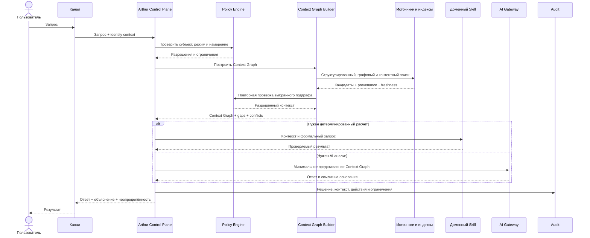

### 10.5. Пример Context Graph

Запрос: «Что мешает завершить заказ для магазина на Русской и кому нужно напомнить?»

| Включённый объект | Причина | Источник | Роль в ответе |
|---|---|---|---|
| Магазин «Русская» | Прямой якорь | Реестр магазинов | Ограничивает область |
| Текущий проект закупки | Активно связан с магазином | Arthur | Определяет рабочий контекст |
| Заказ версии 7 | Последний активный заказ | Purchasing skill | Объект анализа |
| Waiting: ответ поставщика | Блокирует заказ и просрочен | Gmail + Arthur | Причина задержки |
| Поставщик «Альфа» | Адресат Waiting | Entity Graph | Получатель напоминания |
| Decision об исключении категории | Действует для магазина | Decision Registry | Объясняет состав заказа |
| Последнее письмо | Доказательство отправленного запроса | Gmail | Подтверждает начало ожидания |

Не включаются личные встречи владельца, медицинские данные, другие магазины и архивные письма поставщика, если они не объясняют текущую блокировку.

### 10.6. Объяснимость контекста

Для каждого существенного элемента Arthur должен уметь представить:

- прямую или косвенную связь с запросом;
- путь от якоря до объекта;
- источник и свежесть;
- причину приоритета;
- применённую политику доступа;
- предупреждение об ограничениях.

Фраза «AI посчитал релевантным» недостаточна для enterprise-аудита.

### 10.7. Кеширование

Кешировать можно:

- результаты разрешения идентичности;
- заранее рассчитанные соседства;
- embeddings и полнотекстовые индексы;
- стабильные режимные профили;
- AI Summary;
- подграфы часто используемых Entity.

Нельзя слепо повторно использовать готовый Context Graph между пользователями или запросами. Ключ кеша обязан учитывать права, режим, версию данных, время и намерение. Высокорисковые действия требуют свежей проверки канонического источника.

### 10.8. Деградация

| Сбой | Безопасное поведение |
|---|---|
| Недоступен внешний источник | Показать время последней синхронизации; не выдавать кеш за текущую истину |
| Не работает vector search | Использовать структурированный и полнотекстовый поиск |
| Недоступна AI-модель | Вернуть детерминированную сводку или объяснить ограничение |
| Слишком большой граф | Сузить намерение, предложить уточнение, показать ограничения |
| Конфликт фактов | Показать конфликт и источники; не выбирать молча |
| Неоднозначная Entity | Запросить уточнение при существенном риске |
| Нет достаточных доказательств | Ответить «недостаточно данных» с перечнем пробелов |

### 10.9. Метрики Context Graph

- доля ответов с корректным прямым якорем;
- recall обязательных Decisions и Waiting;
- число нерелевантных узлов;
- доля ответов с устаревшим источником;
- контекстный бюджет по режимам;
- время сборки по стадиям;
- частота междоменных отказов;
- доля уточнений из-за неоднозначности;
- объяснимость включения;
- качество ответа при искусственном удалении источника.

---

## 11. Архитектура памяти

### 11.1. Принцип

Память Arthur — не единый журнал сообщений и не бесконечное хранилище «всего известного». Это набор управляемых категорий с разными владельцами, сроками, источниками, чувствительностью и правилами извлечения.

### 11.2. Категории памяти

| Категория | Содержание | Типичная свежесть | Основной риск |
|---|---|---|---|
| Profile | идентичность, локаль, часовой пояс, устойчивые роли | Долгая | неверная персонализация |
| Knowledge | политики, инструкции, справочные материалы | Версионная | использование устаревшей политики |
| Facts | проверенные утверждения об Entity | От минут до лет | конфликт источников |
| Preferences | предпочтения пользователя и организации | Изменяемая | принять ситуативный выбор за правило |
| History | события и изменения | Неизменяемая | чрезмерный объём и приватность |
| Work Items | обязательства, идеи, ожидания, проблемы и другое | Оперативная | потеря жизненного цикла |
| Decisions | принятые выборы и причины | Долгая, с пересмотром | забытое или противоречивое решение |
| Calendar | события, доступность и временные обязательства | Высокая | рассинхронизация |
| Mail | письма, треды, участники, извлечённые обязательства | Высокая | утечка и ошибочная интерпретация |
| Documents | версии, содержание, подписи, ссылки и роли | Версионная | неверная версия или права |

### 11.3. Profile

Profile хранит только устойчивые сведения, необходимые многим режимам: имя, локаль, часовой пояс, каналы, роли, организации и общие настройки доступности. Детальные личные предпочтения не должны превращать профиль в неструктурированный контейнер.

Смена роли или организации должна сохранять историю. Профиль пользователя отделяется от идентичности сотрудника, контакта или автора в конкретной системе.

### 11.4. Knowledge

Knowledge — курируемое знание, которое можно применять повторно:

- бизнес-политики;
- архитектурные решения;
- инструкции;
- определения метрик;
- правила закупки;
- утверждённые шаблоны;
- справочники.

Документ становится активным Knowledge только после классификации, назначения владельца, версии и области применимости. Простое наличие файла не означает его нормативность.

### 11.5. Facts

Fact должен отвечать как минимум на вопросы:

- что утверждается;
- о какой Entity;
- кем или чем подтверждено;
- когда действительно;
- когда наблюдалось;
- насколько уверенно;
- есть ли конфликт;
- кто имеет право видеть;
- какое поле или источник является каноническим.

Факты желательно делать достаточно атомарными для независимой актуализации, но не настолько мелкими, чтобы граф стал неуправляемым.

### 11.6. Preferences

Предпочтение может быть:

- явным: пользователь сказал «предпочитаю утренние рейсы»;
- наблюдаемым: выбор повторился несколько раз;
- условным: «для командировок — только возвратные тарифы»;
- организационным: правило компании;
- временным: предпочтение на конкретную поездку.

Наблюдаемое предпочтение остаётся гипотезой до подтверждения или достаточно строгой политики обучения. Оно не должно безусловно инициировать финансовое действие.

### 11.7. History

History содержит события, а не только снимки. Для пользователя должны быть доступны понятные представления: «что изменилось», «кто изменил», «почему», «что было до», «какой источник». Срок хранения зависит от категории и законодательства; бессрочное хранение по умолчанию не предлагается.

### 11.8. Work Items и Decisions

Work Items хранят оперативную координацию. Decisions выделяются в отдельную категорию памяти, хотя концептуально являются Work Item, потому что они влияют на будущие ответы и нуждаются в более долгом сроке и строгом извлечении.

### 11.9. Calendar

Calendar memory различает:

- внешнее событие источника;
- нормализованную временную проекцию;
- Meeting как Work Item;
- занятость без раскрытия деталей;
- напоминания;
- предположения о времени на дорогу;
- пользовательские ограничения.

Arthur не должен считать событие актуальным после неуспешной синхронизации без маркировки свежести.

### 11.10. Mail

Mail memory не обязана копировать весь почтовый ящик. Возможны уровни:

- метаданные треда;
- участники и связанные Entity;
- извлечённые обязательства;
- безопасный индекс;
- ссылки на оригинал;
- минимальные фрагменты для доказательств;
- полная локальная копия только при отдельной политике.

Извлечение Request или Waiting из письма является предложением до подтверждения, если автоматизация не имеет явно утверждённого правила.

### 11.11. Documents

Для документа критичны:

- идентичность документа и его версий;
- источник и владелец;
- тип: договор, политика, отчёт, спецификация, заметка;
- действующая версия;
- подписи и юридический статус;
- связанные Entity и Decisions;
- уровень доступа;
- индексируемые и запрещённые части;
- срок хранения.

AI Summary документа никогда не заменяет оригинал в юридически или финансово значимом действии.

### 11.12. Жизненный цикл памяти

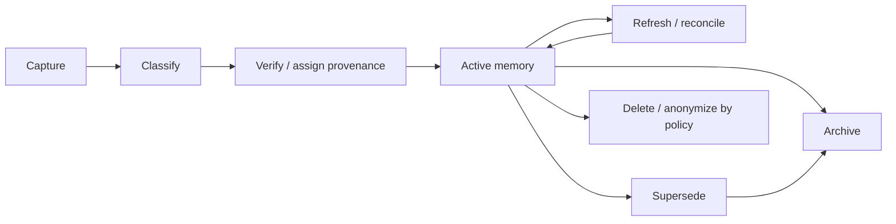

### 11.13. Политика записи из диалога

Не каждое сообщение сохраняется как постоянная память. Кандидат на запись оценивается по:

- будущей полезности;
- устойчивости;
- явности;
- источнику;
- чувствительности;
- возможности исправления;
- дублированию;
- согласию пользователя;
- сроку хранения.

Фраза «сегодня лучше после пяти» не должна становиться постоянным предпочтением. Фраза «всегда показывай суммы закупки без НДС и явно указывай это» может стать preference или policy после подтверждения области действия.

---

## 12. Decision как самостоятельный Work Item

### 12.1. Зачем выделять Decision

Решение — один из самых ценных элементов памяти, поскольку оно сокращает повторные обсуждения и ограничивает последующие планы. Хранение решения как комментария или закрытой задачи не позволяет надёжно определить автора, область действия, основания и актуальность.

### 12.2. Обязательный контракт

| Поле | Требование |
|---|---|
| Автор | Человек или уполномоченный субъект, принявший решение |
| Формулировка | Однозначный выбранный вариант |
| Обоснование | Почему выбран этот вариант |
| Дата | Время принятия и, при необходимости, начало действия |
| Альтернативы | Рассмотренные варианты и причины отклонения |
| Условия пересмотра | События, метрики, даты или изменения предпосылок |
| История | версии, комментарии, подтверждения, замещения |
| Область действия | Entity, проекты, режимы, организация, временной период |
| Основания | Facts, документы, встречи, результаты анализа |
| Статус | proposed, active, superseded, reversed, expired |
| Последствия | созданные Tasks, Policies, Approvals и уведомления |

### 12.3. Жизненный цикл Decision

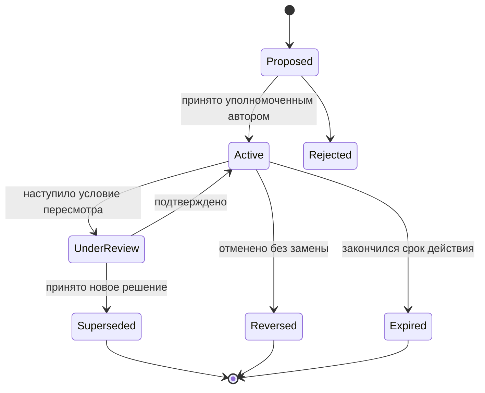

### 12.4. Правила извлечения Decision

Context Graph должен повышать приоритет решения, если оно:

- активно;
- относится к прямой Entity или проекту;
- ограничивает допустимое действие;
- принято уполномоченным автором;
- не потеряло силу;
- имеет подтверждённые основания;
- не конфликтует с более новым решением.

Если условия пересмотра наступили, Arthur не должен применять решение как бесспорное. Он сообщает о необходимости Review.

### 12.5. Пример

| Поле | Значение примера |
|---|---|
| Решение | Не отправлять поставщику итоговый заказ без отдельного подтверждения владельца |
| Автор | Владелец бизнеса |
| Обоснование | Заказ влияет на денежные обязательства и может измениться после проверки спорных позиций |
| Дата | 12 августа 2026 года |
| Альтернативы | Автоматическая отправка; подтверждение только при превышении суммы |
| Условия пересмотра | Появление формализованного лимита, идемпотентного процесса и подтверждённой точности |
| Последствия | Любая отправка создаёт Approval; анализ остаётся read-only |
| История | Не изменяется задним числом; новое решение должно его заместить |

---

## 13. Waiting как самостоятельный Work Item

### 13.1. Семантика

Waiting представляет внешний или асинхронный результат, без которого нельзя считать процесс завершённым. Он отличается от Task тем, что текущий владелец не контролирует непосредственное выполнение, но отвечает за наблюдение и эскалацию.

Типовые примеры:

- ждём поставщика;
- ждём разработчика;
- ждём ответ;
- ждём оплату;
- ждём доставку;
- ждём подтверждение владельца;
- ждём восстановления внешнего сервиса.

### 13.2. Обязательный контракт

| Поле | Назначение |
|---|---|
| Ожидаемый результат | Что именно должно произойти |
| Ожидается от | Человек, компания, команда или система |
| Инициатор | Кто начал ожидание |
| Начало ожидания | С какого момента идёт отсчёт |
| Ожидаемый срок | Обещанный или нормативный срок |
| Следующая проверка | Когда Arthur обязан проверить состояние |
| Канал проверки | Gmail, Telegram, 1С, GitHub, ручное подтверждение и другое |
| Политика напоминания | Частота, адресаты, тихие часы, предел повторов |
| Эскалация | Когда и кому сообщать о нарушении |
| Доказательство | Письмо, запрос, платёж, накладная, issue |
| Влияние | Что блокируется и насколько критично |

### 13.3. Состояния

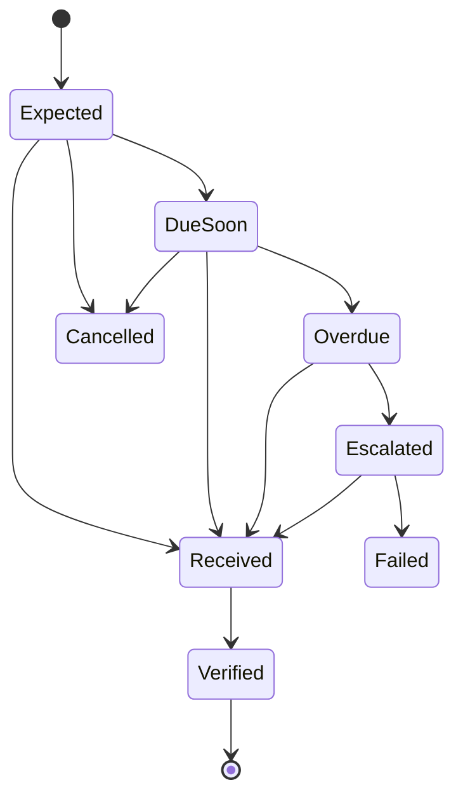

Получение сообщения не всегда означает получение результата. Например, ответ «вернёмся позже» обновляет ожидание и может изменить срок, но не завершает его.

### 13.4. Контроль сроков Arthur

Arthur должен:

1. планировать следующую проверку при создании Waiting;
2. сопоставлять входящие события с ожидаемым результатом;
3. проверять не только наличие ответа, но и его соответствие;
4. уведомлять до срока, если риск высок;
5. эскалировать просрочку по политике;
6. прекращать повторы после достижения лимита или ручной паузы;
7. связывать результат с исходным Request и последующими Tasks;
8. сохранять фактическое время ожидания для аналитики;
9. учитывать рабочие дни, часовые пояса и обещания сторон;
10. не отправлять внешние напоминания без разрешения, если они меняют коммуникацию.

### 13.5. Пример цепочки

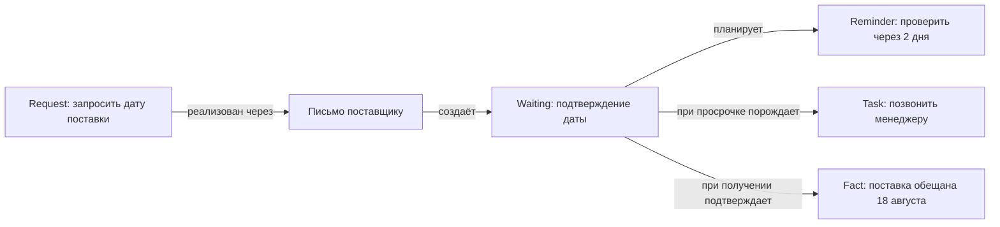

---

## 14. Режимы Arthur OS

### 14.1. Общая модель режима

Режим задаёт профиль Context Graph и поведения. Он включает:

- типичные намерения;
- приоритетные Entity и отношения;
- допустимые источники;
- уровень чувствительности;
- доступные Skills;
- пороги подтверждения;
- стиль и детализацию ответа;
- временной горизонт;
- инициативные проверки;
- метрики качества.

Режим не должен автоматически менять права пользователя. Он только сужает уже разрешённое пространство.

### 14.2. Director

**Назначение:** целостный обзор бизнеса, приоритетов, рисков и решений владельца.

| Аспект | Профиль |
|---|---|
| Якоря | компании, магазины, проекты, Goals, Decisions, Incidents |
| Горизонт | сегодня, неделя, месяц, квартал |
| Главные связи | владеет, влияет_на, блокирует, требует_решения |
| Контекст | агрегаты и исключения вместо сырых строк |
| AI-роль | сравнение вариантов, выявление противоречий, подготовка решений |
| Риск | чрезмерное объединение личных и бизнес-данных |

Director mode не получает unrestricted access ко всему графу. Медицинские и частные данные исключаются, если нет явной необходимости и политики.

### 14.3. Personal

**Назначение:** личные обязательства, дом, автомобиль, документы, отношения, бытовые и долгосрочные планы.

| Аспект | Профиль |
|---|---|
| Якоря | пользователь, семья, дом, автомобиль, личные Goals и Work Items |
| Источники | личный календарь, разрешённая почта, документы, профиль |
| Приоритет | приватность, тихие часы, минимальная инициативность |
| Исключения | бизнес-финансы и данные сотрудников без прямой связи |
| Риск | случайное раскрытие в рабочих каналах |

### 14.4. Purchasing

**Назначение:** закупочные анализы, поставщики, товары, магазины, заказы, ожидания и решения владельца.

| Аспект | Профиль |
|---|---|
| Якоря | магазин, поставщик, товар, категория, заказ |
| Решения | ассортиментные, финансовые и исключения владельца |
| Work Items | Approval, Waiting, Problem, Review, Task |
| Skills | детерминированный Purchasing Agent и read-only адаптеры по умолчанию |
| Риск | LLM-изменение количеств или отправка без подтверждения |

Детерминированные расчёты выполняются Purchasing Agent. AI объясняет, сравнивает и отмечает неопределённость, но не подменяет формулы.

### 14.5. Development

**Назначение:** архитектура, репозитории, изменения, инциденты, ревью и решения разработки.

| Аспект | Профиль |
|---|---|
| Якоря | репозиторий, проект, RFC, issue, pull request, сервис |
| Источники | GitHub, документация, CI, наблюдаемость |
| Work Items | Problem, Decision, Task, Review, Incident |
| Контекст | текущая ветка, связанные решения, затронутые контракты |
| Риск | выполнение изменений вне согласованной области |

### 14.6. Travel

**Назначение:** поездки, маршруты, бронирования, документы, календарные ограничения и предпочтения.

| Аспект | Профиль |
|---|---|
| Якоря | поездка, участники, города, даты, бронирования |
| Источники | Calendar, Mail, документы, разрешённые внешние сервисы |
| Preferences | время вылета, возвратность, багаж, бюджет, лояльность |
| Work Items | Request, Approval, Waiting, Reminder, Meeting |
| Риск | покупка, персональные документы, неверный часовой пояс |

Платежи и невозвратные бронирования всегда требуют отдельного Approval с актуальными параметрами.

### 14.7. Marketing

**Назначение:** бренды, кампании, контент, каналы, аудитории, результаты и согласования.

| Аспект | Профиль |
|---|---|
| Якоря | бренд, кампания, контент-объект, магазин, аудитория |
| Источники | документы, маркетинговые платформы, аналитика, календарь |
| Work Items | Idea, Goal, Review, Approval, Task |
| Контекст | брендовые решения, календарь, прошлые результаты |
| Риск | публикация без согласования, смешение брендов, персональные данные |

### 14.8. Health

**Назначение:** личные медицинские документы, приёмы, напоминания и вопросы здоровья.

| Аспект | Профиль |
|---|---|
| Якоря | пользователь, медицинский документ, врач, приём |
| Политика | restricted по умолчанию, минимальная выдача |
| Work Items | Meeting, Reminder, Waiting, Request |
| AI-роль | организация и объяснение источников, но не диагноз |
| Риск | медицинская ошибка и утечка особо чувствительных данных |

Health mode требует отдельной модели угроз, более строгого хранения и явных дисклеймеров. Его реализация может быть отложена до зрелости базовой платформы.

### 14.9. Переключение и смешанные запросы

Смешанный запрос может потребовать несколько режимных представлений, например: «Перенеси встречу с поставщиком, потому что у меня врач». Arthur должен:

1. прочитать медицинский календарь только в объёме занятости;
2. не раскрывать поставщику причину;
3. применить Travel/Personal или Health privacy policy;
4. применить Purchasing/Director коммуникационную политику;
5. запросить Approval на изменение события и внешнее сообщение;
6. записать аудит без лишних медицинских деталей.

---

## 15. AI-слой и оркестрация

### 15.1. Роль AI

AI применяется там, где нужны понимание языка, суммаризация, классификация, извлечение кандидатов, сравнение альтернатив и формирование объяснения. AI не является:

- системой идентичности;
- источником полномочий;
- каноническим хранилищем;
- исполнителем детерминированных бизнес-формул;
- источником фактов без доказательств;
- владельцем транзакции;
- заменой подтверждения пользователя.

### 15.2. Разделение управляющих функций

| Компонент | Ответственность |
|---|---|
| Intent/Mode Resolver | Классификация цели и режима с оценкой уверенности |
| Context Graph Builder | Отбор минимального доказательного контекста |
| Planner | Формирование плана из разрешённых способностей |
| Policy Engine | Авторизация, ограничения, требования подтверждения |
| Skill Registry | Реальные доступные операции и их свойства |
| Execution Coordinator | Зависимости, повторы, тайм-ауты, идемпотентность |
| AI Gateway | Выбор модели, политика данных, fallback, учёт стоимости |
| Response Composer | Ответ, доказательства, неопределённость, следующие шаги |
| Audit | Воспроизводимая запись решения и действия |

### 15.3. Модельно-независимая маршрутизация

OmniRoute рассматривается как архитектурная точка абстракции между Arthur и моделями. Политика может выбирать:

- быструю модель для классификации;
- reasoning-модель для сложного анализа;
- специализированную модель для документов;
- локальную модель для чувствительных данных;
- резервную модель при отказе;
- детерминированный путь без модели.

Маршрутизация определяется классом данных, риском, требуемым качеством, задержкой, стоимостью и доступностью, а не только длиной запроса.

### 15.4. Доверительные зоны AI

| Зона | Данные | Допустимые модели |
|---|---|---|
| Public/Normal | общие и обезличенные | утверждённые cloud или local |
| Business Sensitive | внутренние бизнес-данные | провайдеры с нужными гарантиями или local |
| Personal Sensitive | личные документы и переписка | минимизированный cloud либо local по политике |
| Restricted | здоровье, финансы, особые персональные данные | преимущественно local/isolated; отдельное решение |
| Secrets | ключи, пароли, токены | не передаются модели |

### 15.5. Grounding и проверка ответа

Существенный ответ должен разделять:

- **факты** — со ссылками на источники;
- **вычисления** — с указанием детерминированного сервиса;
- **решения** — с автором и датой;
- **допущения** — явно;
- **гипотезы AI** — явно;
- **рекомендации** — с основаниями и рисками;
- **пробелы** — какие данные отсутствуют или устарели.

### 15.6. Защита от prompt injection

Письма, документы, страницы и сообщения считаются недоверенным содержимым. Инструкция внутри документа не может изменить полномочия Arthur. Требуются:

- маркировка происхождения контента;
- отделение системных политик от данных;
- запрет выполнения инструкций из источника без интерпретации;
- ограниченный набор инструментов;
- подтверждение внешних действий;
- детектирование попыток эксфильтрации;
- тесты на междоменное раскрытие;
- журналирование блокировок.

### 15.7. Оценка качества AI

Нужны наборы сценариев по режимам:

- правильность выбора Entity;
- полнота действующих Decisions;
- обнаружение просроченного Waiting;
- отсутствие выдуманных возможностей;
- корректность отказа;
- сохранение приватности;
- устойчивость к конфликтам источников;
- отсутствие изменений детерминированных результатов;
- соответствие ссылок утверждениям;
- стабильность при смене модели.

---

## 16. Интеграционная архитектура

### 16.1. Общие принципы

Интеграция подключается через архитектурную точку, которая определяет:

- владельца данных;
- направление обмена;
- читаемые и изменяемые объекты;
- сопоставление внешней и внутренней идентичности;
- модель свежести;
- дедупликацию и идемпотентность;
- права и секреты;
- обработку удаления;
- аудит;
- деградацию;
- подтверждение внешних действий.

Адаптер не должен содержать доменную политику, которая принадлежит Arthur Core или специализированному Skill.

### 16.2. Логическая схема подключений

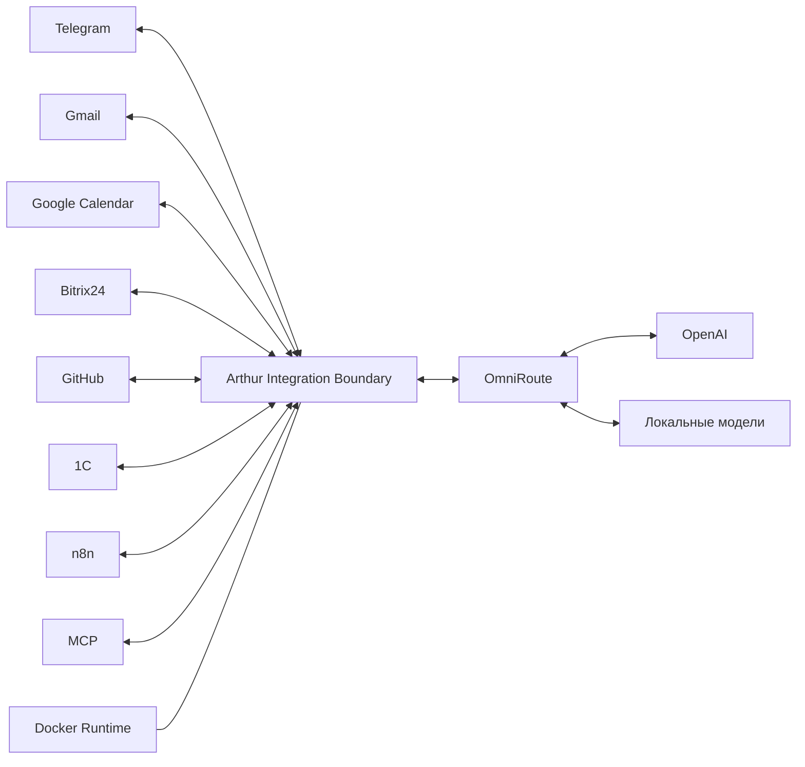

### 16.3. Telegram

Telegram — канал, а не место бизнес-логики. Точка подключения должна обеспечивать:

- сопоставление Telegram identity с субъектом Arthur;
- проверку чатов, участников и контекста пересылки;
- безопасное представление подтверждений;
- защиту от повторной доставки;
- ограничения на чувствительные ответы;
- связь сообщения с Request, Work Item или Entity;
- возможность показать пользователю источник и действие.

Групповой чат требует отдельной политики видимости: наличие владельца в чате не разрешает публиковать его личные данные.

### 16.4. Gmail

Архитектурная точка Gmail предоставляет треды, сообщения, адреса, метки, вложения и изменения. Arthur добавляет:

- разрешение участников в Entity;
- извлечение кандидатов Request и Waiting;
- связь с проектами, поставщиками и документами;
- контроль отправки и черновиков;
- freshness watermark;
- политику хранения содержимого.

Gmail остаётся источником истины для состояния почтового сообщения, если иное не утверждено.

### 16.5. Google Calendar

Точка подключения предоставляет события, участников, календари, занятость и изменения. Arthur связывает календарное событие с Meeting, поездкой, проектом или Reminder.

Критичны:

- часовые пояса;
- повторяющиеся события;
- отмены;
- приватные поля;
- доступность без раскрытия содержания;
- идемпотентное изменение;
- подтверждение приглашений и переносов.

### 16.6. Bitrix24

Bitrix24 рассматривается как внешняя бизнес-платформа и возможный источник истины для CRM-объектов, сделок, компаний, контактов и задач, но не как базовая модель Arthur. Точка подключения должна:

- сопоставлять CRM entities с Entity Arthur;
- сохранять внешние ID и версии;
- различать CRM Task и Work Item Arthur;
- транслировать только утверждённые статусы и события;
- не копировать процессные ограничения Bitrix24 в ядро;
- поддерживать ownership по полям.

### 16.7. GitHub

GitHub является источником для репозиториев, issues, pull requests, reviews, releases, checks и событий разработки. Arthur связывает их с Project, Decision, Review, Incident и документами.

Merge или изменение репозитория является внешним действием с отдельной политикой. Состояние GitHub не должно реконструироваться только из сообщений чата.

### 16.8. 1С

1С может быть каноническим источником для товаров, контрагентов, остатков, документов и финансово-учётных состояний. Интеграционная граница обязана:

- сохранять точность и единицы;
- не менять вычисления через AI;
- различать справочники и документы;
- учитывать период и организацию;
- поддерживать пакетную синхронизацию и контроль полноты;
- требовать подтверждение для бизнес-изменений;
- фиксировать reconcile-отчёты.

### 16.9. Docker

Docker — среда упаковки и изоляции, а не семантическая интеграция. Архитектура должна предусматривать:

- отдельные доверительные зоны;
- минимальные сетевые маршруты;
- секреты вне образов;
- health и readiness;
- контролируемые версии;
- резервное копирование состояний;
- независимое отключение навыков;
- воспроизводимость сред.

### 16.10. n8n

n8n используется для расписаний, триггеров, транспорта и операционных уведомлений. Он не должен владеть:

- формулами закупки;
- моделью Entity;
- политикой типов Work Item;
- решением о доступе;
- содержанием Context Graph;
- необъяснимыми крупными блоками бизнес-логики.

Событие n8n должно приходить в Arthur как аутентифицированный запрос с correlation identity, а результат — возвращаться как формальный статус.

### 16.11. OmniRoute

OmniRoute — точка абстракции и маршрутизации AI. Arthur передаёт ему уже минимизированный контекст и policy labels. OmniRoute не должен самостоятельно расширять доступ к Knowledge Graph или получать секреты интеграций.

### 16.12. OpenAI и локальные модели

OpenAI и локальные модели подключаются как классы вычислительных провайдеров через AI Gateway. Для каждого класса определяются:

- допустимая чувствительность;
- сохранение данных;
- доступные способности;
- latency и cost objectives;
- оценённые сценарии;
- fallback;
- требования к журналированию;
- ограничения юрисдикции.

Локальность сама по себе не гарантирует безопасность: важны контроль модели, окружения, логов, обновлений и доступа к устройству.

### 16.13. MCP

MCP рассматривается как стандартизированная точка обнаружения и вызова инструментов или ресурсов. Он не заменяет внутреннюю авторизацию Arthur. Каждый MCP server должен быть обёрнут политикой:

- доверенный владелец;
- список способностей;
- read/write классификация;
- допустимые домены;
- риск и подтверждение;
- лимиты данных;
- аудит вызовов;
- изоляция недоверенных ответов.

### 16.14. Синхронизация и источник истины

| Стратегия | Применение | Риск |
|---|---|---|
| Live read-through | Высокорисковая проверка текущего статуса | Зависимость от доступности |
| Event-driven projection | Оперативные изменения и уведомления | Потери, дубли, порядок событий |
| Scheduled reconciliation | Проверка полноты и восстановление | Задержка |
| Manual import | Разовые исторические наборы | Происхождение и качество |
| Cached snapshot | Быстрые обзоры | Устаревание |

Для критичных действий рекомендуется сочетание event-driven projection с периодической сверкой и live-проверкой перед исполнением.

---

## 17. Данные, хранение и поиск

### 17.1. Логическая и физическая модели

Логический Knowledge Graph не требует единственного физического движка. Разные нагрузки имеют разные свойства:

- транзакционные обновления Entity и Work Items;
- обход связей;
- полнотекстовый поиск;
- семантический поиск;
- хранение документов и вложений;
- аналитические агрегаты;
- append-only аудит;
- временные ряды наблюдаемости.

Попытка поместить всё в один универсальный механизм может упростить старт, но усложнить масштабирование, резервное копирование и контроль консистентности.

### 17.2. Варианты хранения

| Вариант | Состав | Сильные стороны | Ограничения | Уместность |
|---|---|---|---|---|
| A. Реляционное ядро | Реляционное хранилище + таблицы связей + полнотекстовый индекс | Простота эксплуатации, транзакции, зрелость | Сложные обходы и эволюция графовой схемы | Предпочтительно для ранней стадии |
| B. Реляционное ядро с поисковыми проекциями | Реляционное ядро + search/vector index + object storage | Разделение транзакций и retrieval | Нужна синхронизация проекций | Вероятный целевой минимум |
| C. Полиглот с graph store | Реляционное ядро + графовая БД + search/vector + object storage | Эффективные сложные связи | Операционная сложность и согласованность | После доказанной нагрузки |
| D. Event-sourced core | События как канон + материализованные представления | Полная история и воспроизводимость | Сложность разработки, миграций и понимания | Для отдельных доменов, не обязательно всей системы |
| E. Document-centric | Документное хранилище + ссылки + поиск | Гибкость схемы | Слабее ограничения и каноничность | Для контента, не для всего ядра |

### 17.3. Предлагаемая стартовая позиция

Для аудита предлагается считать базовой гипотезой вариант B:

- транзакционное ядро для Entity, Work Items, Decisions, Waiting, permissions и provenance;
- object storage для бинарных документов;
- полнотекстовая и семантическая поисковая проекция;
- графовая семантика реализуется через формальный relation model;
- специализированный graph store вводится только после измерения запросов и ограничений.

Это предложение не является окончательным выбором технологии.

### 17.4. Источник истины по атрибутам

Source of Truth назначается не только Entity, но иногда отдельному полю:

| Entity | Атрибут | Возможный канонический источник | Роль Arthur |
|---|---|---|---|
| Товар | учётный код, остаток | 1С | Проекция и связь |
| Компания | CRM-статус | Bitrix24 | Проекция и нормализация |
| Письмо | доставка, тред | Gmail | Индекс и извлечение обязательств |
| Встреча | время и участники | Google Calendar | Связь с Meeting и Decisions |
| Решение | формулировка и автор | Arthur | Каноническое хранение |
| Work Item Waiting | следующая проверка | Arthur | Каноническое хранение и контроль |
| Репозиторий | ветки и pull requests | GitHub | Проекция и связи |

Поле без определённого владельца должно считаться архитектурным дефектом для значимых данных.

### 17.5. Индексация

Индексы разделяются:

- exact identity index;
- alias and entity resolution index;
- relationship adjacency index;
- temporal validity index;
- full-text content index;
- semantic vector index;
- work urgency index;
- decision applicability index;
- permissions and sensitivity filters;
- freshness and synchronization index.

Vector index не является каноническим и должен полностью пересоздаваться из исходных данных. Версия embedding-модели и правила chunking фиксируются.

### 17.6. Документы и фрагменты

Индексируемый фрагмент должен сохранять связь с:

- документом и версией;
- разделом или расположением;
- Entity;
- правами;
- языком;
- временем индексации;
- моделью представления;
- контрольной суммой исходного содержимого;
- правилами удаления.

При изменении прав на документ производные фрагменты и embeddings должны обновляться или исключаться, иначе возникает скрытая утечка через поиск.

### 17.7. Согласованность

Предлагается различать:

| Класс | Требование |
|---|---|
| Авторизация и Approval | Строгая актуальная проверка |
| Work Item transitions | Транзакционная целостность |
| Decisions | Строгая история и одна однозначная активная версия в области |
| Search projection | Допустима ограниченная eventual consistency с freshness marker |
| AI Summary | Eventual consistency, никогда не канон |
| Analytics | Допустимы пакетные задержки, явно указанные пользователю |
| External state | Зависит от источника; перед действием — повторная проверка |

### 17.8. Резервное копирование и восстановление

Восстановление должно учитывать связанный набор:

- транзакционное ядро;
- object storage;
- ключи и конфигурации, хранимые отдельно;
- event offsets и sync watermarks;
- поисковые проекции;
- аудит;
- схемы и реестры типов.

Поисковые индексы предпочтительно считать восстанавливаемыми. Аудит и каноническая история — невосстанавливаемыми из AI Summary, поэтому они требуют отдельной защиты.

---

## 18. Контракты, API и события

### 18.1. Принцип контрактов

RFC не задаёт конкретную реализацию API. Он определяет, какие семантические гарантии должны существовать независимо от протокола:

- версия контракта;
- субъект и область полномочий;
- correlation identity;
- идемпотентность изменения;
- ожидаемая версия объекта;
- источник и provenance;
- классификация чувствительности;
- результат и частичные ошибки;
- подтверждение или причина его отсутствия;
- audit reference.

### 18.2. Варианты API

| Вариант | Сильные стороны | Риски | Потенциальная роль |
|---|---|---|---|
| Resource-oriented request/response | Понятные границы, кеширование, зрелые инструменты | Over/under-fetching для графа | Внешние адаптеры и базовые операции |
| Typed graph query | Гибкая выборка связанных объектов | Сложность авторизации на поле и глубину | Read-модель пользовательских интерфейсов |
| Command API | Явное намерение и политика действия | Больше контрактов | Изменения Work Item, Approval и внешние действия |
| Event subscription | Слабая связанность и реактивность | Порядок, дубли, эволюция схем | Интеграции и проекции |
| MCP resources/tools | Обнаружение AI-доступных способностей | Нельзя считать встроенной авторизацией | Контролируемые инструменты и ресурсы |
| Internal service contract | Независимость доменной логики от транспорта | Требует governance | Arthur Core и Skills |

Вероятна комбинация нескольких стилей. Команды предпочтительны для изменений, запросы — для чтения, события — для уведомления и синхронизации.

### 18.3. Семантические классы операций

| Класс | Примеры без привязки к реализации | Политика |
|---|---|---|
| Query | получить Entity, построить контекст, найти активные Waiting | Read-only, permission filtering |
| Command | создать Decision, изменить статус Work Item | Версия, валидация, audit |
| Proposal | предложить связь, факт или действие | Не меняет канон без принятия |
| Approval | разрешить конкретное действие | Неизменность существенных параметров |
| External Action | отправить письмо, изменить событие, обновить бизнес-систему | Идемпотентность, свежая проверка, audit |
| Reconcile | сравнить проекцию с источником | Отчёт о расхождениях, контролируемое исправление |

### 18.4. Варианты событий

Событие описывает произошедший факт, а не приказ. Возможные семейства:

| Семейство | Примеры событий | Потребители |
|---|---|---|
| Entity lifecycle | обнаружена, подтверждена, объединена, архивирована | индексы, аудит, UI |
| Relationship lifecycle | добавлена, подтверждена, завершена, оспорена | графовые проекции |
| Work Item lifecycle | создан, активирован, просрочен, завершён, переоткрыт | reminders, dashboards |
| Decision lifecycle | предложено, принято, замещено, условие пересмотра наступило | Context Graph, уведомления |
| Waiting lifecycle | началось, срок приближается, просрочено, получен кандидат ответа, подтверждено | scheduler, mail adapter |
| Document lifecycle | версия добавлена, права изменены, документ заменён | indexer, summaries |
| Integration | sync начат, watermark обновлён, reconcile выявил расхождение | operations |
| AI artifact | summary построена, оценка провалена, artifact устарел | quality control |
| Security | доступ отклонён, prompt injection обнаружена, approval истёк | SOC/audit |

### 18.5. Доставка и порядок

Архитектура должна предполагать:

- повторную доставку;
- нарушение глобального порядка;
- задержку;
- частичное применение;
- эволюцию схемы;
- восстановление после перерыва;
- дедупликацию;
- карантин ошибочных сообщений.

Exactly-once delivery не должна быть скрытым обязательным допущением. Бизнес-эффект достигается идемпотентностью и проверкой состояния.

### 18.6. Версионирование

Версии требуются для:

- Entity Type и Relationship Type;
- Work Item lifecycle;
- команд и событий;
- Context Graph policy;
- AI prompts и evaluation sets;
- внешних отображений;
- source authority rules.

Breaking change должен иметь период совместимости, миграционный план и способ определить объекты старой версии.

---

## 19. Безопасность, приватность и доверие

### 19.1. Модель нулевого неявного доверия

Каждый запрос оценивается по субъекту, каналу, устройству или интеграции, организации, режиму, цели, объекту и действию. Доступ в графе не наследуется автоматически по связям.

### 19.2. Субъекты

- владелец Arthur;
- сотрудник;
- руководитель;
- внешний контрагент;
- клиент;
- системная автоматизация;
- доменный Skill;
- интеграционный адаптер;
- AI-модель;
- оператор поддержки;
- аудитор.

AI-модель не должна считаться пользователем с самостоятельными правами. Она действует внутри делегированного, ограниченного плана.

### 19.3. Модель доступа

Рекомендуется сочетать:

- role-based access для базовых обязанностей;
- attribute-based rules для домена, чувствительности, организации и времени;
- relationship-based rules для участия в проекте или отношении к Entity;
- purpose limitation для цели запроса;
- action risk policy для изменений;
- explicit consent для чувствительных междоменных сценариев.

### 19.4. Классы чувствительности

| Класс | Примеры | Базовая политика |
|---|---|---|
| Public | публичные материалы и контакты | Допускается широкое чтение |
| Internal | внутренняя документация | Только участники организации |
| Sensitive | коммерческие условия, переписка, личные планы | Минимально необходимый доступ |
| Restricted | здоровье, финансы, кадровые документы | Явная политика и усиленный аудит |
| Secret | токены, ключи, пароли, коды | Не помещать в Memory/Context Graph |

### 19.5. Подтверждения действий

| Риск | Примеры | Требование |
|---|---|---|
| Low | создание внутренней Reminder, read-only анализ | Может выполняться автоматически по политике |
| Medium | создание черновика, внутреннее изменение Work Item | Аудит; иногда подтверждение |
| High | отправка письма, перенос встречи, изменение бизнес-данных | Явное Approval |
| Critical | платёж, закупочный заказ, удаление, юридическое действие | Отдельное усиленное Approval, свежая проверка, возможно второй субъект |

Approval привязывается к точным существенным параметрам. Изменение адресата, суммы, версии документа или времени аннулирует старое разрешение.

### 19.6. Приватность по дизайну

- собирать минимально необходимые данные;
- хранить цель и срок;
- предоставлять просмотр и исправление памяти;
- поддерживать экспорт;
- удалять или обезличивать по политике;
- не использовать личные данные для бизнес-контекста без необходимости;
- разделять логи и содержание;
- ограничивать обучение моделей на данных;
- учитывать права третьих лиц в переписке и документах;
- предоставлять пользователю объяснение сохранения.

### 19.7. Угрозы Knowledge Graph

| Угроза | Пример | Контроль |
|---|---|---|
| Graph traversal leak | разрешённый магазин ведёт к личному контакту владельца | авторизация каждого узла и ребра |
| Inference leak | по занятости выводится медицинский визит | выдавать только необходимую доступность |
| Poisoning | письмо создаёт ложный Fact | недоверенный статус и подтверждение |
| Identity merge error | два человека ошибочно объединены | обратимое merge и evidence threshold |
| Stale permission index | удалённый сотрудник остаётся в поисковой проекции | permission invalidation и reconcile |
| Embedding leakage | удалённый документ остаётся в vector index | связанное удаление производных данных |
| Prompt injection | документ требует отправить секрет | изоляция данных от инструкций |
| Approval replay | старое подтверждение применено к новому заказу | fingerprint, expiry, nonce/idempotency |

### 19.8. Аудит

Аудит фиксирует:

- субъект и делегирование;
- намерение;
- режим;
- решение политики;
- версию Context Graph policy;
- использованные источники;
- выбранный Skill или модель;
- запрос Approval и ответ;
- внешний эффект;
- результат и ошибку;
- correlation identity;
- время;
- ссылку на неизменяемые события.

Нельзя превращать аудит в копию всех чувствительных данных. Он должен быть достаточным для расследования и минимальным по содержанию.

### 19.9. Право на объяснение и исправление

Пользователь должен иметь возможность:

- спросить, что Arthur знает об Entity;
- увидеть источники;
- отметить ошибочный Fact;
- разделить ошибочно объединённые Entity;
- отозвать Preference;
- оспорить AI Note;
- инициировать пересмотр Decision;
- отключить Skill или источник;
- просмотреть значимые действия.

---

## 20. Многопользовательская работа

### 20.1. Эволюция от персональной системы

Arthur начинается как система владельца, но бизнес-сценарии неизбежно включают сотрудников, поставщиков и внешних исполнителей. Нельзя считать, что будущая многопользовательская работа сводится к добавлению `user_id`.

### 20.2. Области владения

| Область | Владелец | Пример |
|---|---|---|
| Personal | конкретный человек | личные планы и предпочтения |
| Organization | юридическая или операционная организация | бизнес-политики и магазины |
| Team | команда | проектные Work Items |
| Shared with explicit consent | несколько субъектов | поездка группы |
| External source governed | внешняя система | CRM-сделка или GitHub PR |

### 20.3. Роли и отношения

Роль контекстна. Один человек может быть владельцем одной компании, руководителем в проекте, участником поездки и внешним контактом в другой организации. Права выводятся из активной роли для конкретного действия, а не из глобального флага «администратор».

### 20.4. Конфликты изменения

Возможные стратегии:

- optimistic concurrency для редких изменений;
- merge отдельных независимых полей;
- append-only comments и events;
- явное разрешение конфликтов Decisions;
- блокировка для кратких критичных операций;
- источник истины побеждает локальную проекцию;
- ручная reconciliation для семантически несовместимых изменений.

### 20.5. Авторство и делегирование

Необходимо отличать:

- кто инициировал;
- кто сформулировал;
- кто одобрил;
- кто исполнил;
- от чьего имени выполнено;
- какая автоматизация участвовала.

Решение, предложенное AI и подтверждённое владельцем, имеет владельца как автора принятия, но AI может быть указан как источник проекта формулировки.

### 20.6. Совместное использование Context Graph

Групповой ответ строится на пересечении допустимого контекста участников и цели коммуникации, а не на объединении их прав. Персональные детали одного участника не становятся доступными другим только потому, что они относятся к общему проекту.

### 20.7. Уведомления

Нужны:

- личные и командные предпочтения;
- тихие часы и часовые пояса;
- дедупликация;
- агрегация;
- подтверждение доставки для критических сигналов;
- эскалация;
- защита содержания в небезопасном канале;
- возможность назначить дежурного или заместителя.

---

## 21. Надёжность, наблюдаемость и эксплуатация

### 21.1. Цели надёжности

Нельзя задавать единый SLA для всей Arthur OS. Классы:

| Класс | Пример | Приоритет |
|---|---|---|
| Conversational | общий вопрос | Быстрый ответ, допустима деградация AI |
| Operational read | статус закупки или ожидания | Свежесть и точность важнее формы |
| Critical reminder | срок оплаты или поставки | Доставка и эскалация |
| External action | письмо, событие, бизнес-изменение | Идемпотентность, подтверждение, аудит |
| Safety-sensitive | здоровье, финансы, юридическое | Минимизация риска, право на отказ |

### 21.2. Наблюдаемость по слоям

| Слой | Метрики и сигналы |
|---|---|
| Channel | доставка, аутентификация, повторные сообщения |
| Orchestrator | intent, mode, план, тайм-ауты, fallback |
| Context Graph | latency, число кандидатов, обрезка, конфликты, freshness |
| Skills | успех, ошибки, повтор, детерминированность |
| Integrations | watermark, lag, reconcile differences, quota |
| AI | модель, latency, стоимость, отказ, grounding, safety flags |
| Data | рост, целостность, репликация, backup age |
| Security | deny rate, unusual traversal, approval failures |

### 21.3. Корреляция

Одна пользовательская операция должна иметь сквозную correlation identity через канал, построение контекста, Skills, внешние API, AI, события и аудит. Повторная попытка получает связь с исходной операцией, но не маскирует отдельный эффект.

### 21.4. Частичные сбои

Arthur должен различать:

- полный отказ;
- частичный ответ;
- устаревшую проекцию;
- неуспешный внешний эффект;
- неизвестный результат после тайм-аута;
- дублированный запрос;
- конфликт состояния;
- запрещённое действие.

«Неизвестно, отправилось ли письмо» опаснее обычной ошибки. В таком случае система сначала проверяет источник, а не повторяет отправку.

### 21.5. Планировщики и фоновые проверки

Фоновые процессы нужны для Waiting, Reminder, условий пересмотра Decision, синхронизации, обновления Summary и контроля целостности. Они должны:

- иметь владельца;
- быть идемпотентными;
- поддерживать backoff;
- сохранять watermark;
- не создавать бесконечные повторы;
- учитывать тихие часы;
- иметь dead-letter/quarantine механизм;
- позволять безопасный replay;
- не обходить Approval.

### 21.6. Disaster recovery

План восстановления определяет:

- допустимую потерю данных по классам;
- допустимое время восстановления;
- порядок запуска компонентов;
- восстановление секретов;
- сверку внешних эффектов;
- переиндексацию;
- проверку целостности графа;
- уведомление пользователей о периоде неполных данных.

### 21.7. Стоимость

Стоимость складывается из:

- хранения истории и документов;
- индексации;
- AI inference;
- повторной генерации Summary;
- фоновых обходов графа;
- синхронизации внешних источников;
- наблюдаемости;
- операционной сложности полиглотного хранения.

FinOps-метрики должны привязывать затраты к режиму, организации, сценарию и классу модели без сохранения лишнего содержания запросов.

---

## 22. Что заимствуется из существующих систем

Эта глава описывает архитектурные уроки, а не решение форкнуть или встроить конкретный продукт. Заимствуется концепция, если она согласуется с entity-centric моделью. Продуктовые детали должны повторно проверяться перед техническим выбором.

### 22.1. Сводная таблица

| Система | Что берём | Что не берём | Почему |
|---|---|---|---|
| Plane | термин Work Item, типы, состояния, представления, циклы как плановые проекции | проект как обязательный контейнер всей работы; UI-модель как доменную модель Arthur | Нужна более широкая семантика личного и бизнес-графа |
| Vikunja | простоту быстрого захвата, reminders, отношения между задачами, фильтры и self-hosting mindset | Task как центральный строительный блок и обязательную принадлежность проекту | Arthur не должен сводить Decision, Waiting и Meeting к задачам |
| Huly | связанность документов, issues, общения и упоминаний; backlinks и командный контекст | workspace как верхнюю границу всей идентичности; issue-centric process | Arthur связывает больше внешних и личных доменов |
| OpenProject | обобщённый Work Package, типы, отношения, иерархии, проектное управление и governance | тяжёлую проектную методологию как универсальную модель жизни | Нужна семантика вне проектов и более лёгкие личные сценарии |
| AppFlowy | контроль данных, self-hosting, документы, базы и локально-ориентированную расширяемость | page/database как универсальную онтологию; свободную схему без domain governance | Документный UX полезен, но канонические Entity требуют строгой идентичности |
| Bitrix24 | опыт интеграции CRM, задач, календаря, коммуникаций и автоматизаций; прикладные бизнес-процессы | монолитный all-in-one UX, CRM-centric ядро и копирование внутренних процессов | Bitrix24 остаётся интеграцией и источником части данных, не моделью Arthur |

### 22.2. Plane

Официальная документация Plane использует Work Items, настраиваемые типы, состояния, циклы, модули, представления и проекты. Это подтверждает полезность общего термина Work Item для разных видов проектной работы. Arthur заимствует:

- нейтральный термин Work Item;
- отдельный реестр типов;
- разделение типа, состояния и представления;
- возможность нескольких views над одной работой;
- зависимости как явные связи.

Arthur не берёт проект как обязательный корень. По официальному описанию Plane проекты организуют Work Items, cycles и modules; для Arthur это только один из возможных контекстов, потому что Decision, Waiting или Meeting могут затрагивать несколько проектов или существовать без них. Источники: [Plane Docs](https://docs.plane.so/), [Plane Project API overview](https://developers.plane.so/api-reference/project/overview).

### 22.3. Vikunja

Vikunja ценна простотой: быстрый захват, списки, Kanban, календарные представления, reminders и task relations. Arthur берёт:

- низкий порог создания Work Item;
- удобные saved views вместо физического перемещения объектов;
- явные связи blocking/related;
- повторения и напоминания как отдельные поведения;
- self-hosting и прозрачность данных как ориентир.

Не берётся task-centric основание. Официальная документация прямо называет Task основным строительным блоком и указывает, что задачи находятся в проектах. Для Arthur это слишком узко: проект — Entity, а Task — один тип Work Item. Источники: [Vikunja Tasks](https://vikunja.io/help/tasks/), [Vikunja Projects](https://vikunja.io/help/projects/), [Vikunja Task Relations](https://vikunja.io/help/task-relations/).

### 22.4. Huly

Huly демонстрирует пользу тесных связей между документами, issues, коммуникациями, mentions и backlinks. Arthur берёт:

- документы как активные участники рабочего контекста;
- backlinks;
- ссылки на объекты из коммуникаций;
- извлечение action items из встреч и документов;
- совместную историю вокруг объекта.

Не берётся предположение, что коммуникационная workspace-платформа должна стать системой истины для личной и бизнес-жизни. В документации Huly issues остаются задачами, организованными в проекты, тогда как Arthur требуется более общая онтология. Источники: [Huly Documents](https://docs.huly.io/knowledge-management/documents/), [Huly Issues](https://docs.huly.io/task-tracking/creating-issues/), [Huly Communication](https://docs.huly.io/communication/sending-messages/).

### 22.5. OpenProject

OpenProject использует Work Package как общее понятие для задач, features, risks, user stories, bugs и change requests, поддерживает типы, отношения и иерархии. Arthur берёт:

- зрелую идею типизированного рабочего пакета;
- формальные relations и dependencies;
- различие представления и сущности;
- важность governance статусов и типов;
- baseline/history как средство аудита.

Не берётся ориентация всей модели на формальное управление проектами. Личные предпочтения, письма, поставщики и здоровье не должны быть Work Packages. Источник: [OpenProject Work Packages](https://www.openproject.org/docs/user-guide/work-packages/).

### 22.6. AppFlowy

AppFlowy позиционирует контроль данных, self-hosting, расширяемость, документы, wiki, database views и AI-функции. Arthur берёт:

- data ownership как архитектурную ценность;
- возможность локального и self-hosted размещения;
- удобное сочетание документов и структурированных views;
- offline/local-first направление как предмет отдельного исследования;
- расширяемость без привязки к одному облаку.

Не берётся «всё является страницей или строкой базы» как онтология. Свободная пользовательская структура полезна для интерфейса, но не должна заменять Entity Registry, provenance и source authority. Источники: [AppFlowy Start](https://docs.appflowy.io/docs), [AppFlowy Overview](https://docs.appflowy.io/docs/appflowy/readme/welcome-to-appflowy), [AppFlowy Deployment](https://docs.appflowy.io/docs/documentation/appflowy-cloud/deployment).

### 22.7. Bitrix24

Bitrix24 объединяет CRM, задачи и проекты, коммуникации, документы, календарь, права и автоматизацию. Arthur берёт:

- практический опыт сквозных бизнес-сценариев;
- связь CRM-объекта и работы;
- несколько представлений работы;
- automation triggers как интеграционные события;
- необходимость ролей, прав и внешних пользователей.

Не берётся CRM-centric модель, монолитная навигация и автоматизация, скрывающаяся внутри конкретного продукта. Bitrix24 подключается через явную границу и остаётся возможным источником истины для CRM. Источники: [Bitrix24 Tasks and Projects](https://www.bitrix24.com/tools/tasks_and_projects/), [Bitrix24 Automation](https://helpdesk.bitrix24.com/section/157580/), [Bitrix24 CRM API overview](https://apidocs.bitrix24.com/api-reference/crm/index.html).

### 22.8. Правило заимствования

Ни одна концепция не принимается только потому, что она реализована популярным продуктом. Для включения требуется ответить:

1. Какую проблему Arthur она решает?
2. Совместима ли с Entity-first?
3. Не создаёт ли лицензионной или операционной зависимости?
4. Сохраняет ли источник истины и права?
5. Можно ли проверить её пользу ограниченным экспериментом?
6. Как она будет удалена, если гипотеза не подтвердится?

---

## 23. Что сознательно не копируется

### 23.1. Общая позиция

Arthur OS не должен стать «ещё одним интерфейсом» поверх модели конкретного продукта. Следующие системы полезны как источники UX- и процессных уроков, но их основная метафора не копируется.

### 23.2. Сводка

| Система | Не копируемая основа | Причина |
|---|---|---|
| Bitrix | CRM/портал как центр всех процессов | Личная жизнь и Knowledge Graph не являются расширением CRM |
| Jira | issue/project/workflow как универсальная единица | Решения, ожидания, люди и документы имеют другую семантику |
| ClickUp | всё как иерархия workspace-space-folder-list-task | Жёсткая вложенность конфликтует с многомерным графом |
| Notion | page/database/block как универсальный объект | Свобода структуры не гарантирует идентичность, временную истину и provenance |
| Todoist | задача и проект как центр персональной системы | Слишком узко для Decisions, Mail, Knowledge и Entity Graph |
| Linear | issue/project/cycle как оптимизированный software workflow | Великолепная фокусировка на разработке не переносится на всю жизнь и бизнес |

### 23.3. Bitrix

Не копируется идея корпоративного портала, в котором полнота функций важнее ясных границ. Arthur интегрируется с Bitrix24, но не наследует его терминологию и процессы как канон. Причины:

- CRM не описывает личную жизнь;
- поля и smart processes могут стать неуправляемой псевдоонтологией;
- продуктовые разрешения не заменяют policy engine Arthur;
- автоматизации должны оставаться наблюдаемыми и переносимыми;
- данные не должны копироваться только ради «единого окна».

### 23.4. Jira

Не копируется issue-centric архитектура и свободно настраиваемые workflows для каждого проекта. Причины:

- избыточная настройка ведёт к несовместимым статусам;
- Decision и Waiting теряют семантику как issue types;
- проект становится административным контейнером;
- AI-контексту важнее отношения и доказательства, чем доска;
- личные сценарии не должны выглядеть как software delivery.

### 23.5. ClickUp

Не копируется глубокая иерархия размещения. Один объект Arthur может принадлежать нескольким контекстам без дублирования. Views и фильтры должны формироваться над графом, а не определяться единственной папкой.

### 23.6. Notion

Не копируется подход «всё — страница/блок/база». Он силён для авторского конструирования workspace, но создаёт проблемы:

- одинаковые понятия моделируются разными базами;
- связи не имеют общей governance;
- текущая истина и история смешиваются;
- права на вложенных и связанных объектах сложны;
- AI может получить красивый текст без канонического источника.

Arthur может предоставлять document-like интерфейс, сохраняя строгую семантическую модель под ним.

### 23.7. Todoist

Не копируется task-first модель, где почти любое намерение становится задачей. Arthur должен сохранять различия между Idea, Goal, Reminder, Waiting и Decision, иначе пользователь получает ложное чувство просрочки и бесконечный список.

### 23.8. Linear

Не копируется ориентация на быстрый поток issues, cycles и software projects. Arthur может заимствовать дисциплину интерфейса, скорость и минимализм, но не предметную модель. Закупка, поездка, письмо и дом не являются software issues.

---

## 24. Риски и меры контроля

### 24.1. Сводный реестр рисков

| ID | Риск | Вероятность | Влияние | Ранний сигнал | Основной контроль |
|---|---|---|---|---|---|
| R-01 | Универсальная Entity становится «бог-объектом» | Высокая | Высокое | рост необязательных metadata | реестр типов и domain ownership |
| R-02 | Граф слишком велик для эффективного обхода | Высокая | Высокое | рост p95 Context Graph | ограниченные проекции и индексы |
| R-03 | Контекст пропускает критичное Decision | Средняя | Критическое | неверная рекомендация | обязательные decision checks |
| R-04 | Контекст раскрывает лишние данные | Средняя | Критическое | междоменный узел в trace | node/edge authorization |
| R-05 | Поиск возвращает устаревший документ | Высокая | Высокое | mismatch версии | freshness и source authority |
| R-06 | Ошибочное entity resolution | Средняя | Высокое | странные связи | reversible merge и review |
| R-07 | AI Summary принимается за факт | Высокая | Высокое | нет provenance в ответе | отдельный trust class |
| R-08 | Индексы расходятся с каноном | Средняя | Высокое | reconcile drift | watermarks и rebuild |
| R-09 | Внешнее действие повторяется | Средняя | Критическое | дубли писем/заказов | idempotency и status check |
| R-10 | Work Item types разрастаются | Высокая | Среднее | синонимы и исключения | type governance |
| R-11 | Статусы становятся несовместимыми | Высокая | Среднее | невозможна общая аналитика | meta-state mapping |
| R-12 | Многопользовательские конфликты | Средняя | Высокое | потерянные изменения | versioning и conflict UI |
| R-13 | Неверная временная интерпретация | Средняя | Высокое | прошлый факт выдан как текущий | bitemporal model |
| R-14 | Слишком дорогой AI и поиск | Высокая | Среднее | cost per request растёт | budgets, caching, routing |
| R-15 | Недоступность внешнего сервиса | Высокая | Среднее | sync lag | degradation и reconcile |
| R-16 | Prompt injection из почты/документа | Высокая | Критическое | tool-use anomaly | untrusted content boundary |
| R-17 | Полиглотное хранение слишком сложно | Средняя | Высокое | операционные инциденты | staged adoption |
| R-18 | Невозможно удалить персональные данные | Средняя | Критическое | производные копии остаются | lineage-aware deletion |
| R-19 | Arthur становится монолитом | Средняя | Высокое | Core знает доменные правила | skills and bounded contexts |
| R-20 | Skills дублируют бизнес-логику | Высокая | Высокое | разные результаты | canonical domain service |
| R-21 | Пользователь перестаёт доверять памяти | Средняя | Высокое | частые исправления | memory transparency |
| R-22 | Избыточная инициативность | Средняя | Среднее | alert fatigue | notification budgets |
| R-23 | Approval fatigue | Высокая | Среднее | механические подтверждения | risk-tier tuning |
| R-24 | Ошибки локальной модели | Средняя | Высокое | regression evaluation | model qualification |
| R-25 | Vendor lock-in AI | Средняя | Высокое | provider-specific prompts | AI Gateway and evals |
| R-26 | Схема не выдерживает реальных доменов | Средняя | Высокое | metadata escapes | pilot scenarios |
| R-27 | Проект снова становится папкой | Высокая | Среднее | exclusive project_id | relation-based model |
| R-28 | Waiting не связывается с входящим ответом | Высокая | Среднее | ложные просрочки | matching confidence and review |
| R-29 | Decision применяется вне области | Средняя | Критическое | неправильное ограничение | applicability model |
| R-30 | Аудит хранит слишком много чувствительного | Средняя | Высокое | PII in logs | minimization and separation |

### 24.2. Масштабируемость графа

**Проблема.** Почта, документы и события создают миллионы потенциальных узлов и связей. Нерегулируемый граф растёт быстрее полезного знания.

**Причины:** автоматическое создание Entity на каждое упоминание; хранение каждого фрагмента как равноправного узла; отсутствие архивации; неограниченные связи `касается`.

**Контрмеры:**

- уровни materialization;
- кандидаты до подтверждения;
- retention для низкоценного контента;
- агрегаты и summaries как кеш, не канон;
- ограниченные доменные проекции;
- лимиты на нестрогие связи;
- архивные tier и холодный поиск;
- измерение полезности типов рёбер.

**Остаточный риск:** важная слабая связь может быть удалена или не материализована.

### 24.3. Контекст и полнота

**Проблема.** Малый Context Graph может пропустить критическое решение; большой ухудшит качество и приватность.

**Контрмеры:** обязательные retrieval-классы по типу запроса, режимные тесты recall, conservative expansion для высокорисковых действий, пользовательское объяснение и уточнение.

**Остаточный риск:** неизвестное неизвестное — объект не связан и не найден ни одним индексом.

### 24.4. Производительность

**Проблема.** Authorization-aware graph traversal, полнотекстовый и vector search, внешняя проверка и AI могут увеличить latency.

**Контрмеры:** поэтапный ответ, предрассчитанные безопасные проекции, параллельные независимые чтения, строгие бюджеты, кеши с policy key, деградация до структурированного ответа.

**Запрещённая оптимизация:** убирать повторную авторизацию или свежую проверку высокорискового действия ради скорости.

### 24.5. Поиск и индексация

**Проблема.** Разные языки, формы имён, OCR, дубли документов и смена модели embeddings вызывают нестабильность.

**Контрмеры:** hybrid retrieval, alias registry, версионирование индексов, golden queries, shadow rebuild, измерение precision/recall по режимам.

### 24.6. AI

**Проблемы:** hallucination, prompt injection, неповторяемость, provider drift, уверенный стиль, неверное tool use.

**Контрмеры:** grounding, structured intermediate decisions, ограниченные tools, deterministic validations, evaluation gates, model routing, отказ при недостатке доказательств, раздельные факты и рекомендации.

### 24.7. Память

**Проблемы:** чрезмерное сохранение, устаревание, ложные предпочтения, отсутствие удаления, конфликтующие факты.

**Контрмеры:** write policy, TTL/freshness, provenance, пользовательский memory review, conflict states, lineage-aware deletion, explicit confirmation для устойчивых preferences.

### 24.8. Конфликты

**Проблемы:** внешняя система и Arthur изменили один объект; два решения активны; несколько сотрудников обновили Waiting.

**Контрмеры:** source authority, optimistic versioning, conflict Work Item, merge policies по полям, human resolution для смысловых конфликтов.

### 24.9. Многопользовательская работа

**Проблемы:** неявное расширение прав, раскрытие личного контекста, спорное авторство, делегирование, offboarding.

**Контрмеры:** scoped roles, relationship-based access, no privilege union, explicit delegation, access reviews, immediate revocation propagation, audit.

### 24.10. Организационная сложность

Самая серьёзная угроза — попытка одновременно смоделировать всю жизнь и бизнес. Даже технически правильная универсальная архитектура может провалиться из-за отсутствия владельцев типов и качества данных.

Контроль:

- начинать с узкого набора Entity и Work Items;
- измерять реальную полезность;
- назначить владельцев семантики;
- запрещать тип без сценария и теста;
- публиковать data quality score;
- проводить регулярный schema review;
- не мигрировать всё наследие автоматически.

### 24.11. Матрица влияния риска на компоненты

| Риск \ Компонент | Entity | Knowledge Graph | Context Graph | AI | Integration | UI |
|---|---:|---:|---:|---:|---:|---:|
| Ошибка идентичности | Высоко | Высоко | Высоко | Средне | Высоко | Средне |
| Устаревание | Средне | Высоко | Высоко | Высоко | Высоко | Средне |
| Утечка прав | Высоко | Критично | Критично | Критично | Высоко | Высоко |
| Перегрузка объёмом | Средне | Высоко | Критично | Высоко | Средне | Средне |
| Конфликт источников | Высоко | Критично | Высоко | Высоко | Критично | Средне |
| Дублирование действия | Низко | Низко | Средне | Средне | Критично | Средне |

### 24.12. Stop criteria

Развитие конкретной архитектурной линии следует остановить и пересмотреть, если:

- entity resolution нельзя довести до приемлемого качества в ключевом домене;
- Context Graph систематически пропускает Decisions;
- authorization-aware retrieval делает целевой UX невозможным;
- пользователи не понимают и не исправляют память;
- стоимость поддержки графа превосходит подтверждённую пользу;
- большинство типов уходят в свободные metadata;
- внешние источники не дают достаточной истории и идентичности;
- AI evaluation не достигает минимальных safety thresholds.

---

## 25. Этапы развития и миграция

### 25.1. Принцип вертикальных срезов

Нельзя сначала построить «универсальный граф», а потом искать ему применение. Каждый этап должен доставлять законченный сценарий, включающий Entity, Work Item, источник, Context Graph, политику, интерфейс, наблюдаемость и оценку качества.

### 25.2. Предлагаемая последовательность

| Этап | Область | Проверяемая гипотеза | Ограничение |
|---|---|---|---|
| 0. Audit | RFC, сценарии, угрозы | Модель логически состоятельна | Без реализации новых платформенных компонентов |
| 1. Semantic foundation | Entity, связи, Work Item registry | Базовые типы покрывают реальные сценарии | Узкий список типов |
| 2. Purchasing context | магазины, поставщики, заказы, Decisions, Waiting | Context Graph повышает качество read-only закупочных ответов | Без отправки заказа |
| 3. Mail and Calendar | письма, встречи, ожидания | Arthur обнаруживает и контролирует обязательства | Черновики и предложения, без автодействий |
| 4. Project graph | проекты как Entity, документы и цели | Граф полезнее контейнера в кросс-проектных вопросах | Ограниченный набор проектов |
| 5. Controlled actions | Approval и идемпотентные внешние эффекты | Действия безопасны и объяснимы | Только несколько обратимых операций |
| 6. Multi-user | роли, делегирование, командный контекст | Изоляция сохраняется при совместной работе | Пилотная команда |
| 7. Additional modes | Director, Development, Travel, Marketing | Режимы переиспользуют ядро без смешения данных | По одному режиму за этап |
| 8. Restricted domains | Health и чувствительные финансы | Платформа выдерживает усиленные требования | Только после отдельного аудита |

### 25.3. Минимальный пилот Knowledge Graph

Пилот Purchasing может ограничиться:

- Entity: Store, Supplier, Product, Brand, Order, Document, Project, Person;
- Work Items: Decision, Waiting, Approval, Review, Task;
- отношения: supplies, applies_to, blocks, based_on, waiting_for, supersedes, related_to;
- источники: существующий Purchasing Agent, утверждённые документы, ручные Decisions;
- режим: Purchasing;
- операции: read-only анализ и внутренние Reminder.

Не включаются полная почтовая история, все товары всех систем, автоматическое entity resolution без review и финансовые действия.

### 25.4. Миграция существующих задач

1. Инвентаризировать текущие Task и поля.
2. Не менять тип массово только по статусу или ключевому слову.
3. Выделить кандидатов Decision и Waiting.
4. Сохранить исходный объект и внешний ID.
5. Создать новые Work Items со связью `derived_from`.
6. Провести выборочную проверку владельцем домена.
7. Оставить неясные элементы Task с migration flag.
8. Не удалять исходные данные до подтверждённой сверки.

### 25.5. Миграция документов и почты

Миграция должна быть demand-driven:

- сначала индексируются документы активного проекта;
- права проверяются до извлечения;
- версии не объединяются по одному имени;
- OCR-результат маркируется как производный;
- письма импортируются по выбранным участникам, меткам или периодам;
- полное содержание может оставаться во внешнем источнике;
- создаётся отчёт полноты и ошибок;
- пользователь видит, что ещё не включено.

### 25.6. Обратимость

Каждый этап обязан иметь план отката:

- отключить режим или Skill;
- перестать использовать новый индекс;
- вернуться к прямому чтению источника;
- экспортировать созданные Decisions и Work Items;
- сохранить аудит;
- удалить производные AI artifacts;
- не потерять изменения, созданные пользователями.

### 25.7. Критерии выхода из пилота

- ≥ 95% контрольного набора запросов выбирают правильные прямые Entity;
- 100% действующих критичных Decisions попадают в высокорисковые закупочные сценарии;
- нет подтверждённых междоменных утечек;
- все внешние данные показывают источник и свежесть;
- Waiting имеет корректную следующую проверку;
- пользователь может исправить Entity и Fact;
- стоимость и latency измерены;
- есть документированные отказы и деградация;
- независимый аудит не содержит блокирующих замечаний.

Численные пороги являются предложением и требуют подтверждения.

---

## 26. Управление архитектурой

### 26.1. Владельцы

| Область | Ответственность владельца |
|---|---|
| Enterprise Architecture | границы, принципы, cross-domain решения |
| Product | сценарии, ценность, приоритеты и UX |
| Entity Schema | типы, отношения, миграции и качество |
| Domain Owner | бизнес-семантика и source authority |
| AI Governance | модели, evaluation, prompts, data policies |
| Security | угрозы, классификация, approvals, incident response |
| Integration Owner | договоры с внешней системой, синхронизация и reconcile |
| Operations | SLO, backup, observability, capacity |

Один человек может временно совмещать роли, но решения должны фиксировать, в какой роли он действует.

### 26.2. Процесс изменения схемы

1. Описать реальный сценарий и проблему.
2. Показать, почему существующего типа или отношения недостаточно.
3. Назначить семантического владельца.
4. Определить совместимость и миграцию.
5. Проверить влияние на Context Graph и безопасность.
6. Добавить положительные и негативные примеры.
7. Провести review.
8. Выпустить версию реестра.
9. Измерить использование.
10. Удалить или объединить неудачную конструкцию.

### 26.3. Архитектурные записи

RFC задаёт предложение уровня системы. После него нужны отдельные ADR/RFC по темам:

- физическое хранение;
- временная модель;
- authorization model;
- Context Graph scoring;
- identity resolution;
- event delivery;
- AI data zones;
- approval semantics;
- multi-user tenancy;
- deletion and retention;
- observability data model.

### 26.4. Контроль архитектурного дрейфа

Признаки дрейфа:

- доменная формула появилась в n8n;
- Skill читает всю память;
- новый режим получил отдельную базу без решения;
- UI создаёт уникальные статусы вне реестра;
- внешнее действие выполняется без Approval policy;
- AI Summary используется как каноническое поле;
- Project снова требует единственного `project_id` для Work Item;
- адаптер стал владельцем бизнес-решения;
- события не имеют версии;
- source authority не определён.

### 26.5. Измерение успеха

| Категория | Метрика |
|---|---|
| Пользовательская польза | сокращение ручного поиска и забытых ожиданий |
| Корректность | доля воспроизводимых ответов с источниками |
| Контекст | recall обязательных объектов и precision включения |
| Память | доля исправленных/оспоренных фактов и время актуализации |
| Безопасность | утечки, отклонённые недопустимые действия, approval incidents |
| Операции | доступность, sync lag, recovery time |
| Архитектура | число типов без владельца, доля metadata escapes |
| AI | groundedness, отказ от выдумки, стабильность при смене модели |

---

## 27. Рассмотренные альтернативы

### 27.1. Альтернатива A: Task-first OS

**Описание:** все рабочие объекты становятся задачами с custom fields.

**Плюсы:** простота, готовые UI-паттерны, много существующих продуктов.

**Минусы:** семантическое смешение Decision, Waiting, Idea и Meeting; сложная аналитика; ложные статусы завершения; слабая память причин.

**Оценка:** отклоняется как базовая модель, но Task остаётся важным Work Item.

### 27.2. Альтернатива B: Document-first OS

**Описание:** всё является страницей, документом или блоком со ссылками.

**Плюсы:** гибкость, естественное авторство, удобство заметок.

**Минусы:** слабая идентичность, трудно обеспечить временную истину, права, source authority и жизненные циклы.

**Оценка:** документы являются ключевым классом Entity, но не универсальным каноном.

### 27.3. Альтернатива C: Event-first OS

**Описание:** вся система строится вокруг неизменяемых событий, а Entity — проекции.

**Плюсы:** полная история, воспроизводимость, гибкие проекции.

**Минусы:** высокая сложность, трудные миграции смысла, дорогой вход для небольшого проекта.

**Оценка:** применимо к аудиту и критичным жизненным циклам; не утверждается для всего ядра.

### 27.4. Альтернатива D: Graph database first

**Описание:** все данные сразу помещаются в специализированную графовую СУБД.

**Плюсы:** естественные обходы и path queries.

**Минусы:** преждевременная технологическая фиксация, операционная сложность, не решает provenance и governance автоматически.

**Оценка:** отложить до доказанных запросов и объёма.

### 27.5. Альтернатива E: Federated search without unified Entity

**Описание:** Arthur ищет напрямую по Gmail, Calendar, CRM, 1С и документам, не создавая общей идентичности.

**Плюсы:** меньше копирования и миграции, быстрый старт.

**Минусы:** дубли, слабые связи, повторное разрешение идентичности, невозможность устойчивых Decisions и Waiting.

**Оценка:** полезно как ранний retrieval слой, недостаточно как целевая система.

### 27.6. Альтернатива F: Набор отдельных агентов

**Описание:** отдельные помощники для закупки, почты, календаря, здоровья и разработки.

**Плюсы:** локальная простота и изоляция.

**Минусы:** дубли памяти, конфликтующие решения, разные идентичности, сложный UX, невозможность сквозного контекста.

**Оценка:** отклоняется. Допустимы отдельные Skills и сервисы под единым Arthur.

### 27.7. Альтернатива G: Bitrix24/Notion как центральное хранилище

**Описание:** выбрать существующий продукт в качестве универсального ядра.

**Плюсы:** готовые интерфейсы и функции.

**Минусы:** чужая онтология, lock-in, ограничения личных и AI-сценариев, сложная трассируемость источников.

**Оценка:** использовать как интеграции и интерфейсные источники, не как единственную модель.

---

## 28. Открытые вопросы

Все вопросы в этой главе намеренно оставлены без ответа. Они являются входом для архитектурного аудита.

### 28.1. Предметная модель

1. Должен ли Work Item технически наследовать Entity или быть отдельным агрегатом со ссылкой на Entity identity?
2. Каков минимальный набор Entity Types для первого production-сценария?
3. Какие критерии оправдывают новый Entity Type вместо metadata или роли?
4. Может ли один человек быть одновременно Person, Employee и Contact без отдельных Entity?
5. Как моделировать временные роли человека в нескольких организациях?
6. Нужно ли делать Fact самостоятельным узлом или атрибутом/утверждением?
7. Где проходит граница между Event и History record?
8. Должен ли Document включать Email или это отдельные типы одного семейства?
9. Как моделировать коллективные или безличные субъекты вроде отдела закупок?
10. Нужна ли отдельная Entity для Conversation/Thread?
11. Когда встреча является Meeting Work Item, а когда только Calendar Event?
12. Какой уровень расширяемости metadata допустим до потери governance?

### 28.2. Work Items

13. Достаточны ли двенадцать предложенных типов Work Item?
14. Нужен ли Risk как отдельный Work Item или как свойство Goal/Project/Decision?
15. Нужен ли Question как отдельный тип или он покрывается Request?
16. Нужен ли Habit как отдельный тип или комбинация Goal, Reminder и History?
17. Следует ли хранить тип неизменным и создавать новый объект при преобразовании?
18. Какие общие meta-states действительно нужны для cross-type views?
19. Как отличить завершённый Request от выполненного результата?
20. Может ли Approval существовать без отдельного Decision?
21. Как объединять повторяющиеся Reminder без потери отдельных доставок?
22. Когда просроченный Waiting должен автоматически становиться Problem или Incident?
23. Кто имеет право менять автора Decision после создания?
24. Как обрабатывать Decision, принятое группой без единственного автора?

### 28.3. Projects и Goals

25. Нужна ли отдельная Initiative Entity над Project?
26. Как представить программу из нескольких проектов без контейнерного мышления?
27. Может ли Project не иметь срока завершения?
28. Как отличить Project от долгоживущего Process?
29. Какие связи Work Item с несколькими проектами считаются первичными?
30. Кто отвечает за закрытие связанных Work Items при завершении проекта?
31. Должен ли Goal быть Work Item или самостоятельной Entity другого класса?
32. Как моделировать конфликтующие Goals разных организаций или людей?

### 28.4. Knowledge Graph

33. Достаточно ли реляционной модели связей на первые два года?
34. Какие запросы объективно потребуют специализированной graph database?
35. Как ограничить рост слабых связей `касается` и `упомянуто_в`?
36. Нужна ли онтология верхнего уровня или достаточно реестров типов?
37. Как версионировать значение relationship type без массовой миграции?
38. Какие связи должны быть симметричными?
39. Где хранить атрибуты сложного отношения, например условия поставки?
40. Как доказать отсутствие недопустимых путей раскрытия данных?
41. Нужны ли отдельные графы по организациям или логическая сегментация достаточна?
42. Как архивировать граф без потери исторических запросов?
43. Как вычислять качество графа по доменам?
44. Кто утверждает автоматические связи, созданные извлечением из документов?

### 28.5. Context Graph

45. Каким должен быть формальный контракт Context Graph?
46. Как измерить recall обязательного контекста, если полный эталон неизвестен?
47. Какие Decisions должны включаться принудительно независимо от similarity?
48. Как выбирать глубину обхода для смешанного запроса?
49. Должна ли модель видеть причины исключения объектов?
50. Какой бюджет контекста установить по режимам?
51. Можно ли безопасно кешировать Context Graph между последовательными сообщениями?
52. Как обнаруживать, что пользователь сменил объект, но использует местоимение?
53. Когда Arthur обязан запросить уточнение вместо ответа с допущением?
54. Какой компонент отвечает за окончательную проверку временной актуальности?
55. Как представлять конфликт источников модели, не провоцируя случайный выбор?
56. Следует ли хранить полный Context Graph для аудита или только manifest?
57. Как обезличивать context traces для evaluation?
58. Как оценивать влияние каждого включённого узла на ответ?

### 28.6. Memory

59. Какие данные диалога сохраняются по умолчанию?
60. Требуется ли явное согласие на каждую устойчивую Preference?
61. Каков срок хранения AI Notes?
62. Кто может повысить AI hypothesis до Fact?
63. Как удалить Fact и все производные embeddings, summaries и кеши?
64. Нужна ли пользователю единая панель «Что Arthur знает обо мне»?
65. Как разрешать конфликт между явной Preference и наблюдаемым поведением?
66. Как хранить отрицательное знание: «этот вариант уже рассматривали и отклонили»?
67. Должна ли History быть event-sourced полностью или выборочно?
68. Какие архивные данные могут возвращаться в Context Graph?

### 28.7. Интеграции и данные

69. Какие поля каждого внешнего объекта принадлежат источнику, а какие Arthur?
70. Как обрабатывать удаление объекта во внешней системе?
71. Нужна ли двусторонняя синхронизация Work Items с Bitrix24?
72. Как избежать циклов обновления между Arthur, n8n и внешней системой?
73. Какой максимальный допустимый sync lag для Gmail, Calendar, 1С и GitHub?
74. Какие интеграции должны поддерживать live read перед ответом?
75. Как сверять массовые данные 1С без чрезмерной нагрузки?
76. Следует ли хранить полное содержимое писем или только ссылки и фрагменты?
77. Как связать один календарный Meeting с несколькими внешними календарями?
78. Как оценивать доверие к стороннему MCP server?
79. Должен ли n8n публиковать события напрямую или только вызывать Arthur commands?
80. Где заканчивается adapter mapping и начинается доменная нормализация?

### 28.8. AI

81. Какие классы запросов должны полностью обходить LLM?
82. Какие данные никогда нельзя отправлять cloud-модели?
83. Как квалифицировать локальную модель для Restricted data?
84. Какая groundedness-метрика достаточна для production?
85. Как обнаруживать модельный дрейф при обновлении провайдера?
86. Нужно ли сохранять model prompts для каждого значимого ответа?
87. Как воспроизводить ответ, если модель недетерминирована или удалена?
88. Может ли AI создавать Candidate Entity автоматически?
89. Может ли AI предлагать merge Entity без ручной проверки?
90. Какие AI Notes допустимо показывать другим пользователям?
91. Как разделить AI-рекомендацию и формальное Decision в интерфейсе?
92. Как тестировать prompt injection на реальных письмах без утечки данных?

### 28.9. Безопасность и multi-user

93. Какой tenant boundary нужен для нескольких компаний одного владельца?
94. Может ли Director mode агрегировать данные компаний с разными сотрудниками?
95. Как реализовать purpose-based access технически и проверяемо?
96. Кто может видеть причины отказа доступа, не раскрывая сам объект?
97. Как быстро отозвать права во всех индексах и кешах?
98. Нужен ли второй подтверждающий для критических закупок?
99. Как ограничить Approval fatigue без снижения безопасности?
100. Каким должен быть процесс восстановления ошибочно удалённой памяти?
101. Кто имеет право экспортировать граф организации?
102. Как учитывать данные третьих лиц в Gmail и документах?
103. Как предотвращать inference attacks через агрегированные ответы?
104. Что сохранять в аудите для Health mode?

### 28.10. Эксплуатация и развитие

105. Какие SLO нужны для Context Graph, Waiting scheduler и внешних действий?
106. Каков допустимый RPO/RTO для Decisions и Work Items?
107. Как оценивать capacity до появления большого графа?
108. Когда вводить отдельный graph store?
109. Кто on-call для ошибочных автоматических напоминаний?
110. Как безопасно повторять события после восстановления?
111. Какой бюджет стоимости на один режим и пользователя приемлем?
112. Какие метрики докажут, что Entity-first полезнее Task-first?
113. Когда следует остановить расширение Arthur OS?
114. Какие компоненты целесообразно купить, а не строить?
115. Как проводить независимый аудит AI и доступа регулярно?
116. Как сохранить простоту пользовательского опыта при сложной семантике?

---

## 29. Приложения

### Приложение A. Полная концептуальная UML-модель

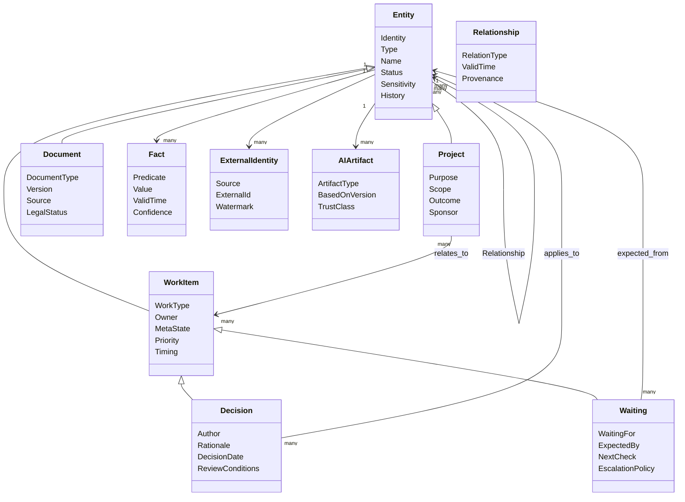

### Приложение B. Варианты хранения

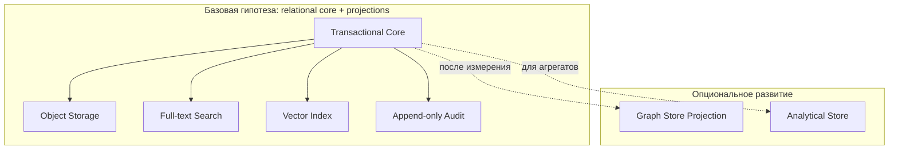

#### B.1. Критерии выбора

| Критерий | Вопрос для измерения |
|---|---|
| Связность | Сколько hop-queries реально требуется? |
| Объём | Сколько активных узлов и рёбер на пользователя/организацию? |
| Изменяемость | Как часто меняются типы и отношения? |
| Транзакции | Какие инварианты должны меняться атомарно? |
| Поиск | Какова доля full-text, semantic и exact запросов? |
| Эксплуатация | Есть ли компетенции резервирования и мониторинга? |
| Безопасность | Можно ли применить одинаковые политики во всех проекциях? |
| Восстановление | Что является каноном и что можно перестроить? |

### Приложение C. Варианты API

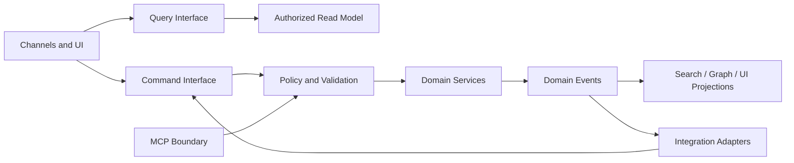

#### C.1. Сравнение вариантов

| Потребитель | Предпочтительная форма | Почему |
|---|---|---|
| Чатовый Gateway | intent-oriented command/query | Сохраняет пользовательское намерение |
| Web UI | typed query + commands | Гибкое чтение и явные изменения |
| Domain Skill | internal service contract | Не зависит от транспорта |
| n8n | ограниченные commands/events | Оркестрация без бизнес-логики |
| MCP | policy-wrapped resources/tools | Безопасное обнаружение возможностей |
| Внешняя система | adapter-specific contract | Изолирует нестабильный API |

### Приложение D. Варианты событий

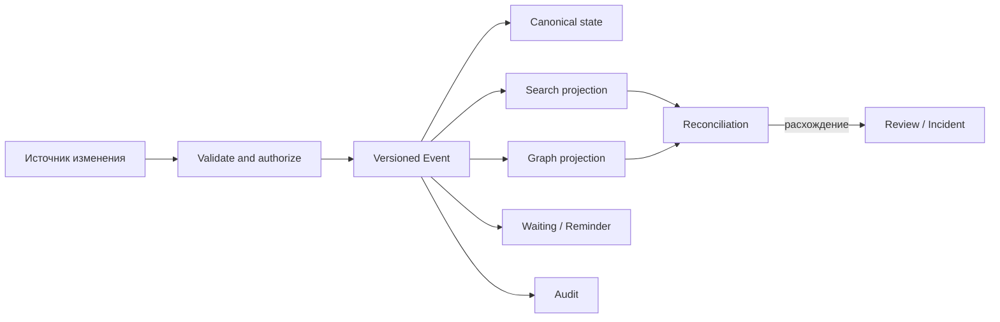

#### D.1. Минимальный event envelope на концептуальном уровне

| Элемент | Смысл |
|---|---|
| Event identity | Уникальность и дедупликация |
| Event type and version | Семантика и совместимость |
| Occurred/observed time | Временная корректность |
| Subject and delegation | Авторство и полномочие |
| Entity reference | Затронутый объект |
| Correlation and causation | Цепочка операции |
| Source | Система происхождения |
| Sensitivity | Политика обработки |
| Outcome data | Минимально нужное описание изменения |

### Приложение E. Жизненный цикл Entity

Сценарий: новый поставщик обнаружен в письме, подтверждён по данным 1С, связан с заказом, переименован и позднее объединён с дублем.

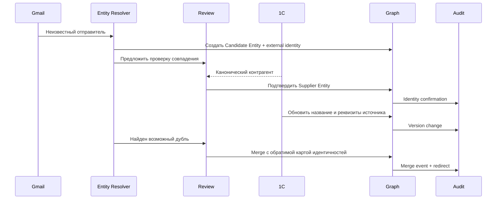

#### E.1. Проверки жизненного цикла

- Candidate не используется для критического действия без проверки.
- Переименование не меняет ID.
- История внешних названий сохраняется.
- Merge не удаляет provenance.
- Ошибочный merge можно отменить.
- Archived Entity не возвращается в обычный контекст без причины.
- Tombstone предотвращает повторное создание того же удалённого объекта при необходимости.

### Приложение F. Жизненный цикл Work Item

Сценарий: письмо создаёт Request, после отправки возникает Waiting, просрочка создаёт Task, ответ приводит к Decision и Approval.

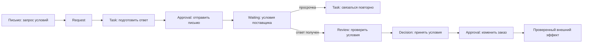

#### F.1. Почему это не одна Task

| Объект | Самостоятельная семантика |
|---|---|
| Request | Кто и что запросил |
| Task | Что делает внутренняя сторона |
| Approval | Какое действие разрешено |
| Waiting | Что должна сделать внешняя сторона |
| Review | По каким критериям оценивается ответ |
| Decision | Какой вариант принят и почему |
| External effect | Что реально изменилось в источнике |

### Приложение G. Развёрнутый пример Context Graph

**Запрос:** «Можно ли завтра утвердить заказ поставщику Альфа для Русской, и что ещё не готово?»

#### G.1. Якоря

| Якорь | Разрешение |
|---|---|
| «поставщик Альфа» | Supplier Entity, подтверждённая связь с 1С и Gmail |
| «Русская» | Store Entity, не улица и не проект |
| «заказ» | Последний активный Order Entity в Purchasing mode |
| «завтра» | Дата в часовом поясе пользователя |

#### G.2. Обязательный контекст

| Объект | Почему обязателен |
|---|---|
| Order version | Уточняет точные параметры утверждения |
| Active purchasing Decisions | Ограничивают состав и подтверждение |
| Owner calendar availability | Показывает возможность, но без лишних деталей |
| Approval state | Указывает, есть ли полномочие |
| Blocking Waiting | Объясняет, что не готово |
| Data freshness | Показывает актуальность расчёта и остатков |
| Validation/Review result | Подтверждает воспроизводимость суммы |

#### G.3. Исключённый контекст

| Объект | Причина исключения |
|---|---|
| Медицинское описание события | Нужна только доступность времени |
| Заказы других магазинов | Нет прямой релевантности |
| Архивные договоры | Есть действующая версия |
| Личная переписка с менеджером | Не является бизнес-основанием |
| AI hypothesis о надёжности | Не подтверждена и не нужна для вопроса готовности |

#### G.4. Возможный ответ как архитектурный пример

> Завтра утвердить заказ можно после двух условий: владелец свободен в подходящем окне, но ещё не получено подтверждение поставщика по сроку доставки и не завершён Review спорных позиций. Действующее Decision требует отдельного Approval именно для текущей версии заказа. Расчёт сформирован из данных, обновлённых сегодня; статус письма поставщика проверен по Gmail. Медицинские и другие личные детали календаря в контекст не включались.

Этот пример показывает структуру ответа, а не готовую функциональность.

### Приложение H. Режимные профили Context Graph

| Параметр | Director | Personal | Purchasing | Development | Travel | Marketing | Health |
|---|---|---|---|---|---|---|---|
| Горизонт | квартал/неделя | день/неделя | цикл закупки | release/sprint | поездка | кампания | эпизод/приём |
| Главные Entity | компании, Goals | человек, дом | store, supplier, order | repo, service, RFC | trip, booking | brand, content | person, provider, document |
| Обязательные Work Items | Decision, Incident | Reminder, Waiting | Approval, Waiting | Problem, Review | Approval, Waiting | Idea, Review | Meeting, Reminder |
| Cross-domain | агрегаты | ограниченно | запрещено по умолчанию | business only | calendar-aware | brand-scoped | максимально ограничено |
| AI data zone | sensitive business | personal sensitive | sensitive business | internal | personal sensitive | internal/public | restricted |

### Приложение I. Матрица источников истины

| Домен | Entity | Поле/состояние | Канонический кандидат | Arthur хранит |
|---|---|---|---|---|
| Purchasing | Product | код, остаток | 1С | external identity, projection, freshness |
| Purchasing | Order | расчётная версия | Purchasing Agent/утверждённый процесс | provenance и status |
| CRM | Company | CRM stage | Bitrix24 | связь и контекст |
| Communication | Email | delivered/thread state | Gmail | индекс, links, extracted proposals |
| Calendar | Event | time/attendance | Google Calendar | normalized projection |
| Development | Pull Request | state/checks | GitHub | links, Review context |
| Arthur | Decision | active/superseded | Arthur | полный канон и история |
| Arthur | Waiting | next check/escalation | Arthur | полный канон и scheduler state |
| Documents | Contract | signed version | утверждённое DMS/Drive | identity, version link, extracted facts |

### Приложение J. Минимальные архитектурные проверки

1. Создание Entity без типа отклоняется.
2. Внешний ID не используется как внутренний.
3. Неоднозначное разрешение имени не меняет канон автоматически.
4. Decision без автора и обоснования не становится Active.
5. Waiting без следующей проверки не активируется.
6. Project не владеет Work Item исключительно.
7. Удаление доступа исключает объект из всех retrieval-проекций.
8. AI Summary с устаревшей версией помечается stale.
9. Высокорисковое действие повторно проверяет источник.
10. Approval не применяется после изменения существенных параметров.
11. Context Graph сохраняет причины включения.
12. Конфликт фактов показывается, а не молча разрешается.
13. Недоступный источник приводит к маркировке свежести.
14. Prompt instruction из документа не расширяет инструменты.
15. Reconcile может восстановить пропущенное событие без дублирования эффекта.

---

## 30. Чек-лист независимого аудита

### 30.1. Концептуальная состоятельность

- [ ] Определения Entity, Work Item, Fact, Event и Document не перекрываются неоднозначно.
- [ ] Project-as-Entity выдерживает сценарии нескольких проектов.
- [ ] Все Work Item types имеют различимую семантику.
- [ ] Decision и Waiting нельзя безопасно заменить статусами Task.
- [ ] Временная модель достаточна для истории и исправлений.
- [ ] Source authority определим на уровне значимых полей.

### 30.2. Context Graph

- [ ] Алгоритм имеет воспроизводимые стадии.
- [ ] Политика применяется до и после retrieval.
- [ ] Обязательные Decisions и Waiting не зависят только от embeddings.
- [ ] Существует объяснение включения каждого существенного объекта.
- [ ] Бюджет не удаляет риски и конфликты раньше фоновых сведений.
- [ ] Кеш не смешивает права и режимы.
- [ ] Деградация не выдаёт устаревшее за актуальное.

### 30.3. Безопасность

- [ ] Графовый обход не расширяет права.
- [ ] AI не получает секреты и unrestricted tools.
- [ ] Prompt injection рассматривается как базовая угроза.
- [ ] Approval связан с неизменными существенными параметрами.
- [ ] Удаление распространяется на производные индексы.
- [ ] Group context использует пересечение, а не объединение прав.
- [ ] Restricted modes имеют усиленную модель угроз.

### 30.4. Данные и интеграции

- [ ] Для каждой интеграции определён владелец данных.
- [ ] Event loss и duplicate delivery учтены.
- [ ] Reconciliation не является необязательной ручной процедурой.
- [ ] Внешний эффект идемпотентен или проверяем.
- [ ] Search/vector/graph projections являются перестраиваемыми.
- [ ] Версии документов и писем сохраняют provenance.

### 30.5. Эксплуатация

- [ ] SLO разделены по классам запросов.
- [ ] Есть наблюдаемость Context Graph, а не только AI latency.
- [ ] Backup и recovery учитывают object storage и event offsets.
- [ ] Стоимость измеряется по режимам и сценариям.
- [ ] Stop criteria допускают отказ от неудачной архитектурной линии.
- [ ] Начальный пилот ограничен и обратим.

### 30.6. Главные вопросы для «жёсткого» вердикта

1. Является ли Entity-first реальной необходимостью или красивой абстракцией без достаточной ценности?
2. Можно ли построить Context Graph с приемлемым recall, latency и privacy одновременно?
3. Достаточно ли relational core или графовая семантика неизбежно потребует отдельного движка?
4. Где RFC чрезмерно универсален и какие части нужно удалить до реализации?
5. Какие пять решений являются блокирующими до следующего RFC?
6. Какой минимальный вертикальный срез способен опровергнуть основную гипотезу дешевле всего?

---

## 31. Источники

### 31.1. Внутренние документы проекта

- `docs/ARTHUR_MASTER_ARCHITECTURE.md` — миссия, слои, единый Arthur, AI Gateway и независимость.
- `docs/arthur/00_PROJECT_VISION.md` — каноническое видение личной и бизнес AI-системы.
- `docs/arthur/03_ARCHITECTURE.md` — текущие базовые компоненты, домены, аудит и надёжность.
- `docs/arthur/04_MEMORY_MODEL.md` — исходное разделение памяти.
- `docs/arthur/05_PRINCIPLES.md` — действующие принципы проекта.
- `docs/arthur/06_SECURITY.md` — классы действий и базовые ограничения.
- `docs/arthur/13_ARTHUR_CORE_V0_SPEC.md` — ранняя спецификация профиля, памяти, задач, решений, подтверждений и аудита.
- `docs/arthur-v1-foundation.md` — реализованное foundation-направление Orchestrator, Skills и AI Provider abstraction.
- `docs/PROJECT_STATUS_2026-08-11.md` — снимок наблюдаемого состояния на дату документа.

### 31.2. Официальные внешние материалы

- [Plane Documentation](https://docs.plane.so/)
- [Plane Project API Overview](https://developers.plane.so/api-reference/project/overview)
- [Vikunja Documentation](https://vikunja.io/docs/)
- [Vikunja Tasks](https://vikunja.io/help/tasks/)
- [Vikunja Projects](https://vikunja.io/help/projects/)
- [Vikunja Task Relations](https://vikunja.io/help/task-relations/)
- [Huly Documentation](https://docs.huly.io/)
- [Huly Documents](https://docs.huly.io/knowledge-management/documents/)
- [Huly Issues](https://docs.huly.io/task-tracking/creating-issues/)
- [Huly Communication](https://docs.huly.io/communication/sending-messages/)
- [OpenProject Work Packages](https://www.openproject.org/docs/user-guide/work-packages/)
- [AppFlowy Documentation](https://docs.appflowy.io/docs)
- [AppFlowy Overview](https://docs.appflowy.io/docs/appflowy/readme/welcome-to-appflowy)
- [AppFlowy Deployment](https://docs.appflowy.io/docs/documentation/appflowy-cloud/deployment)
- [Bitrix24 Tasks and Projects](https://www.bitrix24.com/tools/tasks_and_projects/)
- [Bitrix24 Automation](https://helpdesk.bitrix24.com/section/157580/)
- [Bitrix24 CRM API Overview](https://apidocs.bitrix24.com/api-reference/crm/index.html)

---

## Заключение

RFC-0001 предлагает рассматривать Arthur OS как entity-centric операционную систему пользователя, в которой работа, память, документы, решения, ожидания и внешние системы объединены Knowledge Graph, но раскрываются AI только через ограниченный Context Graph.

Сильная сторона предложения — единая семантика и возможность объяснить связь между объектом, фактом, решением и действием. Главная слабость — риск построить чрезмерно универсальную и дорогую платформу раньше, чем доказана ценность. Поэтому решение не следует принимать на основании полноты этого документа. Следующий шаг — строгий независимый аудит, выбор блокирующих вопросов и минимальный пилот, способный опровергнуть или подтвердить архитектурную гипотезу.

**Статус после публикации:** ожидает комментариев и архитектурного аудита. Никакая часть целевой модели не считается утверждённой только на основании этого RFC.
