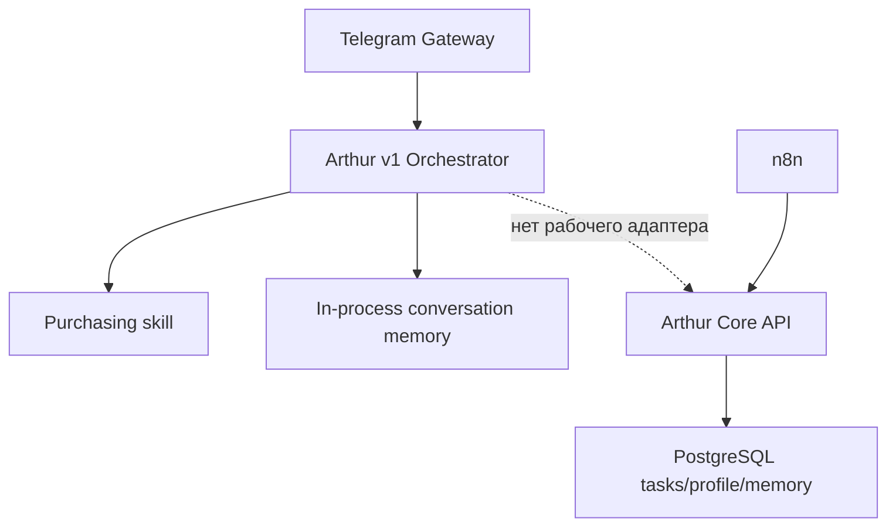

# Arthur — roadmap персонального AI-помощника

**Статус:** рабочий roadmap по фактически существующему коду
**Дата среза:** 13 августа 2026 года
**Область:** `AI-Ecosystem-Sergey`
**Основание:** аудит репозитория и задание «Переход к разработке персонального помощника Артур»

> Этот документ определяет ближайшую последовательность развития персонального помощника. Он не заменяет и не отменяет `docs/architecture/arthur-os-rfc-0001.md`: RFC-0001 сохраняется как долгосрочное архитектурное предложение для отдельного аудита и не является текущим roadmap.

---

## 1. Стратегическое решение

Разработка Arthur OS как новой отдельной платформы откладывается. На текущем этапе не создаются Arthur Kernel, Entity Engine, Knowledge Graph и Context Graph Engine.

Ближайшая цель — развивать уже существующего Артура как единого персонального AI-помощника Сергея, который постепенно получает практические возможности через текущие компоненты:

- Telegram как основной интерактивный канал;
- существующий Arthur Orchestrator;
- зарегистрированные skills с минимальными правами;
- Arthur Core API и PostgreSQL для профиля, задач и памяти;
- OmniRoute как AI gateway;
- n8n для расписаний и интеграционного транспорта;
- существующий AI-закупщик без изменения его расчётного ядра.

Развитие выполняется небольшими вертикальными этапами:


Каждый этап должен дать одну законченную пользовательскую функцию, работать через существующие границы и не требовать массового рефакторинга.

---

## 2. Как читать статусы

| Статус | Значение |
|---|---|
| **Реализовано** | Компонент существует в коде, имеет рабочую точку входа и покрыт тестами |
| **Foundation** | Базовая реализация существует, но ещё не образует законченный пользовательский сценарий |
| **Частично подключено** | Компонент работает в одном контуре, но не связан с остальными частями Артура |
| **Документировано** | Намерение или production-состояние описано, но в этой инвентаризации не подтверждено самостоятельным кодовым модулем |
| **Не реализовано** | Соответствующий модуль или интеграционный адаптер в репозитории не найден |

Отдельно учитываются два вида доказательств:

1. **Код репозитория** — основной источник для этого roadmap.
2. **Production snapshot** — сведения из `docs/PROJECT_STATUS_2026-08-11.md`; они полезны для эксплуатации, но не заменяют проверку кода и воспроизводимый smoke test.

---

## 3. Что уже существует

### 3.1. Общая карта реализованных компонентов

| Компонент | Статус | Фактическая роль | Основные файлы |
|---|---|---|---|
| Arthur Telegram Gateway | Реализовано | Long polling, allow-list, команды `/start`, `/help`, `/status`, передача текста в Orchestrator | `agents/arthur-v1/telegram/` |
| Arthur Orchestrator | Реализовано | Формирует запрос, выбирает план, запускает skills, собирает ответ | `agents/arthur-v1/orchestrator/` |
| Deterministic Planner | Реализовано | Распознаёт четыре purchasing intent и строит `ExecutionPlan` | `agents/arthur-v1/planner/intents.js`, `plan_builder.js` |
| LLM Planner | Реализовано | Строит и валидирует read-only планы только по зарегистрированным capabilities | `agents/arthur-v1/planner/llm_plan_builder.js` |
| Execution Engine | Реализовано с ограничением | Исполняет зависимости, тайм-ауты, retries и частичные результаты | `agents/arthur-v1/orchestrator/execution_engine.js` |
| Skill Registry и contract | Реализовано | Регистрирует skills и проверяет capabilities, `execute()` и `health()` | `agents/arthur-v1/registry/` |
| Arthur Identity | Реализовано | Задаёт имя, роль, ограничения и динамический capability context | `agents/arthur-v1/identity/arthur_identity.js` |
| AI Provider abstraction | Реализовано | Выбирает fake или OmniRoute provider | `agents/arthur-v1/ai/` |
| OmniRoute Provider | Реализовано | Generate, synthesis, model policies, health, retry, timeout, redaction | `agents/arthur-v1/ai/omniroute_provider.js` |
| Structured logging/context | Реализовано | `requestId`, `correlationId`, channel, user, JSON-логи и редактирование secret-like полей | `agents/arthur-v1/context/`, `logging/` |
| File-backed Knowledge Service | Foundation | Индексирует локальные `.md` и `.json`, выполняет простой текстовый поиск | `agents/arthur-v1/knowledge/` |
| Conversation Memory Interface | Foundation | Хранит записи только в памяти процесса по ключу `(userId, correlationId)`; Telegram создаёт новый `correlationId` для каждого сообщения | `agents/arthur-v1/memory/memory_interface.js` |
| Purchasing skill | Реализовано, read-only | Читает только completed purchasing runs и возвращает статус, сводку и Owner Review | `agents/arthur-v1/skills/purchasing/` |
| Arthur Core service layer | Foundation | Профиль, память, задачи, решения, подтверждения и аудит | `agents/arthur-core/services/` |
| Arthur Core HTTP API | Частично подключено | Health, профиль, создание/чтение/переходы задач, список и task brief | `agents/arthur-core/http/create-server.js` |
| PostgreSQL foundation | Foundation | Миграции профиля, памяти, задач, решений, подтверждений и append-only аудита | `data/arthur/migrations/` |
| Task briefing | Реализовано | Делит задачи на overdue, upcoming и waiting | `agents/arthur-core/services/task-briefing-service.js` |
| n8n task workflows | Реализовано как неактивные шаблоны | Создание задачи и утренняя Telegram-сводка | `n8n/workflows/` |
| Docker runtime | Реализовано | PostgreSQL, migrations, Core API, Telegram Gateway, внутренние сети | `docker/arthur/` |
| Deployment/import scripts | Реализовано | Миграции, запуск Compose, соединение с n8n, импорт выбранных workflows | `scripts/arthur/` |
| CI | Реализовано частично | Arthur Core, migrations, Compose и n8n validation | `.github/workflows/arthur-*.yml` |

### 3.2. Интерактивный Arthur v1

Фактический интерактивный путь:

```text
Telegram Gateway
→ createArthurV1()
→ ArthurOrchestrator
→ deterministic или LLM plan
→ зарегистрированный Purchasing skill либо direct AI response
→ OmniRoute/Fake provider
→ Telegram
```

Подтверждённые возможности:

- принимать текстовые сообщения от разрешённых Telegram user IDs;
- отвечать на `/start`, `/help` и `/status` без доменного skill;
- передавать обычный разговорный запрос AI provider;
- показывать только реально зарегистрированные capabilities;
- детерминированно обрабатывать purchasing-запросы;
- возвращать безопасный fallback при ошибке AI provider;
- сохранять текущий turn в in-process memory под ключом текущего запроса; это ещё не многоходовая память диалога;
- вести сквозные `requestId` и `correlationId` в интерактивном контуре;
- работать через proxy для Telegram API;
- предоставлять отдельный health endpoint Gateway.

В `createArthurV1()` сейчас регистрируется только один доменный skill — `purchasing`.

### 3.3. AI-закупщик

AI-закупщик является самым зрелым бизнес-модулем репозитория. Его расчётное ядро, web backend, Owner Review, learning-компоненты, отчёты и тесты находятся вне Arthur v1 и уже имеют собственные контракты.

Arthur использует узкий read-only адаптер:

| Operation | Реальное поведение |
|---|---|
| `getStatus` | Читает metadata и summary последнего completed run |
| `getSummary` | Возвращает SKU, строки, суммы, ручную проверку и warnings |
| `getOwnerReview` | Возвращает компактную сводку и до 20 спорных SKU |
| `getFinalOrder` | Возвращает `NOT_AVAILABLE` и `REQUIRES_OWNER_REVIEW` |

Адаптер:

- не изменяет расчёты;
- не создаёт новый заказ;
- не пишет в run registry;
- не меняет Owner Decisions;
- не отправляет заказ поставщику;
- выбирает только run со статусом `completed` и валидным UUID;
- защищён от path traversal через `runId`.

Это соответствует ограничению задания: Purchasing Agent не изменять.

### 3.4. Arthur Core

Arthur Core представлен отдельным runtime-контуром:

```text
n8n или внутренний клиент
→ Arthur Core HTTP API
→ TaskBriefingService / AsyncArthurCoreService
→ TaskListingPostgresStore
→ PostgreSQL
→ append-only audit
```

Реально доступны через HTTP:

- health check;
- создание профиля;
- чтение профиля;
- создание задачи;
- список задач с фильтрами;
- краткая сводка задач;
- чтение одной задачи;
- переход задачи между разрешёнными статусами.

В service layer также существуют, но пока не выставлены в HTTP API:

- обновление профиля;
- версионирование memory record;
- чтение активной memory record;
- создание и supersede решений;
- создание и approve/reject подтверждений;
- чтение аудита.

Текущая модель задач поддерживает:

- домены;
- priority;
- due date;
- статусы `new`, `planned`, `in_progress`, `waiting`, `needs_confirmation`, `done`, `cancelled`;
- обязательные `waitingFor` и `nextCheckAt` для ожидания;
- аудит переходов;
- утренний brief по просроченным, предстоящим и ожидающим задачам.

### 3.5. n8n и уведомления

В репозитории есть три workflow-файла:

- `arthur-create-task-webhook.json` — ранний вариант создания задачи;
- `arthur-create-task-production.json` — production-шаблон с n8n credential placeholder;
- `arthur-morning-task-brief-production.json` — ежедневная task-сводка в Telegram.

Workflows по умолчанию неактивны и не содержат реальных credential IDs или Telegram chat ID. Импортёр поддерживает только production create-task и morning brief.

Утренняя сводка уже умеет:

- запускаться по расписанию;
- запросить task brief у Arthur Core;
- отдельно показать overdue, upcoming и waiting;
- экранировать HTML;
- ограничить каждый раздел десятью строками;
- отправить результат через Telegram credential.

### 3.6. Docker и эксплуатационный foundation

Compose определяет:

- PostgreSQL 16;
- одноразовый migration service;
- внутренний Arthur Core API;
- Telegram Gateway;
- internal-only сеть для базы и Core;
- отдельную сеть связи с n8n;
- outbound-сеть только для Gateway;
- read-only mount completed purchasing runs в Gateway;
- health checks и `restart: unless-stopped`.

Arthur Core API и PostgreSQL не публикуют host ports. Telegram health port публикуется только на `127.0.0.1`.

### 3.7. Проверка текущего состояния

В ходе подготовки roadmap выполнена текущая Arthur-specific проверка:

```text
node --test agents/arthur-core/tests/*.test.js agents/arthur-v1/tests/*.test.js
```

Результат:

- 238 тестов прошли;
- 0 тестов завершились ошибкой;
- unit-, HTTP-, Telegram-, Orchestrator-, Purchasing skill-, OmniRoute- и topology-сценарии прошли;
- migration runner integration с реальной PostgreSQL локально не запускался, поскольку test database URL не был настроен.

Первый sandbox-запуск не смог открыть `127.0.0.1`; повторный запуск с разрешённым локальным bind прошёл полностью. Это ограничение среды проверки, а не дефект проекта.

Production-состояние Telegram, OmniRoute и контейнеров дополнительно описано в `docs/PROJECT_STATUS_2026-08-11.md`, но в этой задаче production server не изменялся и не проверялся удалённо.

---

## 4. Что требует завершения

### 4.1. Главный незавершённый контур

Arthur v1 и Arthur Core существуют параллельно, но пока не образуют единый персональный помощник:



Следствия:

- Telegram-разговор не читает профиль из Arthur Core;
- Telegram не видит persistent tasks и morning brief state;
- Orchestrator не умеет создавать или перечислять задачи Arthur Core;
- сообщения Telegram не получают историю предыдущих turn: новый `correlationId` создаёт новый memory key;
- in-process memory теряется при перезапуске Gateway;
- n8n-task контур существует отдельно от интерактивного Артура;
- allow-list Telegram не сопоставляется с profile identity в Core;
- подтверждения Core не используются Orchestrator и skills.

Завершение этого соединения является главным platform gap, но его нужно закрывать небольшим адаптером, а не новой архитектурой.

### 4.2. Незавершённые модули по новому приоритету

| Модуль | Текущее состояние | Чего нет |
|---|---|---|
| Purchasing | Read-only skill реализован | Реальный completed production run для полезного ответа должен существовать; финальный заказ намеренно недоступен |
| Gmail | Не реализовано | OAuth, account binding, search/list/read thread, attachment metadata, skill и intents |
| Google Calendar | Не реализовано | OAuth, calendars/events/free-busy, skill и intents; task brief не является Calendar-интеграцией |
| Memory | Два foundation-подхода | Нет persistent memory adapter в Orchestrator; часть Core API не выставлена; schema/store contracts требуют сверки |
| Tasks and reminders | Частично реализовано | Нет Telegram task skill, interactive create/list/complete; reminders существуют только как n8n morning brief |
| GitHub | Не реализовано как Arthur integration | В репозитории есть GitHub Actions, но нет GitHub skill для issues, PR, checks или repository context |
| Documents | Foundation локального поиска | Нет DOCX/PDF/Drive integration, permission model, source citations и устойчивого document identity |
| Projects | Не реализовано | Нет project service, skill или persistent project contract |
| Stores | Только purchasing context | Нет общего store module или skill Артура |
| Analytics | Только purchasing analytics | Нет общего analytics skill персонального помощника |

### 4.3. Knowledge Service не завершён как пользовательская функция

Локальный Knowledge Service существует, но обычный direct AI response не получает найденные knowledge entries. Причины в текущем flow:

- search запускается только когда `request.intent` уже задан во входе;
- intent, определённый внутри `_buildPlan()`, обратно в request не записывается;
- empty knowledge plan приводит к direct AI response;
- `_respondDirectly()` не передаёт `knowledgeResults` модели.

Поэтому Knowledge Service следует считать переиспользуемым foundation, а не готовым документным поиском Артура.

### 4.4. Подтверждения не завершены как execution layer

В Core реализованы fingerprint и approve/reject semantics, но отсутствует законченный путь:

```text
план действия
→ confirmation request
→ пользовательское подтверждение
→ повторная проверка payload
→ идемпотентное исполнение
→ status executed/failed
→ audit
```

До завершения этого пути Gmail send, Calendar write, GitHub write и изменение закупки не должны включаться.

---

## 5. Что можно использовать повторно без переработки

### 5.1. Компоненты, которые следует переиспользовать как есть

| Компонент | Применение в следующих этапах | Условие повторного использования |
|---|---|---|
| Skill contract и registry | Gmail, Calendar, Core tasks, GitHub, Documents | Каждый новый skill объявляет минимальные read-only capabilities |
| ExecutionPlan | Композиция нескольких read-only операций | Не расширять формат без реального сценария |
| Orchestrator | Единый вход и lifecycle запроса | Добавлять только зарегистрированные skills |
| Arthur context | Сквозной request/correlation context | Нормализовать correlation contract с Core |
| Structured logger | Все новые адаптеры | Не логировать письмо, документ или token целиком |
| OmniRoute provider | Общие ответы и synthesis | Передавать только данные, разрешённые skill |
| Identity/capability context | Честное описание возможностей | Capabilities всегда строятся из registry |
| Telegram Gateway/client | Основной канал | Не помещать доменную логику в Gateway |
| Purchasing skill/run resolver | Первый business skill | Оставить read-only и не менять Purchasing Agent |
| AsyncArthurCoreService | Persistent profile/tasks/memory foundation | Сначала согласовать schema/store contracts |
| TaskBriefingService | Утренние и интерактивные brief | Убрать hard-coded timezone из внешнего formatter |
| Task transitions | Waiting и completion | Сохранить проверки `waitingFor`/`nextCheckAt` |
| Confirmation fingerprint | Будущие write actions | Использовать только после завершения execution lifecycle |
| HTTP auth и internal network | n8n и Core adapter | Перейти от общего token к более точной identity позже, без блокировки MVP |
| Migration runner | Изменения Core schema | Добавлять маленькие обратимые миграции |
| n8n importer | Gmail/Calendar schedules и reminders | n8n остаётся orchestration-only |
| Docker Compose topology | Новые сервисы только при необходимости | Не подключать PostgreSQL к outbound network |
| Existing tests and CI patterns | Все этапы | Новый этап получает unit и integration tests |

### 5.2. Компоненты, которые можно использовать после локального исправления

| Компонент | Требуемое завершение перед использованием |
|---|---|
| PostgreSQL Decisions | Согласовать `statement`/`decision`, обязательный `author_id` и mapping |
| PostgreSQL Confirmations | Согласовать `resolved_at`/`decided_at`, `action_description`, `decided_by` и status transitions |
| Persistent memory | Выставить минимальные Core API operations либо создать внутренний Core client |
| Knowledge Service | Подключить retrieval results к ответу и добавить source-aware contract |
| Execution Engine concurrency | Реально ограничивать старт promises значением `maxConcurrency` |
| n8n create-task workflow | Выбрать единственный канонический production-файл и убрать устаревшие ссылки |
| Morning task brief | Получать timezone из профиля/конфигурации, а не из `Europe/Paris` |

### 5.3. Что не переиспользовать как новый production path

- `ArthurCoreService` вместе с `InMemoryArthurStore` как отдельное production-ядро: runtime использует async/PostgreSQL path;
- `arthur-create-task-webhook.json` как второй равноправный workflow рядом с production-файлом;
- in-process `MemoryInterface` как долгосрочную память;
- RFC-0001 как план немедленной реализации платформы;
- LLM Planner для обхода отсутствующего skill;
- n8n Code nodes для бизнес-логики Gmail, Calendar, Memory или Purchasing.

---

## 6. Roadmap

### 6.1. Правила выполнения roadmap

1. Один этап — один пользовательский результат.
2. Каждый этап начинается read-only.
3. Новый модуль подключается как skill или узкий Core adapter.
4. Telegram остаётся основным интерактивным каналом.
5. n8n отвечает за расписания, триггеры и транспорт.
6. Детерминированные правила остаются в доменных сервисах.
7. Write action появляется только после confirmation lifecycle.
8. Существующий Purchasing Agent не изменяется.
9. Не создаются Kernel, Entity Engine, Knowledge Graph и Context Graph Engine.
10. Следующий этап не начинается до smoke test и документации предыдущего.

### 6.2. Нулевой gate — согласовать текущий foundation

Нулевой gate не является новым архитектурным этапом. Это короткая проверка перед расширением.

**Цель:** не строить новые integrations поверх подтверждённых несовместимостей.

**Работы:**

- определить `arthur-v1` как интерактивный orchestration path;
- определить `arthur-core` как persistent system service;
- описать один узкий Core client/skill boundary между ними;
- проверить migration/store compatibility для реально используемых profile и task operations;
- отдельно зафиксировать несовместимости Decisions/Confirmations без их немедленного расширения;
- выбрать канонический n8n create-task workflow;
- определить timezone и profile identity для текущего пользователя;
- добавить путь `agents/arthur-v1/**` в CI trigger;
- не менять purchasing-файлы.

**Результат gate:** короткое решение о связи двух существующих контуров и зелёный smoke test profile/task через PostgreSQL.

---

### Этап 1. Закупщик — завершить текущую read-only интеграцию

**Пользовательский результат:** Сергей спрашивает Артура в Telegram о текущей закупке и получает проверяемые данные из последнего completed run.

**Уже готово:**

- skill contract;
- `PurchasingSkill`;
- run resolver;
- четыре operation;
- deterministic intents;
- Telegram flow;
- read-only mount;
- unit/integration tests.

**Небольшие шаги:**

1. Создать реальный completed run штатным Purchasing pipeline в production-среде.
2. Проверить наличие `run.json`, `summary.json` и `owner-review-compact.json`.
3. Выполнить Telegram smoke tests для status, summary и Owner Review.
4. Проверить понятный ответ при отсутствии completed run.
5. Зафиксировать диагностический run ID и freshness в ответе или diagnostics.
6. Обновить устаревшие инструкции, не меняя Purchasing Agent.

**Не входит:**

- изменение формул;
- автоматическое подтверждение позиций;
- отправка заказа;
- write operation в purchasing storage;
- создание Entity/Graph слоёв.

**Критерии завершения:**

- Telegram возвращает данные реального completed run;
- суммы и счётчики совпадают с canonical artifacts;
- отсутствие данных явно отличается от ошибки;
- адаптер не пишет в run registry;
- existing purchasing tests остаются зелёными.

---

### Этап 2. Gmail — read-only помощник по почте

**Пользовательский результат:** Сергей может спросить Артура о новых, важных или найденных письмах и получить краткую сводку со ссылкой на исходный thread.

#### 2.1. Gmail connection foundation

- определить один Gmail account для MVP;
- использовать OAuth с минимальными read-only scopes;
- хранить refresh token только в secret storage/environment runtime;
- добавить health diagnostics без вывода token;
- сопоставить Gmail account с Arthur profile;
- документировать revoke procedure.

#### 2.2. Gmail read-only skill

Минимальные capabilities:

- `getInboxSummary`;
- `searchThreads`;
- `getThread`;
- `getUnreadImportant`;
- `getWaitingCandidates` как предложение, а не автоматическая запись.

Skill возвращает структурированные данные и source references. Полное письмо не помещается в лог.

#### 2.3. Telegram intents

Первые запросы:

- «Что важного пришло сегодня?»
- «Есть ли ответ от поставщика?»
- «Найди письмо по договору».
- «Какие письма требуют моего ответа?»

#### 2.4. Ограничения этапа

- не отправлять письма;
- не удалять и не перемещать письма;
- не менять labels;
- не создавать persistent task автоматически;
- не загружать всю почту в Arthur Core;
- не передавать вложения модели без отдельного запроса и проверки типа.

#### 2.5. Критерии завершения

- Gmail skill зарегистрирован и отображается в capability context;
- read-only scope подтверждён;
- поиск и inbox summary работают из Telegram;
- каждый результат имеет account/thread/message source reference;
- недоступность Gmail не ломает Purchasing и обычный разговор;
- тесты используют fake Gmail adapter, а не live account.

---

### Этап 3. Google Calendar — расписание и свободные окна

**Пользовательский результат:** Сергей спрашивает Артура о расписании, свободных окнах и конфликтах, не открывая календарь вручную.

#### 3.1. Calendar read-only foundation

- подключить один основной календарь через OAuth;
- добавить `listCalendars`, `getAgenda`, `findFreeWindows`, `findConflicts`;
- нормализовать timezone на основе Arthur profile;
- учитывать all-day и recurring events;
- не раскрывать private event details в неподходящем канале.

#### 3.2. Совместный brief без новой платформы

Расширить пользовательский brief данными из двух существующих источников:

```text
Arthur Core tasks
+ Google Calendar events
→ одна утренняя сводка
```

n8n только вызывает Core/Calendar skill и отправляет результат. Правила приоритета и конфликта находятся в сервисе Артура, а не в Code node workflow.

#### 3.3. Первый write-сценарий — только позже

Создание или перенос события допускается только после завершения confirmation execution path. До этого Arthur может подготовить предложение:

- точное время;
- календарь;
- участников;
- title и description;
- обнаруженные конфликты;
- действие, которое потребует подтверждения.

#### 3.4. Критерии завершения

- agenda и free windows доступны через Telegram;
- timezone не hard-coded в n8n;
- календарный сбой не блокирует task brief целиком;
- read-only access подтверждён тестами;
- утренняя сводка показывает источник и время генерации;
- write operation отсутствует либо закрыта обязательным confirmation gate.

---

### Этап 4. Memory, задачи и напоминания — соединить Arthur v1 с Core

**Пользовательский результат:** Артур помнит подтверждённые предпочтения, видит задачи между перезапусками и умеет вести ожидания и напоминания из Telegram.

Этот этап не создаёт новую memory platform. Он подключает Orchestrator к уже существующему Arthur Core.

#### 4.1. Core adapter

Создать узкий skill/client поверх существующего Core API:

- `getProfile`;
- `listTasks`;
- `getTaskBrief`;
- `createTask`;
- `transitionTask`;
- позднее — `getMemory`/`upsertMemory` после согласования API.

Core adapter не получает прямой доступ к PostgreSQL.

#### 4.2. Identity mapping

- связать разрешённый Telegram user ID с одним Arthur profile ID;
- исключить hard-coded owner в новых paths;
- передавать actor type и correlation ID;
- сохранять timezone и locale в профиле;
- отклонять неизвестное или неоднозначное сопоставление.

#### 4.3. Persistent tasks

Первые интерактивные сценарии:

- «Создай задачу позвонить поставщику завтра»;
- «Что у меня просрочено?»;
- «Что я жду?»;
- «Отметь задачу выполненной»;
- «Напомни проверить ответ через два дня».

Создание внутренней task может быть разрешено автоматически по существующей security policy. Завершение или изменение существенной задачи должно оставаться явным и аудируемым.

#### 4.4. Waiting и reminders

- использовать существующий task status `waiting`;
- всегда требовать `waitingFor` и `nextCheckAt`;
- добавить scheduled check через n8n;
- отделить «напоминание отправлено» от «ожидаемый результат получен»;
- связывать Gmail waiting candidate с task только после явного подтверждения на первом этапе.

#### 4.5. Persistent memory

Начать с малого набора типов, уже предусмотренных Core:

- `fact`;
- `preference`;
- `policy`;
- `project_state`;
- `reference`.

Правила MVP:

- в память записываются только явные или подтверждённые сведения;
- новая версия архивирует предыдущее значение;
- сохраняются source type, source reference, confidence и sensitivity;
- секреты, пароли, API keys и одноразовые коды не сохраняются;
- пользователь может спросить, что сохранено по конкретному key;
- chat transcript целиком не превращается в долгосрочную память.

#### 4.6. Schema/API completion перед activation

До включения Decisions и Confirmations:

- согласовать migrations, service records и PostgresStore columns;
- добавить реальные PostgreSQL integration tests для create/supersede Decision;
- добавить integration tests для approve/reject Confirmation;
- определить expiry, executed и failed transitions;
- выставить минимальные HTTP operations;
- проверить UUID-compatible correlation identity.

#### 4.7. Критерии завершения

- задача, созданная из Telegram, видна после перезапуска Gateway;
- task brief из Telegram и n8n использует один PostgreSQL source;
- waiting task нельзя создать без следующей проверки;
- профиль определяет timezone;
- memory record имеет source/confidence/sensitivity;
- все write operations создают audit event;
- Orchestrator не подключается к БД напрямую;
- in-process MemoryInterface больше не считается долгосрочным источником.

---

### Этап 5. GitHub — read-only помощник по разработке

**Пользовательский результат:** Сергей может спросить Артура о состоянии проекта разработки, pull requests и failing checks.

Наличие GitHub Actions в репозитории не означает, что GitHub уже подключён к Arthur. Требуется отдельный skill.

#### 5.1. Read-only capabilities

- `getRepositoryStatus`;
- `listOpenPullRequests`;
- `getPullRequestSummary`;
- `listOpenIssues`;
- `getCheckStatus`;
- `getRecentChanges`.

#### 5.2. Переиспользование

- Skill Registry;
- LLM Planner validation;
- Execution Engine;
- structured sources;
- Arthur Identity;
- Telegram Gateway;
- existing GitHub Actions metadata как внешний источник, а не memory.

#### 5.3. Ограничения

- не создавать branch;
- не изменять issue;
- не комментировать PR;
- не выполнять merge;
- не делать commit или push;
- не передавать repository secrets;
- не заменять Codex workflow разработки.

#### 5.4. Критерии завершения

- Arthur показывает open PR/issues/checks по выбранному repository;
- ответы содержат repository и object references;
- GitHub outage не влияет на Gmail, Calendar и Purchasing;
- capabilities read-only;
- тесты выполняются через fake adapter;
- write operations отсутствуют.

---

### Этап 6. Документы — поиск и чтение с источниками

**Пользовательский результат:** Сергей может найти нужный документ и получить краткий ответ с указанием исходного файла и версии.

#### 6.1. Сначала завершить локальный Knowledge path

- передавать search results в direct AI response;
- показывать sources;
- отличать отсутствие совпадений от ошибки индекса;
- не индексировать operational data и secrets;
- добавить freshness и размерные ограничения;
- не считать AI summary оригиналом.

#### 6.2. Поддержать реальные типы документов поэтапно

1. Markdown и безопасные JSON references — уже есть foundation.
2. PDF и DOCX — extraction через отдельный document adapter.
3. Google Drive — metadata/search/read через OAuth.
4. Вложения Gmail — только через source link и явный запрос.

#### 6.3. Минимальные capabilities

- `searchDocuments`;
- `getDocumentMetadata`;
- `getDocumentText`;
- `summarizeDocument`;
- `findDocumentReferences`.

#### 6.4. Ограничения

- не изменять и не удалять документы;
- не загружать все Drive-файлы в локальную память;
- не индексировать файл без проверки permission;
- не хранить полное содержимое в логах;
- не выдавать summary за юридически значимый оригинал;
- не создавать Knowledge Graph.

#### 6.5. Критерии завершения

- запрос из Telegram находит документ по title/content;
- ответ содержит source, version/freshness и ограничения;
- удаление доступа исключает документ из поиска;
- локальный и Drive adapters используют общий read-only contract;
- OCR/extraction failure показывается явно;
- документные ответы grounded на найденных фрагментах.

---

## 7. Что следует делать после основной последовательности

Следующие возможности важны, но не должны конкурировать с ближайшим roadmap:

| Направление | Когда возвращаться |
|---|---|
| Projects | После persistent tasks/memory и Documents |
| Stores | После стабильной Purchasing integration и profile identity |
| General Analytics | После появления двух или более реальных data skills |
| Marketing/Instagram | После Calendar, Documents и reminders |
| Travel | После Calendar, Gmail и confirmation execution |
| Health | Только после отдельного privacy/security review |
| KPI/Academy/Revisions | После завершения базового персонального контура |
| Entity/Knowledge Graph | Только после аудита RFC-0001 и доказанной нехватки текущих contracts |

---

## 8. Technical Debt

### 8.1. Приоритет P0 — закрыть до persistent Memory и write actions

#### TD-001. Arthur v1 не связан с Arthur Core

**Факт:** Telegram создаёт `createArthurV1()` и использует in-process `MemoryInterface`; Core API и PostgreSQL доступны только отдельным клиентам/n8n. `MemoryInterface` индексирует записи по `(userId, correlationId)`, а Gateway создаёт новый `correlationId` для каждого сообщения.

**Риск:** два списка состояния, отсутствие многоходового контекста между Telegram-сообщениями, потеря памяти после restart, невозможность управлять задачами из Telegram.

**Рекомендация:** добавить узкий Core client/skill, сохраняя оба существующих bounded components.

#### TD-002. Несовместимость Decision service/store/migration

**Факт:** service/store используют поле `statement`; migration создаёт колонку `decision` и требует `author_id`, который store не записывает.

**Риск:** реальная PostgreSQL-запись Decision завершится ошибкой, несмотря на passing mock-store tests.

**Рекомендация:** выбрать один canonical contract, добавить маленькую migration и PostgreSQL integration test до публикации API.

#### TD-003. Несовместимость Confirmation service/store/migration

**Факт:** store использует `resolved_at`, migration — `decided_at`; migration требует `action_description` и хранит `decided_by`, а текущая запись store не согласована с этими полями.

**Риск:** approve/reject не готов к реальной PostgreSQL эксплуатации.

**Рекомендация:** согласовать поля и полный lifecycle `pending → approved/rejected/expired → executed/failed`.

#### TD-004. Correlation ID не нормализован

**Факт:** audit schema ожидает UUID, а Telegram и n8n формируют значения вида `tg-...` и `n8n-...`.

**Риск:** audit write может быть отклонён PostgreSQL при подключении этих контуров.

**Рекомендация:** генерировать UUID correlation ID, а channel identifiers хранить в metadata/source fields.

#### TD-005. Нет end-to-end PostgreSQL тестов для Decisions и Confirmations

**Факт:** локальная migration runner integration suite была пропущена без test database; unit tests используют fake/mock stores и SQL call assertions.

**Риск:** schema/store drift не обнаруживается обычным локальным тестом.

**Рекомендация:** добавить обязательные DB integration cases в CI и documented local command.

### 8.2. Приоритет P1 — закрывать по мере ближайших этапов

#### TD-006. Устаревшая документация состояния

`docs/arthur/02_ROADMAP.md`, `10_BACKLOG.md`, `12_ASSET_INVENTORY.md` и начало `docs/arthur-v1-foundation.md` утверждают, что Core, PostgreSQL или Telegram ещё не реализованы, хотя код уже существует.

**Рекомендация:** не удалять исторические документы; пометить их датой/статусом и ссылкой на этот roadmap.

#### TD-007. Дубли n8n create-task workflow

Есть ранний `arthur-create-task-webhook.json` и production `arthur-create-task-production.json`. Часть документации и `connect-n8n-network.sh` всё ещё ссылаются на ранний файл, а importer поддерживает production-файл.

**Рекомендация:** объявить production-файл каноническим; ранний файл архивировать или удалить отдельным согласованным изменением.

#### TD-008. Hard-coded owner и timezone

В workflows встречается `ownerId: sergey`; morning brief использует `Europe/Paris` для schedule и форматирования. Telegram identity основана только на allow-list.

**Рекомендация:** получать owner/profile/timezone из явной конфигурации или Arthur profile. Не заменять одним новым hard-coded значением.

#### TD-009. Knowledge retrieval не подключён к direct response

Knowledge index создаётся, но результаты не используются обычным direct AI response.

**Рекомендация:** исправить текущий request lifecycle и source-aware synthesis до этапа Documents, не создавая новый retrieval engine.

#### TD-010. Core HTTP API покрывает только часть service layer

Нет routes для memory, decisions, confirmations, audit и profile update.

**Рекомендация:** добавлять routes только по реальному этапу; первым — минимальные memory operations для persistent assistant.

#### TD-011. Confirmation model не связан с Orchestrator

LLM Planner разрешает только read-only operations, а Core confirmations живут отдельно.

**Рекомендация:** сначала реализовать детерминированный confirmation proposal/execution flow для одного обратимого сценария; не ослаблять read-only planner.

#### TD-012. CI trigger не охватывает Arthur v1 напрямую

`arthur-core-ci.yml` запускается по changes в Core, data, Docker, n8n и scripts, но path `agents/arthur-v1/**` не указан. Workflow также ориентирован на pull requests и manual dispatch.

**Рекомендация:** добавить Arthur v1 paths и согласовать policy запуска на main без изменения общей Git-стратегии в рамках этого документа.

### 8.3. Приоритет P2 — контролировать, не делать массовый рефакторинг

#### TD-013. Два service/store подхода Arthur Core

В репозитории остаются synchronous `ArthurCoreService` + `InMemoryArthurStore` и runtime path `AsyncArthurCoreService` + PostgreSQL.

**Рекомендация:** считать async path production-кандидатом; legacy path оставить для characterization до отдельного удаления. Не переписывать всё сейчас.

#### TD-014. `maxConcurrency` не ограничивает момент запуска promises

Execution Engine создаёт promises для всего уровня до разбиения на batches.

**Риск:** при большом multi-skill плане фактическая concurrency может превысить настройку.

**Рекомендация:** исправить локально при появлении второго/третьего внешнего skill и добавить тест на число одновременно выполняемых операций.

#### TD-015. File Knowledge index ограничен

Поддерживаются только `.md` и `.json`, содержимое обрезается, поиск — простое вхождение терминов, permissions отсутствуют.

**Рекомендация:** использовать только как локальный foundation; расширять по этапу Documents.

#### TD-016. Single shared API token

Core использует один bearer/header token для всех `/v1/` routes.

**Рекомендация:** для MVP сохранить внутреннюю сеть и token, но перед multi-user/write actions ввести scoped identity/permissions.

#### TD-017. Runtime diagnostics фрагментированы

Telegram `/status` показывает Gateway и AI provider, но не Core, Gmail, Calendar, sync freshness или n8n workflow state.

**Рекомендация:** добавлять health aggregation по одному источнику на этап, не создавая отдельную observability platform.

---

## 9. Рекомендуемый следующий этап разработки

### 9.1. Следующая кодовая задача

После утверждения этого roadmap выполнить **Этап 1: production smoke test read-only Purchasing integration**, не изменяя Purchasing Agent.

Предлагаемый scope одной задачи:

1. Проверить или создать штатным способом один completed purchasing run.
2. Убедиться, что он доступен через read-only Docker mount.
3. Проверить `getStatus`, `getSummary` и `getOwnerReview` из Telegram.
4. Зафиксировать run ID, source timestamp и результаты smoke test без бизнес-данных в логах.
5. Обновить только эксплуатационную документацию интеграции.

Если production run уже существует и smoke test проходит, следующей задачей становится **Gmail read-only spike**: определить OAuth/scopes и создать fake-backed Gmail skill contract без отправки писем.

### 9.2. Чего не делать в следующей задаче

- не создавать новую платформу;
- не начинать Arthur Kernel;
- не реализовывать Entity Engine;
- не строить Knowledge Graph или Context Graph Engine;
- не переписывать Orchestrator;
- не объединять все integrations одним большим PR;
- не менять формулы, правила и данные Purchasing Agent;
- не включать Gmail write;
- не включать Calendar write;
- не делать массовую очистку technical debt;
- не удалять RFC-0001.

---

## 10. Definition of Done для каждого этапа

Этап считается завершённым только при выполнении всех пунктов:

- [ ] Есть один понятный пользовательский сценарий в Telegram.
- [ ] Использован существующий Orchestrator и Skill Registry.
- [ ] Capabilities отражают только реально доступные операции.
- [ ] Read-only scope сохранён либо write закрыт Confirmation.
- [ ] Есть unit tests без live external service.
- [ ] Есть один контролируемый integration/smoke test.
- [ ] Ошибка внешнего сервиса не ломает остальные skills.
- [ ] Логи не содержат secrets и полное чувствительное содержимое.
- [ ] Source/freshness видимы пользователю или diagnostics.
- [ ] Документация обновлена по фактическому состоянию.
- [ ] Не изменён Purchasing Agent, если этап не требует отдельного согласованного purchasing change.
- [ ] Нет нового parallel assistant, отдельной памяти или новой платформы.

---

## 11. Итоговая последовательность

| Порядок | Этап | Главный результат | Начальный режим |
|---:|---|---|---|
| 0 | Foundation gate | Согласованы существующие `arthur-v1` и `arthur-core` boundaries | Проверка |
| 1 | Purchasing | Реальные read-only закупочные ответы через Telegram | Read-only |
| 2 | Gmail | Сводка и поиск писем | Read-only |
| 3 | Calendar | Agenda, свободные окна и конфликты | Read-only |
| 4 | Memory / Tasks / Reminders | Persistent профиль, задачи, ожидания и подтверждённая память | Controlled write |
| 5 | GitHub | Статус issues, PR и checks | Read-only |
| 6 | Documents | Поиск и ответы с источниками | Read-only |

Ключевой архитектурный принцип ближайшего развития:

> Не строить новый Arthur OS поверх уже существующего Артура. Последовательно подключать полезные capabilities к текущему Orchestrator и Arthur Core, сохраняя Purchasing Agent как независимый детерминированный модуль.

---

## 12. Источники проверки

При подготовке roadmap проверены:

- `agents/arthur-v1/`;
- `agents/arthur-core/`;
- `agents/purchasing/` и его Arthur adapter;
- `data/arthur/migrations/`;
- `docker/arthur/`;
- `n8n/workflows/`;
- `scripts/arthur/`;
- `.github/workflows/arthur-*.yml`;
- root `package.json`;
- действующая документация `docs/arthur/`;
- `docs/arthur-v1-foundation.md`;
- `docs/arthur-telegram.md`;
- `docs/PROJECT_STATUS_2026-08-11.md`;
- `docs/architecture/arthur-os-rfc-0001.md`.

Документ фиксирует состояние репозитория на дату среза. Изменение production credentials, контейнеров и внешних аккаунтов в рамках этой задачи не выполнялось.
