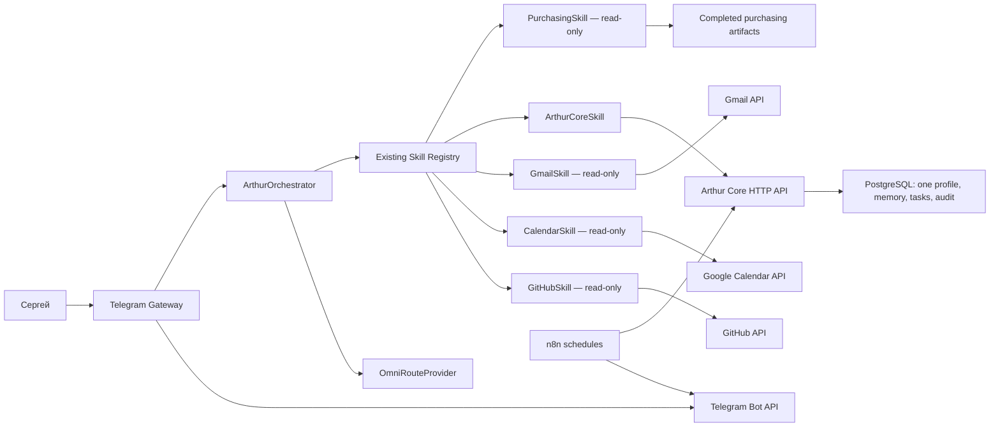

# Arthur Assistant v1 — план реализации

**Статус:** план, функциональность в рамках этой задачи не реализуется
**Дата анализа:** 13 августа 2026 года
**Проект:** `AI-Ecosystem-Sergey`
**Область:** персональный помощник Артур для одного пользователя

## 1. Решение

Arthur Assistant v1 следует развивать как продолжение уже работающего контура `agents/arthur-v1`, а не как новую платформу.

Основная схема v1:

```text
Сергей
→ один Telegram-бот
→ существующий Telegram Gateway
→ существующий ArthurOrchestrator
→ существующий Skill Registry
→ конкретные read-only skills
→ Arthur Core API / внешние API / Purchasing artifacts
→ один ответ в Telegram
```

PostgreSQL остаётся единственным постоянным хранилищем профиля, подтверждённой памяти, задач и аудита. Gmail, Google Calendar, GitHub и Purchasing остаются системами-источниками своих данных. OmniRoute остаётся AI-шлюзом. n8n остаётся фоновым планировщиком и транспортом, но не становится вторым пользовательским интерфейсом и не получает бизнес-логику.

### 1.1. Главный принцип v1

- **Один помощник:** существующий `createArthurV1()` и `ArthurOrchestrator`.
- **Один пользователь:** один разрешённый Telegram user ID.
- **Один профиль:** одна запись `arthur_profiles` с canonical external ID `sergey`.
- **Один интерфейс:** Telegram. HTTP API и n8n являются внутренними интеграционными каналами.

### 1.2. Что намеренно не входит

- Arthur OS;
- Arthur Kernel;
- Entity Engine;
- Knowledge Graph;
- Context Graph Engine;
- отдельная новая платформа или второй Orchestrator;
- универсальный connector framework;
- multi-user и multi-tenant поддержка;
- Web UI или ещё один пользовательский канал;
- автоматические Gmail, Calendar, GitHub или purchasing write-операции;
- изменение формул, правил и данных Purchasing Agent;
- массовый рефакторинг существующего кода.

`docs/architecture/arthur-os-rfc-0001.md` сохраняется как долгосрочная концепция и не используется как текущий implementation backlog.

## 2. Подтверждённое состояние кода

Статусы ниже основаны на существующих точках входа, тестах, Docker-конфигурации, миграциях и workflow-файлах. Документированное намерение без runtime-кода не считается реализованной интеграцией.

| Компонент | Фактический статус | Что уже работает | Решение для v1 |
|---|---|---|---|
| Telegram Gateway | Реализован | Long polling, allow-list, `/start`, `/help`, `/status`, proxy, retry, health endpoint, передача запроса в Arthur | Использовать как единственный интерфейс |
| Arthur Orchestrator | Реализован | Контекст запроса, deterministic/LLM planning, исполнение skills, synthesis, partial failure | Использовать как единственного координатора |
| AI Router | Частично подключён | `createAIProviderFromEnv()` выбирает fake/OmniRoute; `ModelRouter` реализован и протестирован, но текущий `createArthurV1()` его не использует | Сохранить активный provider factory; не подключать второй router без необходимости |
| OmniRoute | Реализован | OpenAI-compatible generate/synthesize, model policy, timeout, retry, health, redaction | Использовать без изменения публичного контракта |
| Conversation Memory | Foundation | `MemoryInterface` хранит записи в памяти процесса | Исправить только текущий conversation lifecycle; не считать её постоянной памятью |
| Persistent Memory | Foundation | PostgreSQL schema, service methods и store для versioned memory | Выставить минимальные Core API operations и подключить к Arthur |
| Gmail | Не реализован | В коде нет Gmail client, OAuth adapter, skill или тестов | Добавить конкретный read-only skill после Purchasing |
| Google Calendar | Не реализован | В коде нет Calendar client, OAuth adapter, skill или тестов | Добавить конкретный read-only skill после Gmail |
| GitHub | Не реализован как Arthur skill | Есть репозиторий и GitHub Actions, но нет runtime-доступа Arthur к issues/PR/checks | Добавить конкретный read-only skill после Memory |
| Purchasing Agent | Реализован отдельно; Arthur adapter реализован | Arthur читает последний completed run и отдаёт status, summary и Owner Review | Использовать текущий read-only adapter; purchasing-код не менять |
| Capability Context | Реализован | Список возможностей строится из реально зарегистрированных skills | Использовать без изменений |
| Identity | Реализована | Имя «Артур», роль, известный бизнес и ограничения формируют system messages | Использовать без изменений |
| PostgreSQL | Foundation реализован | Profiles, memory, tasks, decisions, confirmations, append-only audit; migrations и runtime | Использовать для одного профиля, памяти, задач и аудита |
| Arthur Core HTTP API | Частично реализован | Health, create/get profile, create/list/get/transition task, task brief | Добавить только необходимые memory routes |
| n8n | Частично реализован | Неактивные workflow создания задачи и утренней Telegram-сводки | Оставить фоновым транспортом и расписанием |
| Docker runtime | Реализован | PostgreSQL, migrations, Core API и Telegram Gateway в существующей topology | Расширять существующий Compose, не добавлять новый сервис |

## 3. Повторное использование существующих компонентов

Следующие части уже соответствуют минимальному v1. Для некоторых composition call sites потребуются локальные дополнения, но их публичные контракты и роль не переписываются.

| Компонент | Файлы | Степень повторного использования | Как используется |
|---|---|---|---|
| Публичная точка входа Arthur | `agents/arthur-v1/index.js` | Контракт сохраняется; добавляется регистрация готовых skills | Остаётся composition root одного помощника |
| Orchestrator | `agents/arthur-v1/orchestrator/orchestrator.js` | Роль сохраняется; локально добавляется `conversationId` | Остаётся единым request lifecycle |
| Skill contract и registry | `agents/arthur-v1/registry/skill_contract.js`, `skill_registry.js` | Без изменений | Каждый новый источник добавляется обычным зарегистрированным skill |
| Execution plan и LLM validation | `agents/arthur-v1/planner/` | Контракты без изменений; добавляются конкретные intents/plans | Используются только зарегистрированные read-only capabilities |
| Execution engine | `agents/arthur-v1/orchestrator/execution_engine.js` | Без изменений для первых последовательных plans | Исполняет dependencies, timeout, retry и partial failure |
| Synthesizer | `agents/arthur-v1/orchestrator/synthesizer.js` | Контракт сохраняется; позднее добавляется bounded memory context | Собирает ответы и source metadata из результатов skills |
| OmniRoute provider | `agents/arthur-v1/ai/omniroute_provider.js` | Без изменений | Общие ответы, планирование и synthesis |
| Provider factory | `agents/arthur-v1/ai/provider_factory.js` | Без изменений | Выбор fake/OmniRoute из environment |
| Identity и Capability Context | `agents/arthur-v1/identity/arthur_identity.js` | Без изменений | Новые capabilities автоматически появляются из registry |
| Telegram API client | `agents/arthur-v1/telegram/telegram_client.js` | Без изменений | Вызовы Bot API, proxy, timeout и retries |
| Telegram health/runtime | `agents/arthur-v1/telegram/start.js`, `healthcheck.js` | Без изменений | Существующая эксплуатационная точка входа |
| Purchasing skill | `agents/arthur-v1/skills/purchasing/` | Без изменений | Только чтение canonical completed run artifacts |
| Core service methods для профиля/памяти/задач | `agents/arthur-core/services/async-arthur-core-service.js` | Без изменений для заявленного v1 scope | Бизнес-операции persistent state |
| Task briefing | `agents/arthur-core/services/task-briefing-service.js` | Без изменений | Утренняя и интерактивная сводка задач |
| PostgreSQL migrations 001/002 | `data/arthur/migrations/` | Без изменений для профиля, памяти и задач | Текущие таблицы профиля, памяти, задач и аудита |
| PostgreSQL runtime и migration runner | `agents/arthur-core/runtime/` | Без изменений | Существующий Core process и безопасный migration path |
| Docker network topology | `docker/arthur/compose.yml` | Topology сохраняется; меняется только конфигурация | Gateway уже имеет internal и outbound connectivity |
| Тестовые подходы | `agents/arthur-v1/tests/`, `agents/arthur-core/tests/` | Переиспользуются как шаблон | Fakes для внешних API и HTTP/runtime integration tests |

### 3.1. Части, которые можно использовать буквально без изменения кода

- Skill contract и registry;
- OmniRoute provider и provider factory;
- Identity и Capability Context;
- Telegram API client, startup и health endpoint;
- существующий Purchasing skill и run resolver;
- Core service methods профиля, памяти и задач;
- TaskBriefingService;
- текущие PostgreSQL tables профиля, памяти, задач и audit;
- Arthur Core runtime и migration runner.

### 3.2. Компоненты, которые существуют, но не нужно включать только ради полноты

- `ModelRouter` не подключён к production composition root. OmniRoute уже выбирает модель по policy; подключение ещё одного router сейчас не даёт пользовательского результата.
- Synchronous `ArthurCoreService` и `InMemoryArthurStore` не являются production path. Runtime использует `TaskBriefingService`/`AsyncArthurCoreService` и PostgreSQL.
- Decisions и Confirmations не нужны для первых read-only этапов. Их schema/store drift следует исправлять только перед первой внешней write-операцией.
- Локальный `KnowledgeService` не заменяет Gmail, Calendar или GitHub adapters и не должен становиться новой общей data platform.

## 4. Главные незавершённые места

### 4.1. Telegram identity не равна Arthur profile identity

Сейчас `userId` внутри Orchestrator равен числовому Telegram user ID. Arthur Core ожидает external profile ID, например `sergey`. Для одного пользователя не нужна таблица identity mapping.

Минимальное решение:

- оставить Telegram user ID только для allow-list;
- настроить один `ARTHUR_OWNER_PROFILE_ID=sergey`;
- после allow-list передавать в Orchestrator canonical profile ID;
- сохранять Telegram user/chat/message IDs только в transport metadata.

### 4.2. Текущая conversation memory фактически одноходовая

`MemoryInterface` использует ключ `(userId, conversationId)`, но Orchestrator передаёт ей `correlationId`, а Gateway создаёт новый correlation ID для каждого сообщения. Кроме того, загруженная история не включается в direct AI prompt.

Минимальное решение:

- отделить `conversationId` от `correlationId`;
- для Telegram использовать стабильный `conversationId`, производный от chat ID;
- оставить `correlationId` уникальным UUID каждого запроса;
- передавать ограниченное число последних turn в generate/synthesis context;
- не сохранять полный chat transcript в `arthur_memory`.

### 4.3. Arthur v1 не подключён к Arthur Core

Gateway и Core API находятся в одной internal Docker network, но Arthur Orchestrator не имеет Core client/skill. Из-за этого Telegram не видит профиль, persistent memory и задачи.

Минимальное решение — конкретный `ArthurCoreSkill` поверх HTTP API. Он не создаёт новый слой архитектуры: это adapter существующего skill contract к существующему Core API.

### 4.4. Memory service не выставлен в HTTP

`AsyncArthurCoreService` уже имеет `upsertMemory()` и `getActiveMemory()`, а `PostgresArthurStore` умеет сохранять и читать записи. В `create-server.js` нет memory routes.

Для v1 достаточно двух operations:

- получить одно активное значение по `ownerId + domain + key`;
- записать новую версию явного или подтверждённого значения.

Поиск, embeddings, vector database и Knowledge Graph не нужны.

### 4.5. Gmail, Calendar и GitHub отсутствуют как runtime integrations

Упоминания этих систем находятся в планах и архитектурных документах. Исполняемых clients, skills, credentials config и fake-backed tests в репозитории нет. Их нельзя показывать в Capability Context до регистрации работающего skill.

### 4.6. PostgreSQL contract имеет блокеры для будущих confirmations

Профиль, память, задачи и аудит пригодны для v1 foundation. Но перед внешними write actions нужно отдельно устранить:

- `statement` в Decision service/store против `decision` в migration;
- обязательный `author_id`, который текущий store не пишет;
- `resolved_at` в Confirmation store против `decided_at` в migration;
- обязательные `action_description`, `expires_at` и `decided_by`;
- UUID-тип `arthur_audit_events.correlation_id` против текущих строк `tg-...`/`n8n-...`.

Эти проблемы не блокируют read-only Gmail/Calendar/GitHub, но блокируют безопасную отправку писем, создание событий и GitHub writes.

## 5. Минимальная архитектура Arthur Assistant v1



### 5.1. Границы ответственности

| Часть | Ответственность | Не должна делать |
|---|---|---|
| Telegram Gateway | Auth allow-list, transport metadata, команды, доставка ответа | Бизнес-правила, SQL, OAuth logic |
| Orchestrator | Выбор плана, исполнение skills, сбор ответа | Прямой доступ к PostgreSQL или внешним API |
| Skill | Один конкретный источник и узкий набор capabilities | Универсальная интеграционная платформа |
| Arthur Core | Профиль, persistent memory, tasks, audit | Gmail/Calendar/GitHub data replication |
| PostgreSQL | Постоянное состояние Артура | System of record для почты, календаря, GitHub или закупок |
| OmniRoute | AI generation/planning/synthesis | Владение бизнес-данными или deterministic decisions |
| n8n | Schedule, trigger, transport | Доменная логика и второй assistant |

### 5.2. Request lifecycle

1. Gateway принимает сообщение только от одного разрешённого Telegram user ID.
2. Gateway создаёт UUID `correlationId`, стабильный `conversationId` и canonical `userId=sergey`.
3. Orchestrator определяет deterministic intent либо просит существующий LLM planner построить read-only plan.
4. Registry разрешает только реально зарегистрированный skill и operation.
5. Skill читает данные из Core API, external API или purchasing artifacts.
6. Synthesizer формирует ответ только из полученных данных и source metadata.
7. Gateway возвращает единственный ответ в Telegram.
8. Persistent writes ограничиваются задачами и явно подтверждённой памятью; внешние writes в v1 не включаются.

## 6. Что необходимо реализовать

### 6.1. Single-user foundation

- настроить ровно один Telegram user ID;
- добавить canonical owner profile ID в Gateway config;
- передавать canonical profile ID вместо transport ID;
- сделать correlation ID совместимым с UUID-аудитом;
- отделить stable conversation ID от request correlation ID;
- добавить Core base URL/token только в runtime Gateway;
- не создавать identity table или multi-user resolver.

### 6.2. Core connection

- добавить узкий HTTP client к существующему Arthur Core;
- зарегистрировать конкретный Core skill;
- сначала разрешить `getProfile`, `listTasks`, `getTaskBrief`;
- добавить timeout, typed errors и health;
- не давать Gateway прямой доступ к PostgreSQL.

### 6.3. Conversation context и persistent memory

- использовать bounded in-process history для нескольких соседних turn;
- включать историю в AI prompt с ограничением по числу/размеру записей;
- добавить два memory endpoints в Core;
- добавить Core skill operations чтения и явной записи memory;
- сохранять только факты/предпочтения с source, confidence и sensitivity;
- не выполнять автоматическое извлечение памяти из каждого сообщения.

### 6.4. External read-only skills

Каждая интеграция реализуется как два конкретных файла — API client и skill — плюс тесты. Общий connector framework не создаётся.

Минимальные capabilities:

| Skill | Capabilities v1 | Запрещено в v1 |
|---|---|---|
| Gmail | `listUnread`, `searchThreads`, `getThread` | send, delete, archive, labels mutation |
| Calendar | `getAgenda`, `findFreeWindows`, `findConflicts` | create, update, delete event |
| GitHub | `listPullRequests`, `getPullRequest`, `getChecks`, `listIssues` | commit, push, merge, comment, issue mutation |

Google OAuth используется для одного account. Gmail и Calendar могут использовать одни client credentials и refresh token, но сохраняют отдельные scopes и skills. GitHub использует read-only token с доступом только к выбранному repository. Credentials не записываются в Git, логи, PostgreSQL memory или n8n workflow JSON.

## 7. Очередность реализации

Оценка дана для одного разработчика, без ожидания внешнего OAuth approval и production-доступа:

- **S:** до 1 инженерного дня;
- **M:** 2–4 инженерных дня;
- **L:** 5–8 инженерных дней.

### Этап 0. Зафиксировать single-user runtime boundary — M, 2–3 дня

**Результат:** Telegram-запрос однозначно связан с профилем `sergey`, имеет UUID correlation ID и стабильный conversation ID.

Работы:

1. Добавить `ARTHUR_OWNER_PROFILE_ID` и `ARTHUR_CORE_BASE_URL` в Gateway config.
2. Проверить наличие profile `sergey`; при отсутствии один раз создать его через существующий `POST /v1/profiles`.
3. Ограничить production-конфигурацию одним Telegram user ID.
4. Передавать profile ID в Orchestrator, transport IDs — в metadata.
5. Отделить `conversationId` от `correlationId`.
6. Добавить тесты identity propagation и multi-turn key.
7. Явно выдавать Core token только Core API, Gateway и n8n, но не migration/PostgreSQL containers.

Критерии завершения:

- неизвестный Telegram user отклоняется;
- разрешённый user всегда превращается в profile ID `sergey`;
- correlation ID принимается UUID-колонкой audit;
- два сообщения одного chat получают один conversation ID и разные correlation IDs.

### Этап 1. Подключить Arthur Core read-only — M, 2–4 дня

**Результат:** из Telegram доступны профиль и task brief через существующий Core API.

Работы:

1. Добавить HTTP client с base URL, token и timeout.
2. Добавить `ArthurCoreSkill` с `getProfile`, `listTasks`, `getTaskBrief`.
3. Зарегистрировать skill в `createArthurV1()`.
4. Добавить deterministic intents для запросов о задачах.
5. Проверить degraded response при недоступном Core.

Критерии завершения:

- Orchestrator не импортирует Postgres store;
- профиль читается только по configured owner ID;
- task brief одинаков для Telegram и n8n;
- Core outage не ломает Purchasing и общий разговор.

### Этап 2. Подтвердить Purchasing как первый business capability — S, 0.5–1 день

**Результат:** текущая read-only интеграция проверена на реальном completed run.

Работы:

1. Не менять `agents/purchasing/**` и purchasing data.
2. Проверить `getStatus`, `getSummary`, `getOwnerReview` через Telegram.
3. Сверить значения с `run.json`, `summary.json`, `owner-review-compact.json`.
4. Проверить явный no-data response.

Критерии завершения:

- источник и completed timestamp видимы в результате/diagnostics;
- адаптер остаётся read-only;
- `getFinalOrder` остаётся `NOT_AVAILABLE` до Owner Review.

### Этап 3. Gmail read-only — L, 5–7 дней

**Результат:** Сергей может получить непрочитанные письма, найти thread и прочитать его сводку из Telegram.

Работы:

1. Настроить Google OAuth для одного account и минимальные Gmail read-only scopes.
2. Реализовать конкретный Gmail client через HTTPS.
3. Реализовать Gmail skill и зарегистрировать его.
4. Добавить deterministic intents для типовых запросов; неоднозначные запросы оставить LLM planner.
5. Возвращать thread/message IDs, sender, subject, timestamp и source link.
6. Ограничить body/attachment size до передачи в OmniRoute.
7. Добавить fake-backed unit/integration tests.

Критерии завершения:

- capability появляется только при зарегистрированном работающем skill;
- OAuth token не логируется;
- отсутствуют send/mutation scopes и operations;
- ошибка Gmail даёт partial/degraded ответ.

### Этап 4. Google Calendar read-only — M, 3–5 дней

**Результат:** Сергей видит agenda, свободные окна и конфликты с учётом profile timezone.

Работы:

1. Использовать тот же single-account OAuth foundation с Calendar read-only scope.
2. Реализовать Calendar client и skill.
3. Нормализовать все запросы к timezone профиля.
4. Обработать all-day и recurring events.
5. Дополнить утренний brief через вызов skill/service; n8n оставить только scheduler/transport.

Критерии завершения:

- нет hard-coded `Europe/Paris` в production behavior;
- Calendar и task timestamps явно содержат timezone/source;
- нет create/update/delete event operations;
- Calendar outage не скрывает task brief.

### Этап 5. Memory и tasks controlled write — L, 5–8 дней

**Результат:** Артур поддерживает многоходовый контекст, читает persistent memory и создаёт/обновляет задачи с аудитом.

Работы:

1. Передавать bounded recent turns в direct response и synthesis.
2. Добавить Core HTTP routes `getActiveMemory` и `upsertMemory`.
3. Расширить Core skill memory operations.
4. Разрешить запись только для явных формулировок «запомни» и контролируемых task commands.
5. Сохранять source/confidence/sensitivity и создавать audit event.
6. Перед любыми внешними writes устранить Decision/Confirmation schema drift и завершить confirmation lifecycle.

Критерии завершения:

- контекст соседних сообщений доступен без сохранения всего transcript в PostgreSQL;
- persistent memory переживает restart;
- пользователь может получить сохранённое значение по известному key;
- task write и memory write аудируются;
- внешние Gmail/Calendar/GitHub/Purchasing writes всё ещё выключены.

### Этап 6. GitHub read-only — M, 3–5 дней

**Результат:** Сергей получает через Telegram состояние выбранного repository, PR, issues и checks.

Работы:

1. Настроить read-only credential для одного repository.
2. Реализовать GitHub client и skill.
3. Возвращать repository, object number, URL, state и updated timestamp.
4. Не дублировать Codex workflow и не добавлять code execution.
5. Добавить fake-backed tests и degraded response.

Критерии завершения:

- отсутствуют commit/push/merge/comment operations;
- ответы имеют прямые source references;
- GitHub outage не влияет на остальные skills.

### Этап 7. Сквозная проверка v1 — M, 2–4 дня

**Результат:** один production-like сценарий проходит через все read-only capabilities.

Проверить:

- один разрешённый пользователь и один profile ID;
- `/status`, общий разговор и capability listing;
- profile/task brief;
- Purchasing status/summary/review;
- Gmail unread/search/thread;
- Calendar agenda/free windows/conflicts;
- bounded conversation context и persistent memory read;
- GitHub PR/issues/checks;
- независимое degraded behavior каждого внешнего source;
- отсутствие credentials и полного чувствительного содержимого в логах.

**Суммарная ориентировочная оценка:** 18–32 инженерных дня без времени на получение OAuth consent, production credentials и внешние согласования. Каждый этап должен поставляться отдельно; объединять их в один большой change не следует.

## 8. Планируемые изменения файлов

Ниже перечислены ожидаемые файлы будущей реализации. В рамках подготовки этого документа они не изменяются.

### 8.1. Существующие файлы, которые потребуется изменить локально

| Файл | Планируемое изменение | Этап |
|---|---|---:|
| `agents/arthur-v1/index.js` | Dependency injection и регистрация только готовых Core/Gmail/Calendar/GitHub skills | 1, 3, 4, 6 |
| `agents/arthur-v1/telegram/config.js` | Single owner profile, Core URL/token, validation одного user ID | 0 |
| `agents/arthur-v1/telegram/telegram_gateway.js` | Profile ID, UUID correlation ID, stable conversation ID | 0 |
| `agents/arthur-v1/context/arthur_context.js` | Разделить request correlation и conversation identity | 0 |
| `agents/arthur-v1/orchestrator/orchestrator.js` | Использовать conversation ID и bounded history | 0, 5 |
| `agents/arthur-v1/orchestrator/synthesizer.js` | Передать bounded history в synthesis input | 5 |
| `agents/arthur-v1/identity/arthur_identity.js` | Изменение не планируется; context уже динамический | — |
| `agents/arthur-v1/planner/intents.js` | Только конкретные task/Gmail/Calendar/GitHub intents | 1, 3, 4, 6 |
| `agents/arthur-v1/planner/plan_builder.js` | Deterministic plans для узких типовых запросов | 1, 3, 4, 6 |
| `agents/arthur-core/http/create-server.js` | Два минимальных memory routes | 5 |
| `docker/arthur/compose.yml` | Core connection и service-specific secret exposure для Gateway | 0, 3, 4, 6 |
| `docker/arthur/.env.example` | Имена переменных без secret values | 0, 3, 4, 6 |
| `.github/workflows/arthur-core-ci.yml` | Добавить `agents/arthur-v1/**` в path filter и targeted checks | 0 |
| `package.json` | Уточнить `test:arthur`, чтобы он включал Core и v1 suites | 0 |
| `docs/arthur-v1-foundation.md` | Обновить устаревшие утверждения после каждого реализованного этапа | поэтапно |
| `docs/arthur-telegram.md` | Описать single-profile mapping и новые read-only capabilities | поэтапно |

### 8.2. Новые конкретные файлы, которые потребуются

| Файл | Назначение | Этап |
|---|---|---:|
| `agents/arthur-v1/skills/arthur-core/core_client.js` | Узкий HTTP client существующего Core API | 1 |
| `agents/arthur-v1/skills/arthur-core/arthur_core_skill.js` | Profile, tasks и позднее memory capabilities | 1, 5 |
| `agents/arthur-v1/skills/gmail/gmail_client.js` | Gmail REST/OAuth calls | 3 |
| `agents/arthur-v1/skills/gmail/gmail_skill.js` | Gmail read-only contract | 3 |
| `agents/arthur-v1/skills/calendar/calendar_client.js` | Google Calendar REST/OAuth calls | 4 |
| `agents/arthur-v1/skills/calendar/calendar_skill.js` | Calendar read-only contract | 4 |
| `agents/arthur-v1/skills/github/github_client.js` | GitHub REST calls | 6 |
| `agents/arthur-v1/skills/github/github_skill.js` | GitHub read-only contract | 6 |
| `agents/arthur-v1/tests/arthur_core_skill.test.js` | Core client/skill behavior | 1, 5 |
| `agents/arthur-v1/tests/gmail_skill.test.js` | Gmail contract, pagination, errors, redaction | 3 |
| `agents/arthur-v1/tests/calendar_skill.test.js` | Timezone, recurrence, conflicts, errors | 4 |
| `agents/arthur-v1/tests/github_skill.test.js` | Repository scoping, sources, errors | 6 |

### 8.3. Файлы, которые не должны изменяться в этом roadmap

- `agents/purchasing/**`;
- `apps/purchasing-web-backend/**`;
- `data/purchasing/**`;
- purchasing formulas, policies и owner decisions;
- `docs/architecture/arthur-os-rfc-0001.md`;
- существующая Git history.

## 9. Риски и меры контроля

| Риск | Вероятность / влияние | Контроль |
|---|---|---|
| Capability заявлена до рабочего adapter | Средняя / высокая | Регистрировать skill только при валидной конфигурации и health; context строить только из registry |
| Смешение Telegram ID и profile ID | Высокая / высокая | Один configured profile ID; transport ID только в metadata |
| Correlation ID отклоняется PostgreSQL | Высокая / высокая | Чистый UUID для audit; channel IDs в metadata |
| Потеря conversation context | Высокая / средняя | Stable conversation ID и bounded recent history |
| Утечка Gmail/Calendar/GitHub credentials | Средняя / критическая | Service-specific env exposure, redaction tests, запрет логирования headers/token |
| Избыточные OAuth scopes | Средняя / высокая | Только read-only scopes; проверка scopes в startup diagnostics и документации |
| Передача полного письма/документа модели | Средняя / высокая | Size limits, explicit retrieval, минимизация и source metadata |
| Hard-coded timezone даёт неверные окна | Высокая / высокая | Timezone только из единственного profile; boundary tests вокруг суток/DST |
| External API outage ломает всего Arthur | Средняя / высокая | Timeout, typed error, partial response, независимый health каждого skill |
| Purchasing случайно становится writable | Низкая / критическая | Сохранить текущий adapter и read-only mount; regression tests на отсутствие writes |
| LLM планирует несуществующую операцию | Средняя / высокая | Существующая registry validation и empty-plan fallback |
| `maxConcurrency` фактически запускает все promises уровня | Средняя / средняя | До сложных multi-skill plans исправить локально и добавить concurrency test |
| Decision/Confirmation schema drift | Высокая / высокая для writes | Не включать внешние writes до отдельного исправления и PostgreSQL integration tests |
| Shared `.env` раздаёт лишние secrets контейнерам | Средняя / высокая | Явно перечислять переменные по service в Compose |
| n8n становится вторым местом бизнес-логики | Средняя / высокая | В workflow оставить schedule/HTTP/Telegram transport; правила держать в skills/services |

## 10. Проверки для каждого этапа

Каждый behavioral этап должен включать:

- unit tests конкретного client и skill через fake transport;
- contract tests capabilities и read-only flags;
- negative tests: missing config, auth error, timeout, rate limit, malformed response;
- integration test `Telegram request → Orchestrator → skill → answer`;
- source/freshness assertions;
- redaction assertions для token и чувствительных payload;
- проверку, что сбой одного skill не ломает другие;
- обновление эксплуатационной документации;
- полный `npm test` перед завершением этапа.

Live Gmail, Calendar, GitHub и production Purchasing tests не входят в default suite. Для них нужны отдельные контролируемые smoke tests без записи во внешние системы.

## 11. Definition of Done Arthur Assistant v1

Arthur Assistant v1 считается реализованным, когда одновременно выполнены условия:

- [ ] Один Telegram user ID является единственным разрешённым пользователем.
- [ ] Все запросы используют один canonical profile ID `sergey`.
- [ ] Telegram является единственным пользовательским интерфейсом.
- [ ] Существует только один production Orchestrator — текущий `ArthurOrchestrator`.
- [ ] OmniRoute работает через существующий provider contract.
- [ ] Capability Context перечисляет только реально зарегистрированные skills.
- [ ] Purchasing status, summary и Owner Review читаются без изменения Purchasing Agent.
- [ ] Gmail search/read работает без write scopes.
- [ ] Calendar agenda/free windows/conflicts работает без write scopes.
- [ ] GitHub PR/issues/checks читаются без write operations.
- [ ] Profile, persistent memory, tasks и audit используют существующий Arthur PostgreSQL.
- [ ] Conversation context работает между соседними Telegram-сообщениями и ограничен по размеру.
- [ ] Внешний сбой даёт понятный partial/degraded ответ.
- [ ] Credentials и полное чувствительное содержимое не попадают в логи.
- [ ] Нет Kernel, Entity Engine, Knowledge Graph, Context Graph Engine или новой платформы.
- [ ] Все актуальные тесты и контролируемые read-only smoke tests проходят.

## 12. Первая реализационная задача после утверждения плана

Начать с **Этапа 0: single-user runtime boundary**.

Рекомендуемый scope первого небольшого change:

1. Ввести `ARTHUR_OWNER_PROFILE_ID` в существующую Telegram config.
2. Оставить в production ровно один `TELEGRAM_ALLOWED_USER_IDS`.
3. Передавать `userId=ARTHUR_OWNER_PROFILE_ID` в Orchestrator.
4. Передавать Telegram IDs только в metadata.
5. Генерировать UUID correlation ID и стабильный conversation ID.
6. Добавить regression tests для identity и conversation propagation.

Этот change не требует Gmail, Calendar, GitHub, новой базы, новой архитектуры или изменений Purchasing Agent. После него можно безопасно подключать существующий Arthur Core как первый дополнительный skill.

## 13. Источники анализа

Проверены:

- `agents/arthur-v1/`;
- `agents/arthur-core/`;
- `agents/purchasing/` и существующий Arthur purchasing adapter;
- `data/arthur/migrations/`;
- `docker/arthur/`;
- `n8n/workflows/`;
- `scripts/arthur/`;
- `.github/workflows/arthur-*.yml`;
- `package.json`;
- текущая документация Arthur и production status snapshot.

Gmail, Google Calendar и GitHub упоминаются в документации, но исполняемые Arthur integrations для них в репозитории на дату анализа не найдены.

Baseline существующего Arthur проверен командой:

```text
node --test agents/arthur-core/tests/*.test.js agents/arthur-v1/tests/*.test.js
```

Результат: 238 тестов прошли, ошибок нет. Migration runner integration test пропущен, потому что отдельный test PostgreSQL URL не был настроен; unit-проверки миграций прошли.
