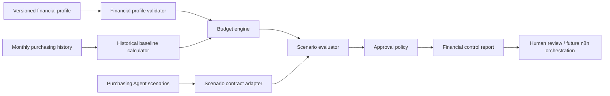

# Purchasing Financial Controller — Miska Design

Status: the local cash-and-reserve controller described below is implemented as
`financial-controller-v1`. The broader planning architecture remains a future
design.

## A. Objective

The Financial Purchasing Controller is a deterministic, read-only control layer
after the Purchasing Agent has produced order scenarios. It answers four
questions without changing product quantities:

1. How much may Miska spend on purchasing in the current month?
2. Does each proposed order scenario fit the available budget?
3. Does the scenario preserve mandatory payments and the required liquidity
   reserve?
4. Should the operator use minimum, working, or aggressive financial mode?

The controller evaluates facts and proposed order totals. It does not select
products, recalculate demand, alter Phase 1 or Phase 2 decisions, or submit a
purchase order.

### Implemented v1 boundary

The independent runtime module is
`agents/purchasing/services/financial_controller.js`. It is deliberately not
imported by `order_agent.js`, so existing Purchasing Agent entry points,
product calculations, workflow statuses, and order quantities remain
unchanged.

The v1 public input uses the approved flat local contract:

```json
{
  "cash_balance": 118000,
  "bank_balance": 300000,
  "expected_revenue": 685899,
  "fixed_expenses": {
    "rent": 60000,
    "payroll": 75000,
    "taxes": 39750
  },
  "acquiring_rate": 0.025,
  "supplier_debt": 0,
  "committed_supplier_payments": 0,
  "minimum_reserve": 100000,
  "proposed_order_amount": 103389.40
}
```

`fixed_expenses` may also be an array of `{ "name", "amount" }` objects. Every
present amount must be finite and non-negative. Missing critical fields remain
`null` in dependent results and produce `PRELIMINARY`; invalid present values
fail validation.

The module exports:

- `evaluateFinancialPurchase(input, options)` for the generic flat contract;
- `buildMiskaFinancialInput(orderAmount, overrides)` to copy Miska defaults;
- `evaluateMiskaPurchase(orderAmount, overrides)` as the local convenience
  entry point;
- `buildFinancialPurchaseReport(result)` for the complete Russian report.

Local usage:

```js
const {
  evaluateMiskaPurchase,
  buildFinancialPurchaseReport,
} = require('./agents/purchasing/services/financial_controller');

const result = evaluateMiskaPurchase(103389.40);
const report = buildFinancialPurchaseReport(result);
```

This call has no external side effects. It does not read 1C, a bank, an API, or
n8n and does not submit payment or supplier-order data.

### Proposed architecture



The implemented v1 service covers validation, the cash-and-reserve calculation,
decision status, and Russian reporting. Broader future services remain:

- a financial-profile validator;
- a historical purchasing baseline calculator;
- a deterministic budget engine;
- a scenario adapter that reads Purchasing Agent result contracts;
- a scenario evaluator and approval policy;
- a formatter for JSON and readable reports.

The broader future public function should accept plain serializable objects and remain
independently callable without n8n. A possible contract is:

```text
evaluatePurchasingFinances({
  financialProfile,
  purchasingScenarios,
  monthlyPurchasingHistory,
  requestedMode,
  customScenario
}) -> financialControlResult
```

## B. Business rules

1. Financial control runs after purchasing quantities and workflow statuses are
   calculated.
2. Financial evaluation never changes a product quantity. An unaffordable
   scenario is rejected or held for review as a whole; product selection is a
   separate future workflow.
3. Mandatory expenses and existing approved supplier payments have priority
   over a new order.
4. The minimum liquidity reserve may not be consumed by an automatically
   approved order.
5. Confirmed expected inflows may be counted only when amount, expected date,
   source, and confidence satisfy configured policy.
6. Missing expected inflows are omitted, not interpreted as confirmed zero.
7. Amounts already cleared from the bank balance must not be subtracted again.
   Only unpaid approved supplier payments are deducted from cash capacity.
8. Current-month purchasing commitments include both paid and approved-unpaid
   purchases for revenue and historical ceilings. This prevents a new order
   from reusing budget already consumed.
9. Negative financial capacity remains negative in the result. A separate
   `spendableAmount` may be zero, but the deficit and limiting formula must be
   reported explicitly.
10. Missing critical financial inputs cannot produce `affordable: yes`.
11. Manual override never converts assumed data into verified data. It creates
    a conditional decision with an audit reason and explicit approval.
12. Aggressive mode always requires human approval and a documented inventory
    opportunity.
13. All currency amounts use the profile currency. Mixed currencies require
    an explicit verified conversion source and rate; otherwise evaluation is
    blocked.
14. Precision is preserved during calculation and currency is rounded to two
    decimal places only at the result boundary.

## C. Inputs

### Financial profile

The versioned profile contains:

- store identifier and purchasing profile;
- currency;
- minimum and target monthly revenue plans;
- forecast monthly revenue and actual revenue to date;
- cash balance and bank balance available to the model;
- confirmed expected cash inflows;
- named mandatory expenses;
- already paid expenses and unpaid mandatory expenses;
- existing approved supplier payments not yet paid;
- current-month purchasing spend already committed;
- historical monthly purchasing values and configured history window;
- minimum and desired liquidity reserves;
- maximum purchasing share of forecast revenue;
- supplier payment terms and purchase frequency;
- current month boundaries;
- freshness policy and timestamps;
- optional supplier and category budgets;
- manual override data.

The example contract is in
`docs/purchasing-financial-controller-config-example.json`.

### Mandatory expenses

Mandatory expenses are itemized rather than represented only by a total. Each
item supports:

- stable item code and name;
- category: rent, payroll, taxes, utilities, acquiring fees, loan payments, or
  another configured fixed cost;
- planned amount or configurable range;
- paid amount and unpaid amount;
- due date and payment status;
- source metadata and confidence;
- whether the item is mandatory for this month.

The controller may calculate total unpaid mandatory expenses from items only
when the expense list is declared complete and every required item has a known
amount. For Miska v1 the approved fixed-expense total is 174,750 RUB: rent
60,000 RUB, payroll 75,000 RUB, and taxes 39,750 RUB. Acquiring is variable and
is added separately as 2.5% of expected revenue.

### Purchasing scenarios

The scenario adapter accepts the existing aggregated order contracts and any
future custom order:

```json
{
  "scenarioId": "recommended_reviewed",
  "label": "Recommended reviewed proposal",
  "orderLines": 97,
  "units": 525,
  "orderSum": 103389.40,
  "currency": "RUB",
  "sourceContractVersion": "recommended-valta-order-v1",
  "status": "proposed_for_human_approval_not_submitted"
}
```

Line and unit counts are informational to the financial engine. `orderSum` is
the amount tested against financial limits. A future custom scenario must pass
the same validation and include traceable line sums.

## D. Data confidence

The implemented v1 flat contract treats all nine fields as critical. Missing
fields produce `PRELIMINARY`, list `missing_critical_fields`, and leave every
dependent calculation `null`. It never substitutes defaults inside the generic
evaluator. Miska defaults are applied only by the explicitly selected
`buildMiskaFinancialInput` or `evaluateMiskaPurchase` helper, and explicit
`null` overrides remain `null`.

The broader future financial profile uses an evidence envelope:

```json
{
  "value": null,
  "source": null,
  "sourceType": null,
  "asOf": null,
  "confidence": "unknown",
  "manuallyEntered": false,
  "verified": false,
  "assumed": false
}
```

Allowed confidence levels are `high`, `medium`, `low`, and `unknown`. Proposed
source types are `bank`, `1c`, `payment_calendar`, `invoice`, `analytics`,
`manual`, and `derived`.

### Future extended critical inputs

These inputs are required for a final `affordable: yes` decision:

- current cash balance;
- forecast monthly revenue;
- complete unpaid mandatory-expense total;
- existing approved supplier payments not yet paid;
- current-month purchasing spend already committed;
- minimum liquidity reserve;
- maximum purchasing share of forecast revenue;
- a valid historical purchasing baseline based on sufficient history;
- current month start and end dates;
- currency and store profile;
- freshness and verification status for the values above;
- confirmation that no mandatory payment is overdue.

Actual revenue to date and desired liquidity reserve are additionally critical
for working and aggressive mode eligibility. Target revenue plan and an
inventory-opportunity justification are critical for aggressive mode.

### Optional inputs

- expected inflows: omitted conservatively when missing;
- supplier and category budgets: reported as not configured;
- payment terms and next-order date: needed for monthly scheduling, but not for
  the basic safe-budget formula;
- average monthly purchasing spend supplied directly: diagnostic only when raw
  monthly history is available;
- utilities, acquiring fees, loans, and other expense categories only if the
  profile explicitly declares they do not apply. An omitted applicable expense
  makes the expense schedule incomplete.

### Safety behavior

- Complete, fresh, verified critical inputs may produce a final decision.
- Missing or stale critical inputs may produce a preliminary numerical estimate
  from the remaining valid limits, but `affordable` is at most `conditional`.
- If no valid limit exists, budget, variance, and affordability amounts remain
  `null`; they are never fabricated.
- An explicit override requires the field overridden, value, reason, approver,
  timestamp, and expiration. It blocks automatic approval.

## E. Financial formulas

Let all amounts refer to the same current month and currency.

### Implemented v1 formulas

```text
total_available_cash =
  cash_balance + bank_balance

estimated_acquiring =
  expected_revenue × acquiring_rate

total_mandatory_expenses =
  sum(fixed_expenses) + estimated_acquiring

available_after_expenses =
  total_available_cash
  - total_mandatory_expenses
  - supplier_debt
  - committed_supplier_payments

available_after_order =
  available_after_expenses - proposed_order_amount

reserve_surplus =
  available_after_order - minimum_reserve

maximum_safe_order_amount =
  total_available_cash
  - total_mandatory_expenses
  - supplier_debt
  - committed_supplier_payments
  - minimum_reserve
```

Calculations retain full precision internally. All returned monetary fields are
rounded to two decimal places at the result boundary, with exact half-cent
values rounded away from zero.

Decision precedence makes every required status operationally distinct:

1. `PRELIMINARY` when any critical input is missing.
2. `REJECTED` when `available_after_order < 0`.
3. `MANUAL_APPROVAL_REQUIRED` when liquidity is non-negative but
   `reserve_surplus < 0`.
4. `APPROVED_WITH_WARNING` when `0 <= reserve_surplus < 30000` RUB.
5. `APPROVED` when `reserve_surplus >= 30000` RUB.

This precedence resolves the overlap between manual review and rejection:
reserve breach with positive liquidity may be reviewed manually, while
negative liquidity is rejected. Neither status changes the order itself.

### Future A. Extended cash-based capacity

```text
cashBasedCapacity =
  currentCashBalance
  + confirmedExpectedInflowsWithinDecisionHorizon
  - unpaidMandatoryExpenses
  - approvedSupplierPaymentsNotYetPaid
  - minimumLiquidityReserve
```

`remainingLiquidityAfterPurchase` is shown separately:

```text
remainingLiquidityAfterPurchase =
  currentCashBalance
  + confirmedExpectedInflowsWithinDecisionHorizon
  - unpaidMandatoryExpenses
  - approvedSupplierPaymentsNotYetPaid
  - scenarioOrderSum
```

The result must also show:

```text
minimumReserveHeadroom =
  remainingLiquidityAfterPurchase - minimumLiquidityReserve
```

### B. Revenue-based purchasing ceiling

```text
revenueBasedCeiling =
  forecastRevenue
  × maximumPurchasingShareOfForecastRevenue
  - currentMonthPurchasesAlreadyCommitted
```

### C. Historical purchasing ceiling

```text
historicalPurchasingCeiling =
  historicalPlanningBaseline
  - currentMonthPurchasesAlreadyCommitted
```

### D. Safe purchasing budget

```text
safePurchasingBudgetRaw = minimum(
  valid cashBasedCapacity,
  valid revenueBasedCeiling,
  valid historicalPurchasingCeiling
)
```

All three limits are required for a final safe result. If a limit is missing,
the controller may show `preliminaryConservativeLimit` as the minimum of the
remaining valid limits, but it must identify missing limits and block automatic
approval.

```text
safePurchasingDeficit = max(0, -safePurchasingBudgetRaw)
safeSpendableAmount = max(0, safePurchasingBudgetRaw)
```

The raw negative budget remains visible; `safeSpendableAmount` must not hide
the deficit.

### E. Working purchasing budget

Working mode uses the safe purchasing budget as its financial ceiling. It is
eligible only when:

- the forecast is verified and at least medium confidence;
- actual revenue progress is on plan for the elapsed part of the month;
- the evaluated scenario leaves the desired liquidity reserve intact;
- no mandatory expense is overdue;
- critical data is fresh and complete.

If the desired reserve is greater than the minimum reserve, it is evaluated as
an additional scenario constraint:

```text
desiredReserveHeadroom =
  remainingLiquidityAfterPurchase - desiredLiquidityReserve
```

### F. Aggressive purchasing budget

Aggressive mode may exceed the outlier-resistant historical planning baseline,
but never the verified cash-based capacity or revenue-based ceiling:

```text
aggressivePurchasingBudget = minimum(
  valid cashBasedCapacity,
  valid revenueBasedCeiling
)
```

It is unavailable unless forecast revenue exceeds the target plan, the minimum
reserve is protected, actual revenue is on plan, mandatory payments are current,
and an inventory opportunity is documented. Exceeding the historical baseline
must be reported as a variance, not hidden. Explicit owner approval is always
required.

### Scenario metrics

```text
budgetVariance = selectedModeBudget - scenarioOrderSum
orderShareOfForecastRevenue = scenarioOrderSum / forecastRevenue
orderShareOfHistoricalBaseline = scenarioOrderSum / historicalPlanningBaseline
```

Division metrics remain `null` when the denominator is missing, invalid, or
zero.

## F. Historical purchasing baseline

### Monthly normalization

History should contain one record per completed calendar month and include paid
supplier invoices plus approved purchase obligations attributable to that
month. Canceled orders are excluded; refunds and credit notes are recorded
explicitly. Currency conversion requires verified month-specific rates.

The calculator returns:

- arithmetic mean over the latest 3 completed months;
- arithmetic mean over the latest 6 completed months;
- arithmetic mean over the latest 12 completed months;
- median monthly spend;
- trimmed mean;
- weighted recent average for comparison;
- minimum and maximum monthly spend;
- identified outlier months and reasons when known;
- current-month purchasing spend already committed;
- remaining capacity against the selected baseline.

### Recommended Miska baseline

Use the **median of the latest six completed months** as the default planning
baseline once six months are available. Median is safest for Miska because a
single large supplier shipment does not pull it upward and create artificial
budget capacity. It is transparent enough for manual verification.

Also calculate:

- trimmed mean over 6–12 months by removing configurable extreme tails;
- a configurable weighted recent average as a trend indicator, not the default
  safe ceiling;
- the ratio between maximum, median, and trimmed mean to expose outliers.

If growth is verified, the weighted recent average may inform working-mode
planning, but changing the financial ceiling requires an explicit profile
decision. It must not happen silently.

### Missing-history behavior

| Available completed months | Output and confidence | Use as final historical ceiling |
| --- | --- | --- |
| 0 | All historical statistics `null`; `no_history` warning | No |
| 1–2 | Show observed mean, median, minimum, and maximum; very low confidence | No |
| 3–5 | Use median of available months as a preliminary baseline; low confidence | No automatic approval |
| 6–11 | Median of latest six is valid; medium confidence, with outlier diagnostics | Yes, if source is verified |
| 12+ | Six-month median plus 12-month median/trimmed-mean comparison; high confidence when stable | Yes |

The current-month committed amount is never included as a completed history
month. It is subtracted after the baseline is selected.

## G. Three budget modes

The following modes remain future planning design. V1 never activates
aggressive mode and always returns
`automatic_aggressive_mode_allowed: false`.

| Mode | Eligibility | Financial ceiling | Purchasing categories | Approval | Risk and wording |
| --- | --- | --- | --- | --- | --- |
| Minimum | Cash and expense data complete; reserve protected | Minimum of safe budget and capacity preserving desired reserve when configured | Existing `must_buy`, strategic ABC A, and non-speculative necessities | Normal human purchasing approval; no automatic submission | Low/medium. “Cash-protective minimum order.” |
| Working | Forecast reliable, revenue on plan, desired reserve protected, no overdue expense | Safe purchasing budget | Existing `must_buy` and `recommended` items, including reviewed lines already approved by the purchasing workflow | Human approval | Medium. “Default working order balanced against liquidity.” |
| Aggressive | Forecast exceeds target, actual revenue on plan, opportunity documented, no overdue expense | Minimum of cash and revenue ceilings; historical excess shown explicitly | Existing approved items plus justified stock expansion from an already prepared scenario | Explicit owner approval with reason | High. “Aggressive inventory investment; not automatically approved.” |

These modes classify whole scenarios financially. They do not rewrite workflow
statuses or quantities. If a scenario contains categories outside the selected
mode, the controller flags incompatibility and requests a separately prepared
scenario from the Purchasing Agent or user.

## H. Scenario evaluation

The multi-scenario structure below remains the future controller contract. V1
evaluates one supplied `proposed_order_amount` at a time and can be called
independently for each existing scenario.

Each scenario result contains:

```json
{
  "scenarioId": "safe_auto_approved",
  "orderLines": 82,
  "units": 476,
  "orderSum": 89742.05,
  "financialMode": "minimum",
  "financialBudget": null,
  "remainingLiquidityAfterPurchase": null,
  "orderShareOfForecastRevenue": null,
  "orderShareOfHistoricalBaseline": null,
  "budgetVariance": null,
  "affordable": "conditional",
  "financialRisk": "critical",
  "recommendation": "hold_for_complete_financial_inputs",
  "requiredApproval": "owner_financial_approval",
  "excludedReason": "critical_financial_inputs_missing"
}
```

Affordability rules:

- `yes`: all critical inputs are complete, fresh, verified, and the scenario is
  within the selected ceiling while required reserves remain protected;
- `no`: complete inputs prove that the scenario exceeds the ceiling, creates a
  deficit, breaches reserve, or violates a hard overdue-payment block;
- `conditional`: data is incomplete, an override is active, or the selected
  mode requires approval. Conditional never means safe.

Risk rules:

- `low`: verified minimum/working scenario well within budget and desired
  reserve;
- `medium`: limited headroom, working-mode approval, or elevated concentration;
- `high`: exceeds safe budget but may meet aggressive eligibility, consumes
  most available cash, or relies on a material override;
- `critical`: cash deficit, reserve breach, overdue mandatory payment,
  inconsistent values, currency mismatch, or missing critical data that makes
  affordability unknowable.

The controller evaluates these independently:

- safe auto-approved portion;
- recommended reviewed proposal;
- reviewed upper bound;
- working maximum;
- any future custom scenario that passes validation.

## I. Warnings

Warnings should be deduplicated and emitted once at report level when they
describe a dataset or profile rather than one scenario:

| Code | Trigger |
| --- | --- |
| `current_cash_missing` | Current cash is `null` or invalid |
| `revenue_forecast_missing` | Forecast revenue is `null` or invalid |
| `financial_data_stale` | An input exceeds its configured freshness threshold |
| `purchasing_history_insufficient` | Fewer than six completed months for final baseline |
| `mandatory_expenses_incomplete` | Expense list not declared complete or required amounts missing |
| `liquidity_reserve_missing` | Minimum reserve not configured |
| `order_exceeds_safe_budget` | Scenario sum exceeds safe budget |
| `order_consumes_most_available_cash` | Remaining cash ratio crosses configured warning threshold |
| `forecast_below_minimum_plan` | Forecast is below 750,000 RUB in the current Miska example profile |
| `mandatory_expense_overdue` | Any mandatory expense is overdue and unpaid |
| `supplier_commitments_missing` | Approved-unpaid supplier obligations unknown or incomplete |
| `financial_values_inconsistent` | Totals do not reconcile, paid exceeds planned without explanation, dates/currency conflict, or duplicate obligations exist |
| `manual_override_active` | Any override is active |

Thresholds such as “most available cash” belong in the financial profile and
are not embedded permanently in code.

## J. Approval workflow

1. Validate profile schema, currency, time period, evidence metadata, and
   internal reconciliations.
2. Calculate historical statistics and classify history sufficiency.
3. Calculate raw cash, revenue, and historical limits, preserving deficits.
4. Evaluate every scenario without changing it.
5. If critical inputs are missing, issue a preliminary report and block final
   approval.
6. Select minimum, working, or aggressive mode only after eligibility checks.
7. Require human approval for the chosen scenario. Aggressive mode and all
   overrides require explicit owner approval.
8. Record selected scenario ID, exact total, source result fingerprint, profile
   version, input timestamps, warnings, approver, reason, and approval time.
9. Future order creation remains a separate idempotent action and must recheck
   that financial data and scenario fingerprint have not changed.

An override object must include:

```text
active, targetField, overrideValue, reason,
requestedBy, approvedBy, approvedAt, expiresAt
```

Blank reason, approver, or expiration makes the override invalid.

## K. Monthly purchasing plan

Proposed structure:

```json
{
  "month": "2026-07",
  "currency": "RUB",
  "openingPurchasingBudget": null,
  "purchasesAlreadyCommitted": null,
  "currentProposedOrder": {
    "scenarioId": "recommended_reviewed",
    "amount": 103389.40
  },
  "remainingBudget": null,
  "expectedNextSupplierOrderDate": null,
  "plannedReserveForNextOrder": null,
  "supplierBudgets": [
    { "supplier": "Valta", "budget": null, "committed": null, "remaining": null },
    { "supplier": "Zoograd", "budget": null, "committed": null, "remaining": null },
    { "supplier": "Pet Products", "budget": null, "committed": null, "remaining": null },
    { "supplier": "Onikienko", "budget": null, "committed": null, "remaining": null },
    { "supplier": "Arkon", "budget": null, "committed": null, "remaining": null },
    { "supplier": "Japanese suppliers", "budget": null, "committed": null, "remaining": null },
    { "supplier": "other", "budget": null, "committed": null, "remaining": null }
  ],
  "categoryBudgets": [],
  "monthEndLiquidityForecast": null,
  "status": "preliminary_missing_financial_inputs"
}
```

Supplier and category budget values remain configuration or imported data; the
controller must not hardcode them. The plan should reconcile:

```text
remainingBudget =
  openingPurchasingBudget
  - purchasesAlreadyCommitted
  - currentProposedOrder
  - plannedReserveForNextOrder
```

If any component is unknown, `remainingBudget` is `null`, with missing data
listed explicitly.

## L. Integration roadmap

### Phase 1 — manual financial entry

- JSON financial profile validated at the agent boundary;
- manually entered bank balance, forecast, expenses, supplier commitments, and
  historical month totals;
- deterministic report only;
- human scenario selection and approval;
- no n8n business calculations and no order submission.

### Phase 2 — reviewed file imports

- 1C UT 11 exports for supplier obligations and monthly purchases;
- bank statement or balance export;
- payment-calendar export;
- supplier invoice imports;
- analytics revenue-forecast export;
- reconciliation diagnostics before financial evaluation.

### Phase 3 — API and n8n automation

- narrow adapters for 1C, bank balance, payment calendar, finance agent,
  analytics agent, SmartZapas result, and supplier invoices;
- n8n fetches, schedules, transports, and routes approvals only;
- financial formulas remain in the Purchasing Agent financial service;
- freshness checks and source fingerprints support idempotent re-evaluation;
- future approval and order actions are separately audited.

SmartZapas remains the product-demand source; it must not become the source of
cash, expense, or payment facts. The finance agent may provide verified
financial inputs, while the business analytics agent may provide forecast and
trend evidence.

## M. Test plan

### Profile and validation

- accepts a complete, internally consistent RUB profile;
- rejects missing store, month, currency, invalid evidence metadata, negative
  non-negative fields, non-finite values, and currency mismatch;
- distinguishes missing, assumed, manual, verified, and stale values;
- proves no unknown amount is converted to zero;
- detects incomplete mandatory expenses and duplicate supplier commitments.

### Historical baseline

- calculates exact 3-, 6-, and 12-month averages;
- calculates median, configurable trimmed mean, minimum, and maximum;
- demonstrates that a large one-off supplier purchase does not inflate the
  six-month median baseline;
- covers no history, 1–2 months, 3–5 months, 6–11 months, and 12+ months;
- excludes current partial month from completed history;
- subtracts current-month committed purchasing exactly once.

### Budget engine

- safe budget with complete valid inputs;
- negative cash capacity reports raw deficit and zero spendable amount;
- missing critical inputs produce preliminary status, never safe approval;
- order below safe budget;
- order above safe budget;
- forecast revenue below minimum plan;
- desired and minimum reserve boundaries immediately below, at, and above;
- overdue mandatory expense blocks approval;
- paid obligations are not subtracted twice;
- manual override requires reason, approver, and expiration;
- stale data blocks final approval;
- inconsistent values produce critical warning;
- no fabricated values in result or report.

### Modes and scenarios

- minimum mode eligibility and category compatibility;
- working mode blocked when actual revenue is off plan or desired reserve fails;
- aggressive mode blocked when forecast does not exceed target;
- aggressive mode allowed only with explicit approval and opportunity evidence;
- evaluates safe, recommended, reviewed-upper-bound, working-maximum, and custom
  scenarios independently;
- scenario order sums and quantities remain unchanged;
- all scenario comparisons use the same profile snapshot;
- warning codes are deduplicated at report level.

## N. Open questions

Sergey must confirm or supply:

1. Which bank accounts and cash equivalents belong in current cash balance?
2. Current cash balance and its timestamp.
3. Current-month forecast revenue and forecasting source.
4. Actual revenue to date and whether returns are netted.
5. Complete unpaid mandatory expenses, due dates, and any overdue items.
6. Approved supplier payments not yet paid, with invoice and due-date details.
7. Current-month purchases already committed and the rule for assigning a
   purchase to a month.
8. Monthly purchasing totals for at least six completed months, preferably
   twelve, and identification of exceptional purchases.
9. Minimum and desired liquidity reserve amounts.
10. Maximum purchasing share of forecast revenue.
11. Whether expected inflows may be counted before settlement and the required
    confidence threshold.
12. Supplier payment terms and normal purchasing cadence for each supplier.
13. Supplier and category budget ownership.
14. Definition of an overdue mandatory payment and who may override it.
15. Approval authority for minimum, working, and aggressive modes.
16. Whether the approved 75,000 RUB payroll value should later become a
    configurable minimum/default/maximum range.
17. Whether utilities, loan payments, or other fixed costs should be added to a
    later profile beyond the currently approved v1 expense list.

## O. Recommended implementation phases

1. **Contracts and validator.** Version the profile, scenario, and result
   contracts; validate evidence metadata and reconciliation without changing
   Purchasing Agent output.
2. **Historical baseline service.** Implement monthly normalization, median,
   trimmed mean, recent weighted diagnostic, outlier flags, and history
   sufficiency.
3. **Budget engine.** Implement cash, revenue, historical, safe, working, and
   aggressive calculations with explicit deficits and provenance.
4. **Scenario evaluator and report.** Evaluate unchanged scenario totals,
   deduplicate warnings, and produce preliminary/final approval states.
5. **Manual workflow pilot.** Run with manually verified Miska values and
   compare decisions for several months before enabling file imports.
6. **File adapters.** Add reviewed 1C, bank, payment-calendar, invoice, and
   forecast imports with reconciliation tests.
7. **Automation.** Add n8n transport and approval routing only after stable
   contracts, audit requirements, and idempotency are verified.
